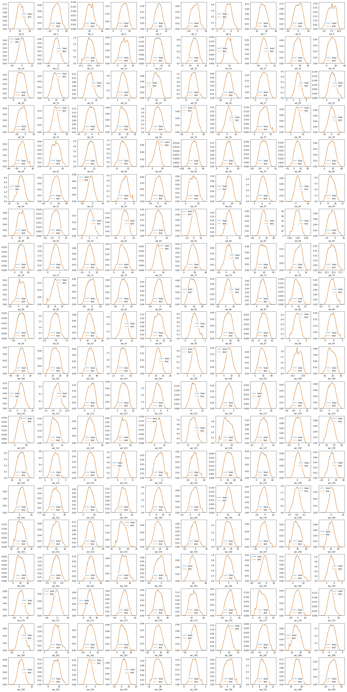
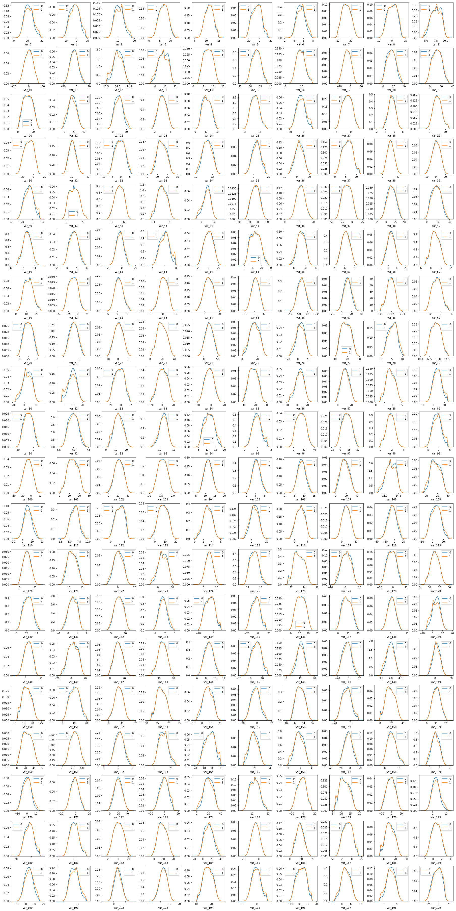
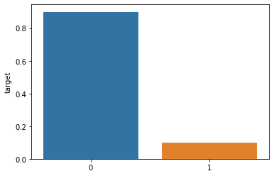
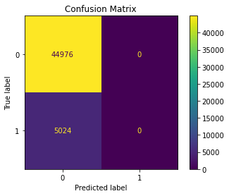
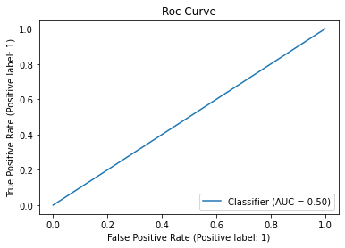

# "Predicting Customer Transactions for Santander Competition on Kaggle"

- toc: true
- badges: true

## Introduction

The Santander Group is a Spanish multinational financial services company based in Madrid and is the 16th largest financial institution in the world. It held a [Kaggle competition](https://www.kaggle.com/c/santander-customer-transaction-prediction) in 2019 where the goal was to identify which customers would make a specific transaction in the future, irrespective of the amount of money transacted. The [data provided](https://www.kaggle.com/c/santander-customer-transaction-prediction/data) for the competition had the same structure as the real data the Santander Group has available to solve this problem. The competetion is one of the most popular competitions on Kaggle with over 8,000 participating teams.

Today, we'll also participate in this competition and work towards improving our standing on the competition leaderboard. The dataset provided has about 200 anonymized features, using which we have to predict the target class in the test dataset. The submission is evaluated based on the AUC ROC between the predicted probability and the observed target in the submission file. Thus, our goal is to make predictions with the highest possible AUC ROC score on the test dataset. We begin the work by first setting up the environment and importing the dataset files.

## Setup

Import the required libraries, import the datasets and setup the training environment.


```python
import numpy as np # linear algebra
import pandas as pd # data processing, CSV file I/O (e.g. pd.read_csv)
import matplotlib.pyplot as plt # data visualization
import seaborn as sns # data visualization
from tqdm import tqdm # progress meter
from sklearn.model_selection import StratifiedKFold, train_test_split, cross_validate # training validation
from sklearn.preprocessing import MinMaxScaler # numeric scaler
from sklearn.metrics import accuracy_score, precision_score, f1_score, recall_score, roc_auc_score, RocCurveDisplay, ConfusionMatrixDisplay # metrics
from imblearn.over_sampling import SMOTE # oversampling imbalanced data
from imblearn.pipeline import make_pipeline as make_imb_pipeline # imbalanced pipeline
from bayes_opt import BayesianOptimization # hyperparameter tuning
import psutil # cpu information

# ML models
from sklearn.dummy import DummyClassifier
from sklearn.linear_model import LogisticRegression, RidgeClassifier
from sklearn.naive_bayes import GaussianNB
from sklearn.ensemble import RandomForestClassifier
import lightgbm as lgb


# ignore warnings
import warnings
warnings.filterwarnings("ignore")

# set data_dir
import os
os.chdir(os.getcwd() + "\Santader_Transactions_Predictions")

# file paths
for dirname, _, filenames in os.walk(os.getcwd()):
    for filename in filenames:
        print(os.path.join(dirname, filename))
```

    C:\Users\ncits\Downloads\Santader_Transactions_Predictions\final_submssion.csv
    C:\Users\ncits\Downloads\Santader_Transactions_Predictions\private_LB.npy
    C:\Users\ncits\Downloads\Santader_Transactions_Predictions\public_LB.npy
    C:\Users\ncits\Downloads\Santader_Transactions_Predictions\sample_submission.csv
    C:\Users\ncits\Downloads\Santader_Transactions_Predictions\synthetic_samples_indexes.npy
    C:\Users\ncits\Downloads\Santader_Transactions_Predictions\test.csv
    C:\Users\ncits\Downloads\Santader_Transactions_Predictions\train.csv
    C:\Users\ncits\Downloads\Santader_Transactions_Predictions\.ipynb_checkpoints\Untitled-checkpoint.ipynb
    

Here, the csv files are part of the official competition dataset. while all the other files are from a separate kernel and will be used for feature engineering in the later section. We have already added them for future use.


```python
# file_paths
train_path = r"C:\Users\ncits\Downloads\Santader_Transactions_Predictions\train.csv"
test_path = r"C:\Users\ncits\Downloads\Santader_Transactions_Predictions\test.csv"
submission_path = r"C:\Users\ncits\Downloads\Santader_Transactions_Predictions\sample_submission.csv"
```


```python
# training dataset file size
!dir {train_path} /a/s
print("-" * 50)
!dir {test_path} /a/s
```

     Volume in drive C has no label.
     Volume Serial Number is 7257-2892
    
     Directory of C:\Users\ncits\Downloads\Santader_Transactions_Predictions
    
    11-12-2019  22:01       302,133,017 train.csv
                   1 File(s)    302,133,017 bytes
    
         Total Files Listed:
                   1 File(s)    302,133,017 bytes
                   0 Dir(s)  299,745,378,304 bytes free
    --------------------------------------------------
     Volume in drive C has no label.
     Volume Serial Number is 7257-2892
    
     Directory of C:\Users\ncits\Downloads\Santader_Transactions_Predictions
    
    11-12-2019  22:00       301,526,706 test.csv
                   1 File(s)    301,526,706 bytes
    
         Total Files Listed:
                   1 File(s)    301,526,706 bytes
                   0 Dir(s)  299,745,378,304 bytes free
    

The training dataset file size is 289 MB and the test dataset file size is 288 MB. It is safe to import both datasets fully at once.


```python
# import training dataset
X = pd.read_csv(r"C:\Users\ncits\Downloads\Santader_Transactions_Predictions\train.csv", index_col = ["ID_code"])

# look at all columns
pd.set_option("display.max_columns", None)
X.head()
```


<div>
<style scoped>
    .dataframe tbody tr th:only-of-type {
        vertical-align: middle;
    }

    .dataframe tbody tr th {
        vertical-align: top;
    }

    .dataframe thead th {
        text-align: right;
    }
</style>
<table border="1" class="dataframe">
  <thead>
    <tr style="text-align: right;">
      <th></th>
      <th>target</th>
      <th>var_0</th>
      <th>var_1</th>
      <th>var_2</th>
      <th>var_3</th>
      <th>var_4</th>
      <th>var_5</th>
      <th>var_6</th>
      <th>var_7</th>
      <th>var_8</th>
      <th>var_9</th>
      <th>var_10</th>
      <th>var_11</th>
      <th>var_12</th>
      <th>var_13</th>
      <th>var_14</th>
      <th>var_15</th>
      <th>var_16</th>
      <th>var_17</th>
      <th>var_18</th>
      <th>var_19</th>
      <th>var_20</th>
      <th>var_21</th>
      <th>var_22</th>
      <th>var_23</th>
      <th>var_24</th>
      <th>var_25</th>
      <th>var_26</th>
      <th>var_27</th>
      <th>var_28</th>
      <th>var_29</th>
      <th>var_30</th>
      <th>var_31</th>
      <th>var_32</th>
      <th>var_33</th>
      <th>var_34</th>
      <th>var_35</th>
      <th>var_36</th>
      <th>var_37</th>
      <th>var_38</th>
      <th>var_39</th>
      <th>var_40</th>
      <th>var_41</th>
      <th>var_42</th>
      <th>var_43</th>
      <th>var_44</th>
      <th>var_45</th>
      <th>var_46</th>
      <th>var_47</th>
      <th>var_48</th>
      <th>var_49</th>
      <th>var_50</th>
      <th>var_51</th>
      <th>var_52</th>
      <th>var_53</th>
      <th>var_54</th>
      <th>var_55</th>
      <th>var_56</th>
      <th>var_57</th>
      <th>var_58</th>
      <th>var_59</th>
      <th>var_60</th>
      <th>var_61</th>
      <th>var_62</th>
      <th>var_63</th>
      <th>var_64</th>
      <th>var_65</th>
      <th>var_66</th>
      <th>var_67</th>
      <th>var_68</th>
      <th>var_69</th>
      <th>var_70</th>
      <th>var_71</th>
      <th>var_72</th>
      <th>var_73</th>
      <th>var_74</th>
      <th>var_75</th>
      <th>var_76</th>
      <th>var_77</th>
      <th>var_78</th>
      <th>var_79</th>
      <th>var_80</th>
      <th>var_81</th>
      <th>var_82</th>
      <th>var_83</th>
      <th>var_84</th>
      <th>var_85</th>
      <th>var_86</th>
      <th>var_87</th>
      <th>var_88</th>
      <th>var_89</th>
      <th>var_90</th>
      <th>var_91</th>
      <th>var_92</th>
      <th>var_93</th>
      <th>var_94</th>
      <th>var_95</th>
      <th>var_96</th>
      <th>var_97</th>
      <th>var_98</th>
      <th>var_99</th>
      <th>var_100</th>
      <th>var_101</th>
      <th>var_102</th>
      <th>var_103</th>
      <th>var_104</th>
      <th>var_105</th>
      <th>var_106</th>
      <th>var_107</th>
      <th>var_108</th>
      <th>var_109</th>
      <th>var_110</th>
      <th>var_111</th>
      <th>var_112</th>
      <th>var_113</th>
      <th>var_114</th>
      <th>var_115</th>
      <th>var_116</th>
      <th>var_117</th>
      <th>var_118</th>
      <th>var_119</th>
      <th>var_120</th>
      <th>var_121</th>
      <th>var_122</th>
      <th>var_123</th>
      <th>var_124</th>
      <th>var_125</th>
      <th>var_126</th>
      <th>var_127</th>
      <th>var_128</th>
      <th>var_129</th>
      <th>var_130</th>
      <th>var_131</th>
      <th>var_132</th>
      <th>var_133</th>
      <th>var_134</th>
      <th>var_135</th>
      <th>var_136</th>
      <th>var_137</th>
      <th>var_138</th>
      <th>var_139</th>
      <th>var_140</th>
      <th>var_141</th>
      <th>var_142</th>
      <th>var_143</th>
      <th>var_144</th>
      <th>var_145</th>
      <th>var_146</th>
      <th>var_147</th>
      <th>var_148</th>
      <th>var_149</th>
      <th>var_150</th>
      <th>var_151</th>
      <th>var_152</th>
      <th>var_153</th>
      <th>var_154</th>
      <th>var_155</th>
      <th>var_156</th>
      <th>var_157</th>
      <th>var_158</th>
      <th>var_159</th>
      <th>var_160</th>
      <th>var_161</th>
      <th>var_162</th>
      <th>var_163</th>
      <th>var_164</th>
      <th>var_165</th>
      <th>var_166</th>
      <th>var_167</th>
      <th>var_168</th>
      <th>var_169</th>
      <th>var_170</th>
      <th>var_171</th>
      <th>var_172</th>
      <th>var_173</th>
      <th>var_174</th>
      <th>var_175</th>
      <th>var_176</th>
      <th>var_177</th>
      <th>var_178</th>
      <th>var_179</th>
      <th>var_180</th>
      <th>var_181</th>
      <th>var_182</th>
      <th>var_183</th>
      <th>var_184</th>
      <th>var_185</th>
      <th>var_186</th>
      <th>var_187</th>
      <th>var_188</th>
      <th>var_189</th>
      <th>var_190</th>
      <th>var_191</th>
      <th>var_192</th>
      <th>var_193</th>
      <th>var_194</th>
      <th>var_195</th>
      <th>var_196</th>
      <th>var_197</th>
      <th>var_198</th>
      <th>var_199</th>
    </tr>
    <tr>
      <th>ID_code</th>
      <th></th>
      <th></th>
      <th></th>
      <th></th>
      <th></th>
      <th></th>
      <th></th>
      <th></th>
      <th></th>
      <th></th>
      <th></th>
      <th></th>
      <th></th>
      <th></th>
      <th></th>
      <th></th>
      <th></th>
      <th></th>
      <th></th>
      <th></th>
      <th></th>
      <th></th>
      <th></th>
      <th></th>
      <th></th>
      <th></th>
      <th></th>
      <th></th>
      <th></th>
      <th></th>
      <th></th>
      <th></th>
      <th></th>
      <th></th>
      <th></th>
      <th></th>
      <th></th>
      <th></th>
      <th></th>
      <th></th>
      <th></th>
      <th></th>
      <th></th>
      <th></th>
      <th></th>
      <th></th>
      <th></th>
      <th></th>
      <th></th>
      <th></th>
      <th></th>
      <th></th>
      <th></th>
      <th></th>
      <th></th>
      <th></th>
      <th></th>
      <th></th>
      <th></th>
      <th></th>
      <th></th>
      <th></th>
      <th></th>
      <th></th>
      <th></th>
      <th></th>
      <th></th>
      <th></th>
      <th></th>
      <th></th>
      <th></th>
      <th></th>
      <th></th>
      <th></th>
      <th></th>
      <th></th>
      <th></th>
      <th></th>
      <th></th>
      <th></th>
      <th></th>
      <th></th>
      <th></th>
      <th></th>
      <th></th>
      <th></th>
      <th></th>
      <th></th>
      <th></th>
      <th></th>
      <th></th>
      <th></th>
      <th></th>
      <th></th>
      <th></th>
      <th></th>
      <th></th>
      <th></th>
      <th></th>
      <th></th>
      <th></th>
      <th></th>
      <th></th>
      <th></th>
      <th></th>
      <th></th>
      <th></th>
      <th></th>
      <th></th>
      <th></th>
      <th></th>
      <th></th>
      <th></th>
      <th></th>
      <th></th>
      <th></th>
      <th></th>
      <th></th>
      <th></th>
      <th></th>
      <th></th>
      <th></th>
      <th></th>
      <th></th>
      <th></th>
      <th></th>
      <th></th>
      <th></th>
      <th></th>
      <th></th>
      <th></th>
      <th></th>
      <th></th>
      <th></th>
      <th></th>
      <th></th>
      <th></th>
      <th></th>
      <th></th>
      <th></th>
      <th></th>
      <th></th>
      <th></th>
      <th></th>
      <th></th>
      <th></th>
      <th></th>
      <th></th>
      <th></th>
      <th></th>
      <th></th>
      <th></th>
      <th></th>
      <th></th>
      <th></th>
      <th></th>
      <th></th>
      <th></th>
      <th></th>
      <th></th>
      <th></th>
      <th></th>
      <th></th>
      <th></th>
      <th></th>
      <th></th>
      <th></th>
      <th></th>
      <th></th>
      <th></th>
      <th></th>
      <th></th>
      <th></th>
      <th></th>
      <th></th>
      <th></th>
      <th></th>
      <th></th>
      <th></th>
      <th></th>
      <th></th>
      <th></th>
      <th></th>
      <th></th>
      <th></th>
      <th></th>
      <th></th>
      <th></th>
      <th></th>
      <th></th>
      <th></th>
      <th></th>
      <th></th>
      <th></th>
      <th></th>
      <th></th>
      <th></th>
      <th></th>
      <th></th>
      <th></th>
      <th></th>
    </tr>
  </thead>
  <tbody>
    <tr>
      <th>train_0</th>
      <td>0</td>
      <td>8.9255</td>
      <td>-6.7863</td>
      <td>11.9081</td>
      <td>5.0930</td>
      <td>11.4607</td>
      <td>-9.2834</td>
      <td>5.1187</td>
      <td>18.6266</td>
      <td>-4.9200</td>
      <td>5.7470</td>
      <td>2.9252</td>
      <td>3.1821</td>
      <td>14.0137</td>
      <td>0.5745</td>
      <td>8.7989</td>
      <td>14.5691</td>
      <td>5.7487</td>
      <td>-7.2393</td>
      <td>4.2840</td>
      <td>30.7133</td>
      <td>10.5350</td>
      <td>16.2191</td>
      <td>2.5791</td>
      <td>2.4716</td>
      <td>14.3831</td>
      <td>13.4325</td>
      <td>-5.1488</td>
      <td>-0.4073</td>
      <td>4.9306</td>
      <td>5.9965</td>
      <td>-0.3085</td>
      <td>12.9041</td>
      <td>-3.8766</td>
      <td>16.8911</td>
      <td>11.1920</td>
      <td>10.5785</td>
      <td>0.6764</td>
      <td>7.8871</td>
      <td>4.6667</td>
      <td>3.8743</td>
      <td>-5.2387</td>
      <td>7.3746</td>
      <td>11.5767</td>
      <td>12.0446</td>
      <td>11.6418</td>
      <td>-7.0170</td>
      <td>5.9226</td>
      <td>-14.2136</td>
      <td>16.0283</td>
      <td>5.3253</td>
      <td>12.9194</td>
      <td>29.0460</td>
      <td>-0.6940</td>
      <td>5.1736</td>
      <td>-0.7474</td>
      <td>14.8322</td>
      <td>11.2668</td>
      <td>5.3822</td>
      <td>2.0183</td>
      <td>10.1166</td>
      <td>16.1828</td>
      <td>4.9590</td>
      <td>2.0771</td>
      <td>-0.2154</td>
      <td>8.6748</td>
      <td>9.5319</td>
      <td>5.8056</td>
      <td>22.4321</td>
      <td>5.0109</td>
      <td>-4.7010</td>
      <td>21.6374</td>
      <td>0.5663</td>
      <td>5.1999</td>
      <td>8.8600</td>
      <td>43.1127</td>
      <td>18.3816</td>
      <td>-2.3440</td>
      <td>23.4104</td>
      <td>6.5199</td>
      <td>12.1983</td>
      <td>13.6468</td>
      <td>13.8372</td>
      <td>1.3675</td>
      <td>2.9423</td>
      <td>-4.5213</td>
      <td>21.4669</td>
      <td>9.3225</td>
      <td>16.4597</td>
      <td>7.9984</td>
      <td>-1.7069</td>
      <td>-21.4494</td>
      <td>6.7806</td>
      <td>11.0924</td>
      <td>9.9913</td>
      <td>14.8421</td>
      <td>0.1812</td>
      <td>8.9642</td>
      <td>16.2572</td>
      <td>2.1743</td>
      <td>-3.4132</td>
      <td>9.4763</td>
      <td>13.3102</td>
      <td>26.5376</td>
      <td>1.4403</td>
      <td>14.7100</td>
      <td>6.0454</td>
      <td>9.5426</td>
      <td>17.1554</td>
      <td>14.1104</td>
      <td>24.3627</td>
      <td>2.0323</td>
      <td>6.7602</td>
      <td>3.9141</td>
      <td>-0.4851</td>
      <td>2.5240</td>
      <td>1.5093</td>
      <td>2.5516</td>
      <td>15.5752</td>
      <td>-13.4221</td>
      <td>7.2739</td>
      <td>16.0094</td>
      <td>9.7268</td>
      <td>0.8897</td>
      <td>0.7754</td>
      <td>4.2218</td>
      <td>12.0039</td>
      <td>13.8571</td>
      <td>-0.7338</td>
      <td>-1.9245</td>
      <td>15.4462</td>
      <td>12.8287</td>
      <td>0.3587</td>
      <td>9.6508</td>
      <td>6.5674</td>
      <td>5.1726</td>
      <td>3.1345</td>
      <td>29.4547</td>
      <td>31.4045</td>
      <td>2.8279</td>
      <td>15.6599</td>
      <td>8.3307</td>
      <td>-5.6011</td>
      <td>19.0614</td>
      <td>11.2663</td>
      <td>8.6989</td>
      <td>8.3694</td>
      <td>11.5659</td>
      <td>-16.4727</td>
      <td>4.0288</td>
      <td>17.9244</td>
      <td>18.5177</td>
      <td>10.7800</td>
      <td>9.0056</td>
      <td>16.6964</td>
      <td>10.4838</td>
      <td>1.6573</td>
      <td>12.1749</td>
      <td>-13.1324</td>
      <td>17.6054</td>
      <td>11.5423</td>
      <td>15.4576</td>
      <td>5.3133</td>
      <td>3.6159</td>
      <td>5.0384</td>
      <td>6.6760</td>
      <td>12.6644</td>
      <td>2.7004</td>
      <td>-0.6975</td>
      <td>9.5981</td>
      <td>5.4879</td>
      <td>-4.7645</td>
      <td>-8.4254</td>
      <td>20.8773</td>
      <td>3.1531</td>
      <td>18.5618</td>
      <td>7.7423</td>
      <td>-10.1245</td>
      <td>13.7241</td>
      <td>-3.5189</td>
      <td>1.7202</td>
      <td>-8.4051</td>
      <td>9.0164</td>
      <td>3.0657</td>
      <td>14.3691</td>
      <td>25.8398</td>
      <td>5.8764</td>
      <td>11.8411</td>
      <td>-19.7159</td>
      <td>17.5743</td>
      <td>0.5857</td>
      <td>4.4354</td>
      <td>3.9642</td>
      <td>3.1364</td>
      <td>1.6910</td>
      <td>18.5227</td>
      <td>-2.3978</td>
      <td>7.8784</td>
      <td>8.5635</td>
      <td>12.7803</td>
      <td>-1.0914</td>
    </tr>
    <tr>
      <th>train_1</th>
      <td>0</td>
      <td>11.5006</td>
      <td>-4.1473</td>
      <td>13.8588</td>
      <td>5.3890</td>
      <td>12.3622</td>
      <td>7.0433</td>
      <td>5.6208</td>
      <td>16.5338</td>
      <td>3.1468</td>
      <td>8.0851</td>
      <td>-0.4032</td>
      <td>8.0585</td>
      <td>14.0239</td>
      <td>8.4135</td>
      <td>5.4345</td>
      <td>13.7003</td>
      <td>13.8275</td>
      <td>-15.5849</td>
      <td>7.8000</td>
      <td>28.5708</td>
      <td>3.4287</td>
      <td>2.7407</td>
      <td>8.5524</td>
      <td>3.3716</td>
      <td>6.9779</td>
      <td>13.8910</td>
      <td>-11.7684</td>
      <td>-2.5586</td>
      <td>5.0464</td>
      <td>0.5481</td>
      <td>-9.2987</td>
      <td>7.8755</td>
      <td>1.2859</td>
      <td>19.3710</td>
      <td>11.3702</td>
      <td>0.7399</td>
      <td>2.7995</td>
      <td>5.8434</td>
      <td>10.8160</td>
      <td>3.6783</td>
      <td>-11.1147</td>
      <td>1.8730</td>
      <td>9.8775</td>
      <td>11.7842</td>
      <td>1.2444</td>
      <td>-47.3797</td>
      <td>7.3718</td>
      <td>0.1948</td>
      <td>34.4014</td>
      <td>25.7037</td>
      <td>11.8343</td>
      <td>13.2256</td>
      <td>-4.1083</td>
      <td>6.6885</td>
      <td>-8.0946</td>
      <td>18.5995</td>
      <td>19.3219</td>
      <td>7.0118</td>
      <td>1.9210</td>
      <td>8.8682</td>
      <td>8.0109</td>
      <td>-7.2417</td>
      <td>1.7944</td>
      <td>-1.3147</td>
      <td>8.1042</td>
      <td>1.5365</td>
      <td>5.4007</td>
      <td>7.9344</td>
      <td>5.0220</td>
      <td>2.2302</td>
      <td>40.5632</td>
      <td>0.5134</td>
      <td>3.1701</td>
      <td>20.1068</td>
      <td>7.7841</td>
      <td>7.0529</td>
      <td>3.2709</td>
      <td>23.4822</td>
      <td>5.5075</td>
      <td>13.7814</td>
      <td>2.5462</td>
      <td>18.1782</td>
      <td>0.3683</td>
      <td>-4.8210</td>
      <td>-5.4850</td>
      <td>13.7867</td>
      <td>-13.5901</td>
      <td>11.0993</td>
      <td>7.9022</td>
      <td>12.2301</td>
      <td>0.4768</td>
      <td>6.8852</td>
      <td>8.0905</td>
      <td>10.9631</td>
      <td>11.7569</td>
      <td>-1.2722</td>
      <td>24.7876</td>
      <td>26.6881</td>
      <td>1.8944</td>
      <td>0.6939</td>
      <td>-13.6950</td>
      <td>8.4068</td>
      <td>35.4734</td>
      <td>1.7093</td>
      <td>15.1866</td>
      <td>2.6227</td>
      <td>7.3412</td>
      <td>32.0888</td>
      <td>13.9550</td>
      <td>13.0858</td>
      <td>6.6203</td>
      <td>7.1051</td>
      <td>5.3523</td>
      <td>8.5426</td>
      <td>3.6159</td>
      <td>4.1569</td>
      <td>3.0454</td>
      <td>7.8522</td>
      <td>-11.5100</td>
      <td>7.5109</td>
      <td>31.5899</td>
      <td>9.5018</td>
      <td>8.2736</td>
      <td>10.1633</td>
      <td>0.1225</td>
      <td>12.5942</td>
      <td>14.5697</td>
      <td>2.4354</td>
      <td>0.8194</td>
      <td>16.5346</td>
      <td>12.4205</td>
      <td>-0.1780</td>
      <td>5.7582</td>
      <td>7.0513</td>
      <td>1.9568</td>
      <td>-8.9921</td>
      <td>9.7797</td>
      <td>18.1577</td>
      <td>-1.9721</td>
      <td>16.1622</td>
      <td>3.6937</td>
      <td>6.6803</td>
      <td>-0.3243</td>
      <td>12.2806</td>
      <td>8.6086</td>
      <td>11.0738</td>
      <td>8.9231</td>
      <td>11.7700</td>
      <td>4.2578</td>
      <td>-4.4223</td>
      <td>20.6294</td>
      <td>14.8743</td>
      <td>9.4317</td>
      <td>16.7242</td>
      <td>-0.5687</td>
      <td>0.1898</td>
      <td>12.2419</td>
      <td>-9.6953</td>
      <td>22.3949</td>
      <td>10.6261</td>
      <td>29.4846</td>
      <td>5.8683</td>
      <td>3.8208</td>
      <td>15.8348</td>
      <td>-5.0121</td>
      <td>15.1345</td>
      <td>3.2003</td>
      <td>9.3192</td>
      <td>3.8821</td>
      <td>5.7999</td>
      <td>5.5378</td>
      <td>5.0988</td>
      <td>22.0330</td>
      <td>5.5134</td>
      <td>30.2645</td>
      <td>10.4968</td>
      <td>-7.2352</td>
      <td>16.5721</td>
      <td>-7.3477</td>
      <td>11.0752</td>
      <td>-5.5937</td>
      <td>9.4878</td>
      <td>-14.9100</td>
      <td>9.4245</td>
      <td>22.5441</td>
      <td>-4.8622</td>
      <td>7.6543</td>
      <td>-15.9319</td>
      <td>13.3175</td>
      <td>-0.3566</td>
      <td>7.6421</td>
      <td>7.7214</td>
      <td>2.5837</td>
      <td>10.9516</td>
      <td>15.4305</td>
      <td>2.0339</td>
      <td>8.1267</td>
      <td>8.7889</td>
      <td>18.3560</td>
      <td>1.9518</td>
    </tr>
    <tr>
      <th>train_2</th>
      <td>0</td>
      <td>8.6093</td>
      <td>-2.7457</td>
      <td>12.0805</td>
      <td>7.8928</td>
      <td>10.5825</td>
      <td>-9.0837</td>
      <td>6.9427</td>
      <td>14.6155</td>
      <td>-4.9193</td>
      <td>5.9525</td>
      <td>-0.3249</td>
      <td>-11.2648</td>
      <td>14.1929</td>
      <td>7.3124</td>
      <td>7.5244</td>
      <td>14.6472</td>
      <td>7.6782</td>
      <td>-1.7395</td>
      <td>4.7011</td>
      <td>20.4775</td>
      <td>17.7559</td>
      <td>18.1377</td>
      <td>1.2145</td>
      <td>3.5137</td>
      <td>5.6777</td>
      <td>13.2177</td>
      <td>-7.9940</td>
      <td>-2.9029</td>
      <td>5.8463</td>
      <td>6.1439</td>
      <td>-11.1025</td>
      <td>12.4858</td>
      <td>-2.2871</td>
      <td>19.0422</td>
      <td>11.0449</td>
      <td>4.1087</td>
      <td>4.6974</td>
      <td>6.9346</td>
      <td>10.8917</td>
      <td>0.9003</td>
      <td>-13.5174</td>
      <td>2.2439</td>
      <td>11.5283</td>
      <td>12.0406</td>
      <td>4.1006</td>
      <td>-7.9078</td>
      <td>11.1405</td>
      <td>-5.7864</td>
      <td>20.7477</td>
      <td>6.8874</td>
      <td>12.9143</td>
      <td>19.5856</td>
      <td>0.7268</td>
      <td>6.4059</td>
      <td>9.3124</td>
      <td>6.2846</td>
      <td>15.6372</td>
      <td>5.8200</td>
      <td>1.1000</td>
      <td>9.1854</td>
      <td>12.5963</td>
      <td>-10.3734</td>
      <td>0.8748</td>
      <td>5.8042</td>
      <td>3.7163</td>
      <td>-1.1016</td>
      <td>7.3667</td>
      <td>9.8565</td>
      <td>5.0228</td>
      <td>-5.7828</td>
      <td>2.3612</td>
      <td>0.8520</td>
      <td>6.3577</td>
      <td>12.1719</td>
      <td>19.7312</td>
      <td>19.4465</td>
      <td>4.5048</td>
      <td>23.2378</td>
      <td>6.3191</td>
      <td>12.8046</td>
      <td>7.4729</td>
      <td>15.7811</td>
      <td>13.3529</td>
      <td>10.1852</td>
      <td>5.4604</td>
      <td>19.0773</td>
      <td>-4.4577</td>
      <td>9.5413</td>
      <td>11.9052</td>
      <td>2.1447</td>
      <td>-22.4038</td>
      <td>7.0883</td>
      <td>14.1613</td>
      <td>10.5080</td>
      <td>14.2621</td>
      <td>0.2647</td>
      <td>20.4031</td>
      <td>17.0360</td>
      <td>1.6981</td>
      <td>-0.0269</td>
      <td>-0.3939</td>
      <td>12.6317</td>
      <td>14.8863</td>
      <td>1.3854</td>
      <td>15.0284</td>
      <td>3.9995</td>
      <td>5.3683</td>
      <td>8.6273</td>
      <td>14.1963</td>
      <td>20.3882</td>
      <td>3.2304</td>
      <td>5.7033</td>
      <td>4.5255</td>
      <td>2.1929</td>
      <td>3.1290</td>
      <td>2.9044</td>
      <td>1.1696</td>
      <td>28.7632</td>
      <td>-17.2738</td>
      <td>2.1056</td>
      <td>21.1613</td>
      <td>8.9573</td>
      <td>2.7768</td>
      <td>-2.1746</td>
      <td>3.6932</td>
      <td>12.4653</td>
      <td>14.1978</td>
      <td>-2.5511</td>
      <td>-0.9479</td>
      <td>17.1092</td>
      <td>11.5419</td>
      <td>0.0975</td>
      <td>8.8186</td>
      <td>6.6231</td>
      <td>3.9358</td>
      <td>-11.7218</td>
      <td>24.5437</td>
      <td>15.5827</td>
      <td>3.8212</td>
      <td>8.6674</td>
      <td>7.3834</td>
      <td>-2.4438</td>
      <td>10.2158</td>
      <td>7.4844</td>
      <td>9.1104</td>
      <td>4.3649</td>
      <td>11.4934</td>
      <td>1.7624</td>
      <td>4.0714</td>
      <td>-1.2681</td>
      <td>14.3330</td>
      <td>8.0088</td>
      <td>4.4015</td>
      <td>14.1479</td>
      <td>-5.1747</td>
      <td>0.5778</td>
      <td>14.5362</td>
      <td>-1.7624</td>
      <td>33.8820</td>
      <td>11.6041</td>
      <td>13.2070</td>
      <td>5.8442</td>
      <td>4.7086</td>
      <td>5.7141</td>
      <td>-1.0410</td>
      <td>20.5092</td>
      <td>3.2790</td>
      <td>-5.5952</td>
      <td>7.3176</td>
      <td>5.7690</td>
      <td>-7.0927</td>
      <td>-3.9116</td>
      <td>7.2569</td>
      <td>-5.8234</td>
      <td>25.6820</td>
      <td>10.9202</td>
      <td>-0.3104</td>
      <td>8.8438</td>
      <td>-9.7009</td>
      <td>2.4013</td>
      <td>-4.2935</td>
      <td>9.3908</td>
      <td>-13.2648</td>
      <td>3.1545</td>
      <td>23.0866</td>
      <td>-5.3000</td>
      <td>5.3745</td>
      <td>-6.2660</td>
      <td>10.1934</td>
      <td>-0.8417</td>
      <td>2.9057</td>
      <td>9.7905</td>
      <td>1.6704</td>
      <td>1.6858</td>
      <td>21.6042</td>
      <td>3.1417</td>
      <td>-6.5213</td>
      <td>8.2675</td>
      <td>14.7222</td>
      <td>0.3965</td>
    </tr>
    <tr>
      <th>train_3</th>
      <td>0</td>
      <td>11.0604</td>
      <td>-2.1518</td>
      <td>8.9522</td>
      <td>7.1957</td>
      <td>12.5846</td>
      <td>-1.8361</td>
      <td>5.8428</td>
      <td>14.9250</td>
      <td>-5.8609</td>
      <td>8.2450</td>
      <td>2.3061</td>
      <td>2.8102</td>
      <td>13.8463</td>
      <td>11.9704</td>
      <td>6.4569</td>
      <td>14.8372</td>
      <td>10.7430</td>
      <td>-0.4299</td>
      <td>15.9426</td>
      <td>13.7257</td>
      <td>20.3010</td>
      <td>12.5579</td>
      <td>6.8202</td>
      <td>2.7229</td>
      <td>12.1354</td>
      <td>13.7367</td>
      <td>0.8135</td>
      <td>-0.9059</td>
      <td>5.9070</td>
      <td>2.8407</td>
      <td>-15.2398</td>
      <td>10.4407</td>
      <td>-2.5731</td>
      <td>6.1796</td>
      <td>10.6093</td>
      <td>-5.9158</td>
      <td>8.1723</td>
      <td>2.8521</td>
      <td>9.1738</td>
      <td>0.6665</td>
      <td>-3.8294</td>
      <td>-1.0370</td>
      <td>11.7770</td>
      <td>11.2834</td>
      <td>8.0485</td>
      <td>-24.6840</td>
      <td>12.7404</td>
      <td>-35.1659</td>
      <td>0.7613</td>
      <td>8.3838</td>
      <td>12.6832</td>
      <td>9.5503</td>
      <td>1.7895</td>
      <td>5.2091</td>
      <td>8.0913</td>
      <td>12.3972</td>
      <td>14.4698</td>
      <td>6.5850</td>
      <td>3.3164</td>
      <td>9.4638</td>
      <td>15.7820</td>
      <td>-25.0222</td>
      <td>3.4418</td>
      <td>-4.3923</td>
      <td>8.6464</td>
      <td>6.3072</td>
      <td>5.6221</td>
      <td>23.6143</td>
      <td>5.0220</td>
      <td>-3.9989</td>
      <td>4.0462</td>
      <td>0.2500</td>
      <td>1.2516</td>
      <td>24.4187</td>
      <td>4.5290</td>
      <td>15.4235</td>
      <td>11.6875</td>
      <td>23.6273</td>
      <td>4.0806</td>
      <td>15.2733</td>
      <td>0.7839</td>
      <td>10.5404</td>
      <td>1.6212</td>
      <td>-5.2896</td>
      <td>1.6027</td>
      <td>17.9762</td>
      <td>-2.3174</td>
      <td>15.6298</td>
      <td>4.5474</td>
      <td>7.5509</td>
      <td>-7.5866</td>
      <td>7.0364</td>
      <td>14.4027</td>
      <td>10.7795</td>
      <td>7.2887</td>
      <td>-1.0930</td>
      <td>11.3596</td>
      <td>18.1486</td>
      <td>2.8344</td>
      <td>1.9480</td>
      <td>-19.8592</td>
      <td>22.5316</td>
      <td>18.6129</td>
      <td>1.3512</td>
      <td>9.3291</td>
      <td>4.2835</td>
      <td>10.3907</td>
      <td>7.0874</td>
      <td>14.3256</td>
      <td>14.4135</td>
      <td>4.2827</td>
      <td>6.9750</td>
      <td>1.6480</td>
      <td>11.6896</td>
      <td>2.5762</td>
      <td>-2.5459</td>
      <td>5.3446</td>
      <td>38.1015</td>
      <td>3.5732</td>
      <td>5.0988</td>
      <td>30.5644</td>
      <td>11.3025</td>
      <td>3.9618</td>
      <td>-8.2464</td>
      <td>2.7038</td>
      <td>12.3441</td>
      <td>12.5431</td>
      <td>-1.3683</td>
      <td>3.5974</td>
      <td>13.9761</td>
      <td>14.3003</td>
      <td>1.0486</td>
      <td>8.9500</td>
      <td>7.1954</td>
      <td>-1.1984</td>
      <td>1.9586</td>
      <td>27.5609</td>
      <td>24.6065</td>
      <td>-2.8233</td>
      <td>8.9821</td>
      <td>3.8873</td>
      <td>15.9638</td>
      <td>10.0142</td>
      <td>7.8388</td>
      <td>9.9718</td>
      <td>2.9253</td>
      <td>10.4994</td>
      <td>4.1622</td>
      <td>3.7613</td>
      <td>2.3701</td>
      <td>18.0984</td>
      <td>17.1765</td>
      <td>7.6508</td>
      <td>18.2452</td>
      <td>17.0336</td>
      <td>-10.9370</td>
      <td>12.0500</td>
      <td>-1.2155</td>
      <td>19.9750</td>
      <td>12.3892</td>
      <td>31.8833</td>
      <td>5.9684</td>
      <td>7.2084</td>
      <td>3.8899</td>
      <td>-11.0882</td>
      <td>17.2502</td>
      <td>2.5881</td>
      <td>-2.7018</td>
      <td>0.5641</td>
      <td>5.3430</td>
      <td>-7.1541</td>
      <td>-6.1920</td>
      <td>18.2366</td>
      <td>11.7134</td>
      <td>14.7483</td>
      <td>8.1013</td>
      <td>11.8771</td>
      <td>13.9552</td>
      <td>-10.4701</td>
      <td>5.6961</td>
      <td>-3.7546</td>
      <td>8.4117</td>
      <td>1.8986</td>
      <td>7.2601</td>
      <td>-0.4639</td>
      <td>-0.0498</td>
      <td>7.9336</td>
      <td>-12.8279</td>
      <td>12.4124</td>
      <td>1.8489</td>
      <td>4.4666</td>
      <td>4.7433</td>
      <td>0.7178</td>
      <td>1.4214</td>
      <td>23.0347</td>
      <td>-1.2706</td>
      <td>-2.9275</td>
      <td>10.2922</td>
      <td>17.9697</td>
      <td>-8.9996</td>
    </tr>
    <tr>
      <th>train_4</th>
      <td>0</td>
      <td>9.8369</td>
      <td>-1.4834</td>
      <td>12.8746</td>
      <td>6.6375</td>
      <td>12.2772</td>
      <td>2.4486</td>
      <td>5.9405</td>
      <td>19.2514</td>
      <td>6.2654</td>
      <td>7.6784</td>
      <td>-9.4458</td>
      <td>-12.1419</td>
      <td>13.8481</td>
      <td>7.8895</td>
      <td>7.7894</td>
      <td>15.0553</td>
      <td>8.4871</td>
      <td>-3.0680</td>
      <td>6.5263</td>
      <td>11.3152</td>
      <td>21.4246</td>
      <td>18.9608</td>
      <td>10.1102</td>
      <td>2.7142</td>
      <td>14.2080</td>
      <td>13.5433</td>
      <td>3.1736</td>
      <td>-3.3423</td>
      <td>5.9015</td>
      <td>7.9352</td>
      <td>-3.1582</td>
      <td>9.4668</td>
      <td>-0.0083</td>
      <td>19.3239</td>
      <td>12.4057</td>
      <td>0.6329</td>
      <td>2.7922</td>
      <td>5.8184</td>
      <td>19.3038</td>
      <td>1.4450</td>
      <td>-5.5963</td>
      <td>14.0685</td>
      <td>11.9171</td>
      <td>11.5111</td>
      <td>6.9087</td>
      <td>-65.4863</td>
      <td>13.8657</td>
      <td>0.0444</td>
      <td>-0.1346</td>
      <td>14.4268</td>
      <td>13.3273</td>
      <td>10.4857</td>
      <td>-1.4367</td>
      <td>5.7555</td>
      <td>-8.5414</td>
      <td>14.1482</td>
      <td>16.9840</td>
      <td>6.1812</td>
      <td>1.9548</td>
      <td>9.2048</td>
      <td>8.6591</td>
      <td>-27.7439</td>
      <td>-0.4952</td>
      <td>-1.7839</td>
      <td>5.2670</td>
      <td>-4.3205</td>
      <td>6.9860</td>
      <td>1.6184</td>
      <td>5.0301</td>
      <td>-3.2431</td>
      <td>40.1236</td>
      <td>0.7737</td>
      <td>-0.7264</td>
      <td>4.5886</td>
      <td>-4.5346</td>
      <td>23.3521</td>
      <td>1.0273</td>
      <td>19.1600</td>
      <td>7.1734</td>
      <td>14.3937</td>
      <td>2.9598</td>
      <td>13.3317</td>
      <td>-9.2587</td>
      <td>-6.7075</td>
      <td>7.8984</td>
      <td>14.5265</td>
      <td>7.0799</td>
      <td>20.1670</td>
      <td>8.0053</td>
      <td>3.7954</td>
      <td>-39.7997</td>
      <td>7.0065</td>
      <td>9.3627</td>
      <td>10.4316</td>
      <td>14.0553</td>
      <td>0.0213</td>
      <td>14.7246</td>
      <td>35.2988</td>
      <td>1.6844</td>
      <td>0.6715</td>
      <td>-22.9264</td>
      <td>12.3562</td>
      <td>17.3410</td>
      <td>1.6940</td>
      <td>7.1179</td>
      <td>5.1934</td>
      <td>8.8230</td>
      <td>10.6617</td>
      <td>14.0837</td>
      <td>28.2749</td>
      <td>-0.1937</td>
      <td>5.9654</td>
      <td>1.0719</td>
      <td>7.9923</td>
      <td>2.9138</td>
      <td>-3.6135</td>
      <td>1.4684</td>
      <td>25.6795</td>
      <td>13.8224</td>
      <td>4.7478</td>
      <td>41.1037</td>
      <td>12.7140</td>
      <td>5.2964</td>
      <td>9.7289</td>
      <td>3.9370</td>
      <td>12.1316</td>
      <td>12.5815</td>
      <td>7.0642</td>
      <td>5.6518</td>
      <td>10.9346</td>
      <td>11.4266</td>
      <td>0.9442</td>
      <td>7.7532</td>
      <td>6.6173</td>
      <td>-6.8304</td>
      <td>6.4730</td>
      <td>17.1728</td>
      <td>25.8128</td>
      <td>2.6791</td>
      <td>13.9547</td>
      <td>6.6289</td>
      <td>-4.3965</td>
      <td>11.7159</td>
      <td>16.1080</td>
      <td>7.6874</td>
      <td>9.1570</td>
      <td>11.5670</td>
      <td>-12.7047</td>
      <td>3.7574</td>
      <td>9.9110</td>
      <td>20.1461</td>
      <td>1.2995</td>
      <td>5.8493</td>
      <td>19.8234</td>
      <td>4.7022</td>
      <td>10.6101</td>
      <td>13.0021</td>
      <td>-12.6068</td>
      <td>27.0846</td>
      <td>8.0913</td>
      <td>33.5107</td>
      <td>5.6953</td>
      <td>5.4663</td>
      <td>18.2201</td>
      <td>6.5769</td>
      <td>21.2607</td>
      <td>3.2304</td>
      <td>-1.7759</td>
      <td>3.1283</td>
      <td>5.5518</td>
      <td>1.4493</td>
      <td>-2.6627</td>
      <td>19.8056</td>
      <td>2.3705</td>
      <td>18.4685</td>
      <td>16.3309</td>
      <td>-3.3456</td>
      <td>13.5261</td>
      <td>1.7189</td>
      <td>5.1743</td>
      <td>-7.6938</td>
      <td>9.7685</td>
      <td>4.8910</td>
      <td>12.2198</td>
      <td>11.8503</td>
      <td>-7.8931</td>
      <td>6.4209</td>
      <td>5.9270</td>
      <td>16.0201</td>
      <td>-0.2829</td>
      <td>-1.4905</td>
      <td>9.5214</td>
      <td>-0.1508</td>
      <td>9.1942</td>
      <td>13.2876</td>
      <td>-1.5121</td>
      <td>3.9267</td>
      <td>9.5031</td>
      <td>17.9974</td>
      <td>-8.8104</td>
    </tr>
  </tbody>
</table>
</div>


```python
# separate target class
y = X.pop("target")
```


```python
# import test dataset
test_df = pd.read_csv(test_path, index_col = ["ID_code"])
test_df.head()
```


<div>
<style scoped>
    .dataframe tbody tr th:only-of-type {
        vertical-align: middle;
    }

    .dataframe tbody tr th {
        vertical-align: top;
    }

    .dataframe thead th {
        text-align: right;
    }
</style>
<table border="1" class="dataframe">
  <thead>
    <tr style="text-align: right;">
      <th></th>
      <th>var_0</th>
      <th>var_1</th>
      <th>var_2</th>
      <th>var_3</th>
      <th>var_4</th>
      <th>var_5</th>
      <th>var_6</th>
      <th>var_7</th>
      <th>var_8</th>
      <th>var_9</th>
      <th>var_10</th>
      <th>var_11</th>
      <th>var_12</th>
      <th>var_13</th>
      <th>var_14</th>
      <th>var_15</th>
      <th>var_16</th>
      <th>var_17</th>
      <th>var_18</th>
      <th>var_19</th>
      <th>var_20</th>
      <th>var_21</th>
      <th>var_22</th>
      <th>var_23</th>
      <th>var_24</th>
      <th>var_25</th>
      <th>var_26</th>
      <th>var_27</th>
      <th>var_28</th>
      <th>var_29</th>
      <th>var_30</th>
      <th>var_31</th>
      <th>var_32</th>
      <th>var_33</th>
      <th>var_34</th>
      <th>var_35</th>
      <th>var_36</th>
      <th>var_37</th>
      <th>var_38</th>
      <th>var_39</th>
      <th>var_40</th>
      <th>var_41</th>
      <th>var_42</th>
      <th>var_43</th>
      <th>var_44</th>
      <th>var_45</th>
      <th>var_46</th>
      <th>var_47</th>
      <th>var_48</th>
      <th>var_49</th>
      <th>var_50</th>
      <th>var_51</th>
      <th>var_52</th>
      <th>var_53</th>
      <th>var_54</th>
      <th>var_55</th>
      <th>var_56</th>
      <th>var_57</th>
      <th>var_58</th>
      <th>var_59</th>
      <th>var_60</th>
      <th>var_61</th>
      <th>var_62</th>
      <th>var_63</th>
      <th>var_64</th>
      <th>var_65</th>
      <th>var_66</th>
      <th>var_67</th>
      <th>var_68</th>
      <th>var_69</th>
      <th>var_70</th>
      <th>var_71</th>
      <th>var_72</th>
      <th>var_73</th>
      <th>var_74</th>
      <th>var_75</th>
      <th>var_76</th>
      <th>var_77</th>
      <th>var_78</th>
      <th>var_79</th>
      <th>var_80</th>
      <th>var_81</th>
      <th>var_82</th>
      <th>var_83</th>
      <th>var_84</th>
      <th>var_85</th>
      <th>var_86</th>
      <th>var_87</th>
      <th>var_88</th>
      <th>var_89</th>
      <th>var_90</th>
      <th>var_91</th>
      <th>var_92</th>
      <th>var_93</th>
      <th>var_94</th>
      <th>var_95</th>
      <th>var_96</th>
      <th>var_97</th>
      <th>var_98</th>
      <th>var_99</th>
      <th>var_100</th>
      <th>var_101</th>
      <th>var_102</th>
      <th>var_103</th>
      <th>var_104</th>
      <th>var_105</th>
      <th>var_106</th>
      <th>var_107</th>
      <th>var_108</th>
      <th>var_109</th>
      <th>var_110</th>
      <th>var_111</th>
      <th>var_112</th>
      <th>var_113</th>
      <th>var_114</th>
      <th>var_115</th>
      <th>var_116</th>
      <th>var_117</th>
      <th>var_118</th>
      <th>var_119</th>
      <th>var_120</th>
      <th>var_121</th>
      <th>var_122</th>
      <th>var_123</th>
      <th>var_124</th>
      <th>var_125</th>
      <th>var_126</th>
      <th>var_127</th>
      <th>var_128</th>
      <th>var_129</th>
      <th>var_130</th>
      <th>var_131</th>
      <th>var_132</th>
      <th>var_133</th>
      <th>var_134</th>
      <th>var_135</th>
      <th>var_136</th>
      <th>var_137</th>
      <th>var_138</th>
      <th>var_139</th>
      <th>var_140</th>
      <th>var_141</th>
      <th>var_142</th>
      <th>var_143</th>
      <th>var_144</th>
      <th>var_145</th>
      <th>var_146</th>
      <th>var_147</th>
      <th>var_148</th>
      <th>var_149</th>
      <th>var_150</th>
      <th>var_151</th>
      <th>var_152</th>
      <th>var_153</th>
      <th>var_154</th>
      <th>var_155</th>
      <th>var_156</th>
      <th>var_157</th>
      <th>var_158</th>
      <th>var_159</th>
      <th>var_160</th>
      <th>var_161</th>
      <th>var_162</th>
      <th>var_163</th>
      <th>var_164</th>
      <th>var_165</th>
      <th>var_166</th>
      <th>var_167</th>
      <th>var_168</th>
      <th>var_169</th>
      <th>var_170</th>
      <th>var_171</th>
      <th>var_172</th>
      <th>var_173</th>
      <th>var_174</th>
      <th>var_175</th>
      <th>var_176</th>
      <th>var_177</th>
      <th>var_178</th>
      <th>var_179</th>
      <th>var_180</th>
      <th>var_181</th>
      <th>var_182</th>
      <th>var_183</th>
      <th>var_184</th>
      <th>var_185</th>
      <th>var_186</th>
      <th>var_187</th>
      <th>var_188</th>
      <th>var_189</th>
      <th>var_190</th>
      <th>var_191</th>
      <th>var_192</th>
      <th>var_193</th>
      <th>var_194</th>
      <th>var_195</th>
      <th>var_196</th>
      <th>var_197</th>
      <th>var_198</th>
      <th>var_199</th>
    </tr>
    <tr>
      <th>ID_code</th>
      <th></th>
      <th></th>
      <th></th>
      <th></th>
      <th></th>
      <th></th>
      <th></th>
      <th></th>
      <th></th>
      <th></th>
      <th></th>
      <th></th>
      <th></th>
      <th></th>
      <th></th>
      <th></th>
      <th></th>
      <th></th>
      <th></th>
      <th></th>
      <th></th>
      <th></th>
      <th></th>
      <th></th>
      <th></th>
      <th></th>
      <th></th>
      <th></th>
      <th></th>
      <th></th>
      <th></th>
      <th></th>
      <th></th>
      <th></th>
      <th></th>
      <th></th>
      <th></th>
      <th></th>
      <th></th>
      <th></th>
      <th></th>
      <th></th>
      <th></th>
      <th></th>
      <th></th>
      <th></th>
      <th></th>
      <th></th>
      <th></th>
      <th></th>
      <th></th>
      <th></th>
      <th></th>
      <th></th>
      <th></th>
      <th></th>
      <th></th>
      <th></th>
      <th></th>
      <th></th>
      <th></th>
      <th></th>
      <th></th>
      <th></th>
      <th></th>
      <th></th>
      <th></th>
      <th></th>
      <th></th>
      <th></th>
      <th></th>
      <th></th>
      <th></th>
      <th></th>
      <th></th>
      <th></th>
      <th></th>
      <th></th>
      <th></th>
      <th></th>
      <th></th>
      <th></th>
      <th></th>
      <th></th>
      <th></th>
      <th></th>
      <th></th>
      <th></th>
      <th></th>
      <th></th>
      <th></th>
      <th></th>
      <th></th>
      <th></th>
      <th></th>
      <th></th>
      <th></th>
      <th></th>
      <th></th>
      <th></th>
      <th></th>
      <th></th>
      <th></th>
      <th></th>
      <th></th>
      <th></th>
      <th></th>
      <th></th>
      <th></th>
      <th></th>
      <th></th>
      <th></th>
      <th></th>
      <th></th>
      <th></th>
      <th></th>
      <th></th>
      <th></th>
      <th></th>
      <th></th>
      <th></th>
      <th></th>
      <th></th>
      <th></th>
      <th></th>
      <th></th>
      <th></th>
      <th></th>
      <th></th>
      <th></th>
      <th></th>
      <th></th>
      <th></th>
      <th></th>
      <th></th>
      <th></th>
      <th></th>
      <th></th>
      <th></th>
      <th></th>
      <th></th>
      <th></th>
      <th></th>
      <th></th>
      <th></th>
      <th></th>
      <th></th>
      <th></th>
      <th></th>
      <th></th>
      <th></th>
      <th></th>
      <th></th>
      <th></th>
      <th></th>
      <th></th>
      <th></th>
      <th></th>
      <th></th>
      <th></th>
      <th></th>
      <th></th>
      <th></th>
      <th></th>
      <th></th>
      <th></th>
      <th></th>
      <th></th>
      <th></th>
      <th></th>
      <th></th>
      <th></th>
      <th></th>
      <th></th>
      <th></th>
      <th></th>
      <th></th>
      <th></th>
      <th></th>
      <th></th>
      <th></th>
      <th></th>
      <th></th>
      <th></th>
      <th></th>
      <th></th>
      <th></th>
      <th></th>
      <th></th>
      <th></th>
      <th></th>
      <th></th>
      <th></th>
      <th></th>
      <th></th>
      <th></th>
      <th></th>
      <th></th>
      <th></th>
      <th></th>
    </tr>
  </thead>
  <tbody>
    <tr>
      <th>test_0</th>
      <td>11.0656</td>
      <td>7.7798</td>
      <td>12.9536</td>
      <td>9.4292</td>
      <td>11.4327</td>
      <td>-2.3805</td>
      <td>5.8493</td>
      <td>18.2675</td>
      <td>2.1337</td>
      <td>8.8100</td>
      <td>-2.0248</td>
      <td>-4.3554</td>
      <td>13.9696</td>
      <td>0.3458</td>
      <td>7.5408</td>
      <td>14.5001</td>
      <td>7.7028</td>
      <td>-19.0919</td>
      <td>15.5806</td>
      <td>16.1763</td>
      <td>3.7088</td>
      <td>18.8064</td>
      <td>1.5899</td>
      <td>3.0654</td>
      <td>6.4509</td>
      <td>14.1192</td>
      <td>-9.4902</td>
      <td>-2.1917</td>
      <td>5.7107</td>
      <td>3.7864</td>
      <td>-1.7981</td>
      <td>9.2645</td>
      <td>2.0657</td>
      <td>12.7753</td>
      <td>11.3334</td>
      <td>8.1462</td>
      <td>-0.0610</td>
      <td>3.5331</td>
      <td>9.7804</td>
      <td>8.7625</td>
      <td>-15.6305</td>
      <td>18.8766</td>
      <td>11.2864</td>
      <td>11.8362</td>
      <td>13.3680</td>
      <td>-31.9891</td>
      <td>12.1776</td>
      <td>8.7714</td>
      <td>17.2011</td>
      <td>16.8508</td>
      <td>13.0534</td>
      <td>14.4069</td>
      <td>-4.8525</td>
      <td>7.3213</td>
      <td>-0.5259</td>
      <td>16.6365</td>
      <td>19.3036</td>
      <td>6.4129</td>
      <td>-5.3948</td>
      <td>9.3269</td>
      <td>11.9314</td>
      <td>-3.5750</td>
      <td>-0.7706</td>
      <td>0.8705</td>
      <td>6.9282</td>
      <td>2.8914</td>
      <td>5.9744</td>
      <td>17.4851</td>
      <td>5.0125</td>
      <td>-1.4230</td>
      <td>33.3401</td>
      <td>0.8018</td>
      <td>-4.7906</td>
      <td>30.2708</td>
      <td>26.8339</td>
      <td>21.7205</td>
      <td>7.3075</td>
      <td>14.0810</td>
      <td>3.1192</td>
      <td>17.4265</td>
      <td>9.4883</td>
      <td>16.9060</td>
      <td>14.5117</td>
      <td>10.0276</td>
      <td>-0.9706</td>
      <td>20.4588</td>
      <td>4.7945</td>
      <td>20.4160</td>
      <td>13.1633</td>
      <td>7.9307</td>
      <td>-7.6509</td>
      <td>7.0834</td>
      <td>15.2324</td>
      <td>10.1416</td>
      <td>5.9156</td>
      <td>-0.5775</td>
      <td>5.7600</td>
      <td>30.3238</td>
      <td>2.1251</td>
      <td>1.8585</td>
      <td>-9.2198</td>
      <td>17.3089</td>
      <td>30.9548</td>
      <td>1.4918</td>
      <td>12.8721</td>
      <td>3.4902</td>
      <td>8.2856</td>
      <td>11.9794</td>
      <td>14.0176</td>
      <td>15.0763</td>
      <td>3.7662</td>
      <td>6.0426</td>
      <td>4.4243</td>
      <td>14.1799</td>
      <td>2.0921</td>
      <td>1.5493</td>
      <td>3.2206</td>
      <td>0.0172</td>
      <td>-6.6602</td>
      <td>8.4785</td>
      <td>42.0248</td>
      <td>11.4164</td>
      <td>0.4564</td>
      <td>9.4006</td>
      <td>0.9685</td>
      <td>12.4929</td>
      <td>14.1240</td>
      <td>4.0388</td>
      <td>-4.4442</td>
      <td>16.6684</td>
      <td>12.5380</td>
      <td>0.9205</td>
      <td>10.5998</td>
      <td>7.5147</td>
      <td>-4.1748</td>
      <td>-0.4824</td>
      <td>10.5267</td>
      <td>17.7547</td>
      <td>-6.5226</td>
      <td>-2.5502</td>
      <td>-5.1547</td>
      <td>-2.1246</td>
      <td>19.8319</td>
      <td>13.0752</td>
      <td>9.2275</td>
      <td>3.0213</td>
      <td>11.6793</td>
      <td>-11.6827</td>
      <td>4.1017</td>
      <td>5.2954</td>
      <td>18.7741</td>
      <td>9.8892</td>
      <td>7.5219</td>
      <td>14.9745</td>
      <td>18.9880</td>
      <td>1.0842</td>
      <td>11.9125</td>
      <td>-4.5103</td>
      <td>16.1361</td>
      <td>11.0067</td>
      <td>5.9232</td>
      <td>5.4113</td>
      <td>3.8302</td>
      <td>5.7380</td>
      <td>-8.6105</td>
      <td>22.9530</td>
      <td>2.5531</td>
      <td>-0.2836</td>
      <td>4.3416</td>
      <td>5.1855</td>
      <td>4.2603</td>
      <td>1.6779</td>
      <td>29.0849</td>
      <td>8.4685</td>
      <td>18.1317</td>
      <td>12.2818</td>
      <td>-0.6912</td>
      <td>10.2226</td>
      <td>-5.5579</td>
      <td>2.2926</td>
      <td>-4.5358</td>
      <td>10.3903</td>
      <td>-15.4937</td>
      <td>3.9697</td>
      <td>31.3521</td>
      <td>-1.1651</td>
      <td>9.2874</td>
      <td>-23.5705</td>
      <td>13.2643</td>
      <td>1.6591</td>
      <td>-2.1556</td>
      <td>11.8495</td>
      <td>-1.4300</td>
      <td>2.4508</td>
      <td>13.7112</td>
      <td>2.4669</td>
      <td>4.3654</td>
      <td>10.7200</td>
      <td>15.4722</td>
      <td>-8.7197</td>
    </tr>
    <tr>
      <th>test_1</th>
      <td>8.5304</td>
      <td>1.2543</td>
      <td>11.3047</td>
      <td>5.1858</td>
      <td>9.1974</td>
      <td>-4.0117</td>
      <td>6.0196</td>
      <td>18.6316</td>
      <td>-4.4131</td>
      <td>5.9739</td>
      <td>-1.3809</td>
      <td>-0.3310</td>
      <td>14.1129</td>
      <td>2.5667</td>
      <td>5.4988</td>
      <td>14.1853</td>
      <td>7.0196</td>
      <td>4.6564</td>
      <td>29.1609</td>
      <td>0.0910</td>
      <td>12.1469</td>
      <td>3.1389</td>
      <td>5.2578</td>
      <td>2.4228</td>
      <td>16.2064</td>
      <td>13.5023</td>
      <td>-5.2341</td>
      <td>-3.6648</td>
      <td>5.7080</td>
      <td>2.9965</td>
      <td>-10.4720</td>
      <td>11.4938</td>
      <td>-0.9660</td>
      <td>15.3445</td>
      <td>10.6361</td>
      <td>0.8966</td>
      <td>6.7428</td>
      <td>2.3421</td>
      <td>12.8678</td>
      <td>-1.5536</td>
      <td>10.0309</td>
      <td>3.1337</td>
      <td>10.5742</td>
      <td>11.7664</td>
      <td>2.1782</td>
      <td>-41.1924</td>
      <td>13.5322</td>
      <td>-17.3834</td>
      <td>6.3806</td>
      <td>12.5589</td>
      <td>11.6887</td>
      <td>25.3930</td>
      <td>1.5776</td>
      <td>6.8481</td>
      <td>8.7348</td>
      <td>16.4239</td>
      <td>21.7056</td>
      <td>6.9345</td>
      <td>1.6678</td>
      <td>9.5249</td>
      <td>5.3383</td>
      <td>-18.7083</td>
      <td>1.3382</td>
      <td>-1.7401</td>
      <td>5.8398</td>
      <td>3.1051</td>
      <td>4.4307</td>
      <td>16.0005</td>
      <td>5.0306</td>
      <td>-7.3365</td>
      <td>12.2806</td>
      <td>0.6992</td>
      <td>-0.7772</td>
      <td>21.5123</td>
      <td>6.7803</td>
      <td>18.1896</td>
      <td>6.9388</td>
      <td>22.1336</td>
      <td>6.3755</td>
      <td>13.1525</td>
      <td>1.9772</td>
      <td>14.0406</td>
      <td>6.6904</td>
      <td>9.9732</td>
      <td>-11.5679</td>
      <td>20.4525</td>
      <td>9.4951</td>
      <td>9.6343</td>
      <td>8.1252</td>
      <td>2.6059</td>
      <td>-17.4201</td>
      <td>7.1848</td>
      <td>15.3484</td>
      <td>10.6522</td>
      <td>5.9897</td>
      <td>0.3392</td>
      <td>10.3516</td>
      <td>29.8204</td>
      <td>1.9998</td>
      <td>-1.4166</td>
      <td>-1.7257</td>
      <td>15.4712</td>
      <td>35.6020</td>
      <td>1.6570</td>
      <td>13.0783</td>
      <td>2.7752</td>
      <td>6.4986</td>
      <td>4.6835</td>
      <td>13.7963</td>
      <td>17.7261</td>
      <td>1.7375</td>
      <td>5.5689</td>
      <td>3.6609</td>
      <td>8.9725</td>
      <td>4.1159</td>
      <td>1.0693</td>
      <td>2.0234</td>
      <td>8.2760</td>
      <td>-6.8610</td>
      <td>0.2780</td>
      <td>17.0488</td>
      <td>11.6704</td>
      <td>3.1215</td>
      <td>8.5093</td>
      <td>5.6367</td>
      <td>12.0099</td>
      <td>14.2372</td>
      <td>-6.1600</td>
      <td>-5.6690</td>
      <td>8.9094</td>
      <td>11.0605</td>
      <td>0.4583</td>
      <td>9.7974</td>
      <td>7.0891</td>
      <td>2.6849</td>
      <td>8.4970</td>
      <td>15.7774</td>
      <td>4.8775</td>
      <td>3.6129</td>
      <td>6.7530</td>
      <td>11.1003</td>
      <td>15.3593</td>
      <td>2.2105</td>
      <td>8.2280</td>
      <td>9.0717</td>
      <td>-5.0947</td>
      <td>8.7644</td>
      <td>-2.2873</td>
      <td>4.1240</td>
      <td>-13.3006</td>
      <td>18.7454</td>
      <td>9.3783</td>
      <td>1.5284</td>
      <td>16.0407</td>
      <td>7.7732</td>
      <td>1.4316</td>
      <td>14.8679</td>
      <td>3.3619</td>
      <td>11.5799</td>
      <td>14.2058</td>
      <td>30.9641</td>
      <td>5.6723</td>
      <td>3.6873</td>
      <td>13.0429</td>
      <td>-10.6572</td>
      <td>15.5134</td>
      <td>3.2185</td>
      <td>9.0535</td>
      <td>7.0535</td>
      <td>5.3924</td>
      <td>-0.7720</td>
      <td>-8.1783</td>
      <td>29.9227</td>
      <td>-5.6274</td>
      <td>10.5018</td>
      <td>9.6083</td>
      <td>-0.4935</td>
      <td>8.1696</td>
      <td>-4.3605</td>
      <td>5.2110</td>
      <td>0.4087</td>
      <td>12.0030</td>
      <td>-10.3812</td>
      <td>5.8496</td>
      <td>25.1958</td>
      <td>-8.8468</td>
      <td>11.8263</td>
      <td>-8.7112</td>
      <td>15.9072</td>
      <td>0.9812</td>
      <td>10.6165</td>
      <td>8.8349</td>
      <td>0.9403</td>
      <td>10.1282</td>
      <td>15.5765</td>
      <td>0.4773</td>
      <td>-1.4852</td>
      <td>9.8714</td>
      <td>19.1293</td>
      <td>-20.9760</td>
    </tr>
    <tr>
      <th>test_2</th>
      <td>5.4827</td>
      <td>-10.3581</td>
      <td>10.1407</td>
      <td>7.0479</td>
      <td>10.2628</td>
      <td>9.8052</td>
      <td>4.8950</td>
      <td>20.2537</td>
      <td>1.5233</td>
      <td>8.3442</td>
      <td>-4.7057</td>
      <td>-3.0422</td>
      <td>13.6751</td>
      <td>3.8183</td>
      <td>10.8535</td>
      <td>14.2126</td>
      <td>9.8837</td>
      <td>2.6541</td>
      <td>21.2181</td>
      <td>20.8163</td>
      <td>12.4666</td>
      <td>12.3696</td>
      <td>4.7473</td>
      <td>2.7936</td>
      <td>5.2189</td>
      <td>13.5670</td>
      <td>-15.4246</td>
      <td>-0.1655</td>
      <td>7.2633</td>
      <td>3.4310</td>
      <td>-9.1508</td>
      <td>9.7320</td>
      <td>3.1062</td>
      <td>22.3076</td>
      <td>11.9593</td>
      <td>9.9255</td>
      <td>4.0702</td>
      <td>4.9934</td>
      <td>8.0667</td>
      <td>0.8804</td>
      <td>-19.0841</td>
      <td>5.2272</td>
      <td>9.5977</td>
      <td>12.1801</td>
      <td>8.3565</td>
      <td>15.1170</td>
      <td>10.0921</td>
      <td>-20.8504</td>
      <td>8.6758</td>
      <td>8.1292</td>
      <td>11.8932</td>
      <td>10.6869</td>
      <td>-0.6434</td>
      <td>5.6510</td>
      <td>9.3742</td>
      <td>25.8831</td>
      <td>19.8701</td>
      <td>5.4834</td>
      <td>-4.0304</td>
      <td>8.5160</td>
      <td>8.9776</td>
      <td>-5.6619</td>
      <td>2.8117</td>
      <td>2.5996</td>
      <td>9.0986</td>
      <td>7.1167</td>
      <td>4.9466</td>
      <td>13.8268</td>
      <td>5.0093</td>
      <td>4.7782</td>
      <td>19.2081</td>
      <td>0.4340</td>
      <td>0.8459</td>
      <td>34.8598</td>
      <td>20.7048</td>
      <td>16.4953</td>
      <td>-9.7077</td>
      <td>19.6357</td>
      <td>7.6587</td>
      <td>15.5744</td>
      <td>16.1691</td>
      <td>14.3299</td>
      <td>1.3360</td>
      <td>-0.4412</td>
      <td>-0.2830</td>
      <td>14.9105</td>
      <td>-3.9016</td>
      <td>14.6881</td>
      <td>7.3220</td>
      <td>-5.1443</td>
      <td>-34.3488</td>
      <td>7.0194</td>
      <td>12.4785</td>
      <td>9.6665</td>
      <td>13.2595</td>
      <td>-0.5624</td>
      <td>5.6347</td>
      <td>9.5853</td>
      <td>1.4515</td>
      <td>1.7818</td>
      <td>-3.5065</td>
      <td>14.1663</td>
      <td>28.0256</td>
      <td>1.3935</td>
      <td>10.8257</td>
      <td>4.2954</td>
      <td>8.2125</td>
      <td>26.2595</td>
      <td>14.0232</td>
      <td>19.4604</td>
      <td>8.6896</td>
      <td>8.1036</td>
      <td>1.2057</td>
      <td>8.9156</td>
      <td>0.9777</td>
      <td>2.3797</td>
      <td>3.1638</td>
      <td>37.8664</td>
      <td>-3.3864</td>
      <td>-2.4090</td>
      <td>29.7978</td>
      <td>12.2056</td>
      <td>4.7688</td>
      <td>7.9344</td>
      <td>2.2102</td>
      <td>12.6482</td>
      <td>14.3377</td>
      <td>2.3268</td>
      <td>2.3930</td>
      <td>13.7005</td>
      <td>12.7047</td>
      <td>0.7507</td>
      <td>7.7726</td>
      <td>6.5950</td>
      <td>0.2990</td>
      <td>12.9154</td>
      <td>29.9162</td>
      <td>6.8031</td>
      <td>10.5031</td>
      <td>-6.0452</td>
      <td>-4.5298</td>
      <td>1.3903</td>
      <td>5.0469</td>
      <td>12.9740</td>
      <td>9.3878</td>
      <td>-0.1113</td>
      <td>11.6749</td>
      <td>16.8588</td>
      <td>4.2600</td>
      <td>14.6476</td>
      <td>14.4431</td>
      <td>14.1649</td>
      <td>9.4875</td>
      <td>16.5769</td>
      <td>7.2638</td>
      <td>-2.2008</td>
      <td>12.5953</td>
      <td>7.4487</td>
      <td>23.1407</td>
      <td>10.4597</td>
      <td>39.3654</td>
      <td>5.5228</td>
      <td>3.3159</td>
      <td>4.3324</td>
      <td>-0.5382</td>
      <td>13.3009</td>
      <td>3.1243</td>
      <td>-4.1731</td>
      <td>1.2330</td>
      <td>6.1513</td>
      <td>-0.0391</td>
      <td>1.4950</td>
      <td>16.8874</td>
      <td>-2.9787</td>
      <td>27.4035</td>
      <td>15.8819</td>
      <td>-10.9660</td>
      <td>15.6415</td>
      <td>-9.4056</td>
      <td>4.4611</td>
      <td>-3.0835</td>
      <td>8.5549</td>
      <td>-2.8517</td>
      <td>13.4770</td>
      <td>24.4721</td>
      <td>-3.4824</td>
      <td>4.9178</td>
      <td>-2.0720</td>
      <td>11.5390</td>
      <td>1.1821</td>
      <td>-0.7484</td>
      <td>10.9935</td>
      <td>1.9803</td>
      <td>2.1800</td>
      <td>12.9813</td>
      <td>2.1281</td>
      <td>-7.1086</td>
      <td>7.0618</td>
      <td>19.8956</td>
      <td>-23.1794</td>
    </tr>
    <tr>
      <th>test_3</th>
      <td>8.5374</td>
      <td>-1.3222</td>
      <td>12.0220</td>
      <td>6.5749</td>
      <td>8.8458</td>
      <td>3.1744</td>
      <td>4.9397</td>
      <td>20.5660</td>
      <td>3.3755</td>
      <td>7.4578</td>
      <td>0.0095</td>
      <td>-5.0659</td>
      <td>14.0526</td>
      <td>13.5010</td>
      <td>8.7660</td>
      <td>14.7352</td>
      <td>10.0383</td>
      <td>-15.3508</td>
      <td>2.1273</td>
      <td>21.4797</td>
      <td>14.5372</td>
      <td>12.5527</td>
      <td>2.9707</td>
      <td>4.2398</td>
      <td>13.7796</td>
      <td>14.1408</td>
      <td>1.0061</td>
      <td>-1.3479</td>
      <td>5.2570</td>
      <td>6.5911</td>
      <td>6.2161</td>
      <td>9.5540</td>
      <td>2.3628</td>
      <td>10.2124</td>
      <td>10.8047</td>
      <td>-2.5588</td>
      <td>6.0720</td>
      <td>3.2613</td>
      <td>16.5632</td>
      <td>8.8336</td>
      <td>-4.8327</td>
      <td>0.9554</td>
      <td>12.3754</td>
      <td>11.4241</td>
      <td>6.6917</td>
      <td>-12.9761</td>
      <td>13.7343</td>
      <td>5.0150</td>
      <td>31.3923</td>
      <td>5.8555</td>
      <td>12.6082</td>
      <td>1.4182</td>
      <td>-4.1185</td>
      <td>6.2536</td>
      <td>1.4257</td>
      <td>13.5426</td>
      <td>15.4090</td>
      <td>6.8761</td>
      <td>1.7476</td>
      <td>10.0413</td>
      <td>15.2857</td>
      <td>-4.1378</td>
      <td>0.7928</td>
      <td>2.5301</td>
      <td>8.1458</td>
      <td>2.5738</td>
      <td>5.9876</td>
      <td>13.0758</td>
      <td>5.0087</td>
      <td>-9.7824</td>
      <td>8.9289</td>
      <td>0.4205</td>
      <td>-2.5463</td>
      <td>2.9428</td>
      <td>10.7087</td>
      <td>12.2008</td>
      <td>12.5465</td>
      <td>19.4201</td>
      <td>5.5060</td>
      <td>14.1586</td>
      <td>17.5941</td>
      <td>15.4375</td>
      <td>-13.2668</td>
      <td>14.0885</td>
      <td>4.0357</td>
      <td>22.3119</td>
      <td>1.8571</td>
      <td>16.5210</td>
      <td>10.8149</td>
      <td>0.3256</td>
      <td>-21.4797</td>
      <td>6.9174</td>
      <td>9.9483</td>
      <td>10.3696</td>
      <td>11.0362</td>
      <td>0.1892</td>
      <td>19.4321</td>
      <td>40.3383</td>
      <td>1.4105</td>
      <td>2.6165</td>
      <td>1.7021</td>
      <td>2.5363</td>
      <td>3.8763</td>
      <td>1.5173</td>
      <td>13.4083</td>
      <td>2.8965</td>
      <td>7.0919</td>
      <td>21.6304</td>
      <td>14.2000</td>
      <td>23.0368</td>
      <td>10.3445</td>
      <td>6.0369</td>
      <td>5.0227</td>
      <td>12.6600</td>
      <td>2.1278</td>
      <td>4.0592</td>
      <td>1.9084</td>
      <td>11.6095</td>
      <td>7.5397</td>
      <td>8.1972</td>
      <td>20.0844</td>
      <td>10.4440</td>
      <td>8.4676</td>
      <td>5.0350</td>
      <td>4.3103</td>
      <td>12.0067</td>
      <td>13.7149</td>
      <td>1.6143</td>
      <td>-1.2328</td>
      <td>22.7248</td>
      <td>12.6609</td>
      <td>0.8039</td>
      <td>4.7666</td>
      <td>6.7888</td>
      <td>5.8537</td>
      <td>-4.5434</td>
      <td>19.0111</td>
      <td>12.6907</td>
      <td>-2.9322</td>
      <td>12.7898</td>
      <td>12.0466</td>
      <td>13.1646</td>
      <td>7.7063</td>
      <td>11.6549</td>
      <td>9.8274</td>
      <td>1.8061</td>
      <td>8.6963</td>
      <td>1.8057</td>
      <td>3.8265</td>
      <td>-16.3027</td>
      <td>13.7106</td>
      <td>9.7908</td>
      <td>5.8497</td>
      <td>15.4378</td>
      <td>5.0372</td>
      <td>-8.7673</td>
      <td>13.6035</td>
      <td>-3.5002</td>
      <td>13.9785</td>
      <td>14.6118</td>
      <td>19.7251</td>
      <td>5.3882</td>
      <td>3.6775</td>
      <td>7.4753</td>
      <td>-11.0780</td>
      <td>24.8712</td>
      <td>2.6415</td>
      <td>2.2673</td>
      <td>7.2788</td>
      <td>5.6406</td>
      <td>7.2048</td>
      <td>3.4504</td>
      <td>2.4130</td>
      <td>11.1674</td>
      <td>14.5499</td>
      <td>10.6151</td>
      <td>-5.7922</td>
      <td>13.9407</td>
      <td>7.1078</td>
      <td>1.1019</td>
      <td>9.4590</td>
      <td>9.8243</td>
      <td>5.9917</td>
      <td>5.1634</td>
      <td>8.1154</td>
      <td>3.6638</td>
      <td>3.3102</td>
      <td>-19.7819</td>
      <td>13.4499</td>
      <td>1.3104</td>
      <td>9.5702</td>
      <td>9.0766</td>
      <td>1.6580</td>
      <td>3.5813</td>
      <td>15.1874</td>
      <td>3.1656</td>
      <td>3.9567</td>
      <td>9.2295</td>
      <td>13.0168</td>
      <td>-4.2108</td>
    </tr>
    <tr>
      <th>test_4</th>
      <td>11.7058</td>
      <td>-0.1327</td>
      <td>14.1295</td>
      <td>7.7506</td>
      <td>9.1035</td>
      <td>-8.5848</td>
      <td>6.8595</td>
      <td>10.6048</td>
      <td>2.9890</td>
      <td>7.1437</td>
      <td>5.1025</td>
      <td>-3.2827</td>
      <td>14.1013</td>
      <td>8.9672</td>
      <td>4.7276</td>
      <td>14.5811</td>
      <td>11.8615</td>
      <td>3.1480</td>
      <td>18.0126</td>
      <td>13.8006</td>
      <td>1.6026</td>
      <td>16.3059</td>
      <td>6.7954</td>
      <td>3.6015</td>
      <td>13.6569</td>
      <td>13.8807</td>
      <td>8.6228</td>
      <td>-2.2654</td>
      <td>5.2255</td>
      <td>7.0165</td>
      <td>-15.6961</td>
      <td>10.6239</td>
      <td>-4.7674</td>
      <td>17.5447</td>
      <td>11.8668</td>
      <td>3.0154</td>
      <td>4.2546</td>
      <td>6.7601</td>
      <td>5.9613</td>
      <td>0.3695</td>
      <td>-14.4364</td>
      <td>5.1392</td>
      <td>11.6336</td>
      <td>12.0338</td>
      <td>18.9670</td>
      <td>12.0144</td>
      <td>16.2096</td>
      <td>-2.1966</td>
      <td>1.1174</td>
      <td>13.4532</td>
      <td>12.7925</td>
      <td>4.3775</td>
      <td>-0.1543</td>
      <td>5.6794</td>
      <td>0.8210</td>
      <td>19.1358</td>
      <td>12.6589</td>
      <td>6.4394</td>
      <td>4.3425</td>
      <td>8.7003</td>
      <td>12.0586</td>
      <td>-10.4753</td>
      <td>-0.0337</td>
      <td>5.6603</td>
      <td>6.2529</td>
      <td>1.5238</td>
      <td>4.5356</td>
      <td>20.1344</td>
      <td>5.0267</td>
      <td>-1.8628</td>
      <td>39.8219</td>
      <td>1.0498</td>
      <td>-0.9113</td>
      <td>38.5076</td>
      <td>2.2201</td>
      <td>9.5235</td>
      <td>8.1522</td>
      <td>14.9224</td>
      <td>6.1573</td>
      <td>15.5221</td>
      <td>11.8133</td>
      <td>16.7661</td>
      <td>-14.6524</td>
      <td>-0.4469</td>
      <td>0.0306</td>
      <td>22.5276</td>
      <td>6.9774</td>
      <td>2.2563</td>
      <td>3.5779</td>
      <td>1.4268</td>
      <td>9.0680</td>
      <td>7.0197</td>
      <td>19.7765</td>
      <td>10.0499</td>
      <td>11.4803</td>
      <td>0.2548</td>
      <td>16.7029</td>
      <td>45.5510</td>
      <td>1.5795</td>
      <td>0.1148</td>
      <td>-14.3858</td>
      <td>17.8630</td>
      <td>23.2274</td>
      <td>1.4375</td>
      <td>14.4838</td>
      <td>4.3806</td>
      <td>10.6976</td>
      <td>18.4023</td>
      <td>14.2212</td>
      <td>16.0638</td>
      <td>6.3933</td>
      <td>6.8699</td>
      <td>2.7253</td>
      <td>12.6458</td>
      <td>3.2376</td>
      <td>3.4218</td>
      <td>-0.5658</td>
      <td>-5.6840</td>
      <td>4.7753</td>
      <td>10.3320</td>
      <td>39.7127</td>
      <td>11.2319</td>
      <td>-1.2978</td>
      <td>12.4827</td>
      <td>6.5034</td>
      <td>12.7157</td>
      <td>13.3054</td>
      <td>-1.9678</td>
      <td>-1.2363</td>
      <td>11.5686</td>
      <td>12.6428</td>
      <td>0.4792</td>
      <td>7.1984</td>
      <td>7.1434</td>
      <td>-0.2056</td>
      <td>-16.3908</td>
      <td>27.1589</td>
      <td>23.5997</td>
      <td>-4.6175</td>
      <td>11.7989</td>
      <td>12.5683</td>
      <td>-3.6145</td>
      <td>22.1069</td>
      <td>9.5539</td>
      <td>9.2721</td>
      <td>-1.6214</td>
      <td>12.9327</td>
      <td>6.8080</td>
      <td>4.2135</td>
      <td>22.1044</td>
      <td>20.0502</td>
      <td>6.9953</td>
      <td>9.3823</td>
      <td>20.5534</td>
      <td>3.4368</td>
      <td>-15.2208</td>
      <td>13.0974</td>
      <td>-14.0888</td>
      <td>11.7586</td>
      <td>14.5259</td>
      <td>22.8700</td>
      <td>5.6688</td>
      <td>6.1159</td>
      <td>13.2433</td>
      <td>-11.9785</td>
      <td>26.2040</td>
      <td>3.2348</td>
      <td>-5.5775</td>
      <td>5.7036</td>
      <td>6.1717</td>
      <td>-1.6039</td>
      <td>-2.4866</td>
      <td>17.2728</td>
      <td>2.3640</td>
      <td>14.0037</td>
      <td>12.9165</td>
      <td>-12.0311</td>
      <td>10.1161</td>
      <td>-8.7562</td>
      <td>6.0889</td>
      <td>-1.3620</td>
      <td>10.3559</td>
      <td>-7.4915</td>
      <td>9.4588</td>
      <td>3.9829</td>
      <td>5.8580</td>
      <td>8.3635</td>
      <td>-24.8254</td>
      <td>11.4928</td>
      <td>1.6321</td>
      <td>4.2259</td>
      <td>9.1723</td>
      <td>1.2835</td>
      <td>3.3778</td>
      <td>19.5542</td>
      <td>-0.2860</td>
      <td>-5.1612</td>
      <td>7.2882</td>
      <td>13.9260</td>
      <td>-9.1846</td>
    </tr>
  </tbody>
</table>
</div>


We'll also import the submission file which will be used for adding targets from the trained ML models. It will then be exported as a csv file, which will be submitted on Kaggle.


```python
# import submssion file
submission_df = pd.read_csv(submission_path)
submission_df.head()
```


<div>
<style scoped>
    .dataframe tbody tr th:only-of-type {
        vertical-align: middle;
    }

    .dataframe tbody tr th {
        vertical-align: top;
    }

    .dataframe thead th {
        text-align: right;
    }
</style>
<table border="1" class="dataframe">
  <thead>
    <tr style="text-align: right;">
      <th></th>
      <th>ID_code</th>
      <th>target</th>
    </tr>
  </thead>
  <tbody>
    <tr>
      <th>0</th>
      <td>test_0</td>
      <td>0</td>
    </tr>
    <tr>
      <th>1</th>
      <td>test_1</td>
      <td>0</td>
    </tr>
    <tr>
      <th>2</th>
      <td>test_2</td>
      <td>0</td>
    </tr>
    <tr>
      <th>3</th>
      <td>test_3</td>
      <td>0</td>
    </tr>
    <tr>
      <th>4</th>
      <td>test_4</td>
      <td>0</td>
    </tr>
  </tbody>
</table>
</div>


This submission file will be used for adding targets from the trained ML models. It will then be exported as a csv file, which will be submitted on Kaggle.


```python
# random state seed
seed = 42
```

## EDA and Data Preparation


```python
# Basic overview
X.info()
```

    <class 'pandas.core.frame.DataFrame'>
    Index: 200000 entries, train_0 to train_199999
    Columns: 200 entries, var_0 to var_199
    dtypes: float64(200)
    memory usage: 306.7+ MB
    

**Observations**

- The data is of 200000 * 200 shape
- All of the values are numeric stored as dtype float64.
- The 200 columns are named var_0 to var_199.

### Basic statistics

First we'll look at the basic statistics of both train and test datasets. 


```python
X.describe()
```


<div>
<style scoped>
    .dataframe tbody tr th:only-of-type {
        vertical-align: middle;
    }

    .dataframe tbody tr th {
        vertical-align: top;
    }

    .dataframe thead th {
        text-align: right;
    }
</style>
<table border="1" class="dataframe">
  <thead>
    <tr style="text-align: right;">
      <th></th>
      <th>var_0</th>
      <th>var_1</th>
      <th>var_2</th>
      <th>var_3</th>
      <th>var_4</th>
      <th>var_5</th>
      <th>var_6</th>
      <th>var_7</th>
      <th>var_8</th>
      <th>var_9</th>
      <th>var_10</th>
      <th>var_11</th>
      <th>var_12</th>
      <th>var_13</th>
      <th>var_14</th>
      <th>var_15</th>
      <th>var_16</th>
      <th>var_17</th>
      <th>var_18</th>
      <th>var_19</th>
      <th>var_20</th>
      <th>var_21</th>
      <th>var_22</th>
      <th>var_23</th>
      <th>var_24</th>
      <th>var_25</th>
      <th>var_26</th>
      <th>var_27</th>
      <th>var_28</th>
      <th>var_29</th>
      <th>var_30</th>
      <th>var_31</th>
      <th>var_32</th>
      <th>var_33</th>
      <th>var_34</th>
      <th>var_35</th>
      <th>var_36</th>
      <th>var_37</th>
      <th>var_38</th>
      <th>var_39</th>
      <th>var_40</th>
      <th>var_41</th>
      <th>var_42</th>
      <th>var_43</th>
      <th>var_44</th>
      <th>var_45</th>
      <th>var_46</th>
      <th>var_47</th>
      <th>var_48</th>
      <th>var_49</th>
      <th>var_50</th>
      <th>var_51</th>
      <th>var_52</th>
      <th>var_53</th>
      <th>var_54</th>
      <th>var_55</th>
      <th>var_56</th>
      <th>var_57</th>
      <th>var_58</th>
      <th>var_59</th>
      <th>var_60</th>
      <th>var_61</th>
      <th>var_62</th>
      <th>var_63</th>
      <th>var_64</th>
      <th>var_65</th>
      <th>var_66</th>
      <th>var_67</th>
      <th>var_68</th>
      <th>var_69</th>
      <th>var_70</th>
      <th>var_71</th>
      <th>var_72</th>
      <th>var_73</th>
      <th>var_74</th>
      <th>var_75</th>
      <th>var_76</th>
      <th>var_77</th>
      <th>var_78</th>
      <th>var_79</th>
      <th>var_80</th>
      <th>var_81</th>
      <th>var_82</th>
      <th>var_83</th>
      <th>var_84</th>
      <th>var_85</th>
      <th>var_86</th>
      <th>var_87</th>
      <th>var_88</th>
      <th>var_89</th>
      <th>var_90</th>
      <th>var_91</th>
      <th>var_92</th>
      <th>var_93</th>
      <th>var_94</th>
      <th>var_95</th>
      <th>var_96</th>
      <th>var_97</th>
      <th>var_98</th>
      <th>var_99</th>
      <th>var_100</th>
      <th>var_101</th>
      <th>var_102</th>
      <th>var_103</th>
      <th>var_104</th>
      <th>var_105</th>
      <th>var_106</th>
      <th>var_107</th>
      <th>var_108</th>
      <th>var_109</th>
      <th>var_110</th>
      <th>var_111</th>
      <th>var_112</th>
      <th>var_113</th>
      <th>var_114</th>
      <th>var_115</th>
      <th>var_116</th>
      <th>var_117</th>
      <th>var_118</th>
      <th>var_119</th>
      <th>var_120</th>
      <th>var_121</th>
      <th>var_122</th>
      <th>var_123</th>
      <th>var_124</th>
      <th>var_125</th>
      <th>var_126</th>
      <th>var_127</th>
      <th>var_128</th>
      <th>var_129</th>
      <th>var_130</th>
      <th>var_131</th>
      <th>var_132</th>
      <th>var_133</th>
      <th>var_134</th>
      <th>var_135</th>
      <th>var_136</th>
      <th>var_137</th>
      <th>var_138</th>
      <th>var_139</th>
      <th>var_140</th>
      <th>var_141</th>
      <th>var_142</th>
      <th>var_143</th>
      <th>var_144</th>
      <th>var_145</th>
      <th>var_146</th>
      <th>var_147</th>
      <th>var_148</th>
      <th>var_149</th>
      <th>var_150</th>
      <th>var_151</th>
      <th>var_152</th>
      <th>var_153</th>
      <th>var_154</th>
      <th>var_155</th>
      <th>var_156</th>
      <th>var_157</th>
      <th>var_158</th>
      <th>var_159</th>
      <th>var_160</th>
      <th>var_161</th>
      <th>var_162</th>
      <th>var_163</th>
      <th>var_164</th>
      <th>var_165</th>
      <th>var_166</th>
      <th>var_167</th>
      <th>var_168</th>
      <th>var_169</th>
      <th>var_170</th>
      <th>var_171</th>
      <th>var_172</th>
      <th>var_173</th>
      <th>var_174</th>
      <th>var_175</th>
      <th>var_176</th>
      <th>var_177</th>
      <th>var_178</th>
      <th>var_179</th>
      <th>var_180</th>
      <th>var_181</th>
      <th>var_182</th>
      <th>var_183</th>
      <th>var_184</th>
      <th>var_185</th>
      <th>var_186</th>
      <th>var_187</th>
      <th>var_188</th>
      <th>var_189</th>
      <th>var_190</th>
      <th>var_191</th>
      <th>var_192</th>
      <th>var_193</th>
      <th>var_194</th>
      <th>var_195</th>
      <th>var_196</th>
      <th>var_197</th>
      <th>var_198</th>
      <th>var_199</th>
    </tr>
  </thead>
  <tbody>
    <tr>
      <th>count</th>
      <td>200000.000000</td>
      <td>200000.000000</td>
      <td>200000.000000</td>
      <td>200000.000000</td>
      <td>200000.000000</td>
      <td>200000.000000</td>
      <td>200000.000000</td>
      <td>200000.000000</td>
      <td>200000.000000</td>
      <td>200000.000000</td>
      <td>200000.000000</td>
      <td>200000.000000</td>
      <td>200000.000000</td>
      <td>200000.000000</td>
      <td>200000.000000</td>
      <td>200000.000000</td>
      <td>200000.000000</td>
      <td>200000.000000</td>
      <td>200000.000000</td>
      <td>200000.000000</td>
      <td>200000.000000</td>
      <td>200000.000000</td>
      <td>200000.000000</td>
      <td>200000.000000</td>
      <td>200000.000000</td>
      <td>200000.000000</td>
      <td>200000.000000</td>
      <td>200000.000000</td>
      <td>200000.000000</td>
      <td>200000.000000</td>
      <td>200000.000000</td>
      <td>200000.000000</td>
      <td>200000.000000</td>
      <td>200000.000000</td>
      <td>200000.000000</td>
      <td>200000.000000</td>
      <td>200000.000000</td>
      <td>200000.000000</td>
      <td>200000.000000</td>
      <td>200000.000000</td>
      <td>200000.000000</td>
      <td>200000.000000</td>
      <td>200000.000000</td>
      <td>200000.000000</td>
      <td>200000.000000</td>
      <td>200000.000000</td>
      <td>200000.000000</td>
      <td>200000.000000</td>
      <td>200000.000000</td>
      <td>200000.000000</td>
      <td>200000.000000</td>
      <td>200000.000000</td>
      <td>200000.000000</td>
      <td>200000.000000</td>
      <td>200000.000000</td>
      <td>200000.000000</td>
      <td>200000.000000</td>
      <td>200000.000000</td>
      <td>200000.000000</td>
      <td>200000.000000</td>
      <td>200000.000000</td>
      <td>200000.000000</td>
      <td>200000.000000</td>
      <td>200000.000000</td>
      <td>200000.000000</td>
      <td>200000.000000</td>
      <td>200000.000000</td>
      <td>200000.000000</td>
      <td>200000.000000</td>
      <td>200000.000000</td>
      <td>200000.000000</td>
      <td>200000.000000</td>
      <td>200000.000000</td>
      <td>200000.000000</td>
      <td>200000.000000</td>
      <td>200000.000000</td>
      <td>200000.000000</td>
      <td>200000.000000</td>
      <td>200000.000000</td>
      <td>200000.000000</td>
      <td>200000.000000</td>
      <td>200000.000000</td>
      <td>200000.000000</td>
      <td>200000.000000</td>
      <td>200000.000000</td>
      <td>200000.000000</td>
      <td>200000.000000</td>
      <td>200000.000000</td>
      <td>200000.000000</td>
      <td>200000.000000</td>
      <td>200000.000000</td>
      <td>200000.000000</td>
      <td>200000.000000</td>
      <td>200000.000000</td>
      <td>200000.000000</td>
      <td>200000.000000</td>
      <td>200000.000000</td>
      <td>200000.000000</td>
      <td>200000.000000</td>
      <td>200000.000000</td>
      <td>200000.000000</td>
      <td>200000.000000</td>
      <td>200000.000000</td>
      <td>200000.000000</td>
      <td>200000.000000</td>
      <td>200000.000000</td>
      <td>200000.000000</td>
      <td>200000.000000</td>
      <td>200000.000000</td>
      <td>200000.000000</td>
      <td>200000.000000</td>
      <td>200000.000000</td>
      <td>200000.000000</td>
      <td>200000.000000</td>
      <td>200000.000000</td>
      <td>200000.000000</td>
      <td>200000.000000</td>
      <td>200000.000000</td>
      <td>200000.000000</td>
      <td>200000.000000</td>
      <td>200000.000000</td>
      <td>200000.000000</td>
      <td>200000.000000</td>
      <td>200000.000000</td>
      <td>200000.000000</td>
      <td>200000.000000</td>
      <td>200000.000000</td>
      <td>200000.000000</td>
      <td>200000.000000</td>
      <td>200000.000000</td>
      <td>200000.000000</td>
      <td>200000.000000</td>
      <td>200000.000000</td>
      <td>200000.000000</td>
      <td>200000.000000</td>
      <td>200000.000000</td>
      <td>200000.000000</td>
      <td>200000.000000</td>
      <td>200000.000000</td>
      <td>200000.000000</td>
      <td>200000.000000</td>
      <td>200000.000000</td>
      <td>200000.000000</td>
      <td>200000.000000</td>
      <td>200000.000000</td>
      <td>200000.000000</td>
      <td>200000.000000</td>
      <td>200000.000000</td>
      <td>200000.000000</td>
      <td>200000.000000</td>
      <td>200000.000000</td>
      <td>200000.000000</td>
      <td>200000.000000</td>
      <td>200000.000000</td>
      <td>200000.000000</td>
      <td>200000.000000</td>
      <td>200000.000000</td>
      <td>200000.000000</td>
      <td>200000.000000</td>
      <td>200000.000000</td>
      <td>200000.000000</td>
      <td>200000.000000</td>
      <td>200000.000000</td>
      <td>200000.000000</td>
      <td>200000.000000</td>
      <td>200000.000000</td>
      <td>200000.000000</td>
      <td>200000.000000</td>
      <td>200000.000000</td>
      <td>200000.000000</td>
      <td>200000.000000</td>
      <td>200000.000000</td>
      <td>200000.000000</td>
      <td>200000.000000</td>
      <td>200000.000000</td>
      <td>200000.000000</td>
      <td>200000.000000</td>
      <td>200000.000000</td>
      <td>200000.000000</td>
      <td>200000.000000</td>
      <td>200000.000000</td>
      <td>200000.000000</td>
      <td>200000.000000</td>
      <td>200000.000000</td>
      <td>200000.000000</td>
      <td>200000.000000</td>
      <td>200000.000000</td>
      <td>200000.000000</td>
      <td>200000.000000</td>
      <td>200000.000000</td>
      <td>200000.000000</td>
      <td>200000.000000</td>
      <td>200000.000000</td>
      <td>200000.000000</td>
      <td>200000.000000</td>
      <td>200000.000000</td>
      <td>200000.000000</td>
      <td>200000.000000</td>
      <td>200000.000000</td>
      <td>200000.000000</td>
    </tr>
    <tr>
      <th>mean</th>
      <td>10.679914</td>
      <td>-1.627622</td>
      <td>10.715192</td>
      <td>6.796529</td>
      <td>11.078333</td>
      <td>-5.065317</td>
      <td>5.408949</td>
      <td>16.545850</td>
      <td>0.284162</td>
      <td>7.567236</td>
      <td>0.394340</td>
      <td>-3.245596</td>
      <td>14.023978</td>
      <td>8.530232</td>
      <td>7.537606</td>
      <td>14.573126</td>
      <td>9.333264</td>
      <td>-5.696731</td>
      <td>15.244013</td>
      <td>12.438567</td>
      <td>13.290894</td>
      <td>17.257883</td>
      <td>4.305430</td>
      <td>3.019540</td>
      <td>10.584400</td>
      <td>13.667496</td>
      <td>-4.055133</td>
      <td>-1.137908</td>
      <td>5.532980</td>
      <td>5.053874</td>
      <td>-7.687740</td>
      <td>10.393046</td>
      <td>-0.512886</td>
      <td>14.774147</td>
      <td>11.434250</td>
      <td>3.842499</td>
      <td>2.187230</td>
      <td>5.868899</td>
      <td>10.642131</td>
      <td>0.662956</td>
      <td>-6.725505</td>
      <td>9.299858</td>
      <td>11.222356</td>
      <td>11.569954</td>
      <td>8.948289</td>
      <td>-12.699667</td>
      <td>11.326488</td>
      <td>-12.471737</td>
      <td>14.704713</td>
      <td>16.682499</td>
      <td>12.740986</td>
      <td>13.428912</td>
      <td>-2.528816</td>
      <td>6.008569</td>
      <td>1.137117</td>
      <td>12.745852</td>
      <td>16.629165</td>
      <td>6.272014</td>
      <td>3.177633</td>
      <td>8.931124</td>
      <td>12.155618</td>
      <td>-11.946744</td>
      <td>0.874170</td>
      <td>0.661173</td>
      <td>6.369157</td>
      <td>0.982891</td>
      <td>5.794039</td>
      <td>11.943223</td>
      <td>5.018893</td>
      <td>-3.331515</td>
      <td>24.446811</td>
      <td>0.669756</td>
      <td>0.640553</td>
      <td>19.610888</td>
      <td>19.518846</td>
      <td>16.853732</td>
      <td>6.050871</td>
      <td>19.066993</td>
      <td>5.349479</td>
      <td>14.402136</td>
      <td>5.795044</td>
      <td>14.719024</td>
      <td>-3.471273</td>
      <td>1.025817</td>
      <td>-2.590209</td>
      <td>18.362721</td>
      <td>5.621058</td>
      <td>11.351483</td>
      <td>8.702924</td>
      <td>3.725208</td>
      <td>-16.548147</td>
      <td>6.987541</td>
      <td>12.739578</td>
      <td>10.556740</td>
      <td>10.999162</td>
      <td>-0.084344</td>
      <td>14.400433</td>
      <td>18.539645</td>
      <td>1.752012</td>
      <td>-0.746296</td>
      <td>-6.600518</td>
      <td>13.413526</td>
      <td>22.294908</td>
      <td>1.568393</td>
      <td>11.509834</td>
      <td>4.244744</td>
      <td>8.617657</td>
      <td>17.796266</td>
      <td>14.224435</td>
      <td>18.458001</td>
      <td>5.513238</td>
      <td>6.312603</td>
      <td>3.317843</td>
      <td>8.136542</td>
      <td>3.081191</td>
      <td>2.213717</td>
      <td>2.402570</td>
      <td>16.102233</td>
      <td>-5.305132</td>
      <td>3.032849</td>
      <td>24.521078</td>
      <td>11.310591</td>
      <td>1.192984</td>
      <td>7.076254</td>
      <td>4.272740</td>
      <td>12.489165</td>
      <td>13.202326</td>
      <td>0.851507</td>
      <td>-1.127952</td>
      <td>15.460314</td>
      <td>12.257151</td>
      <td>0.544674</td>
      <td>7.799676</td>
      <td>6.813270</td>
      <td>-4.826053</td>
      <td>-4.259472</td>
      <td>22.968602</td>
      <td>17.613651</td>
      <td>1.210792</td>
      <td>7.760193</td>
      <td>3.423636</td>
      <td>2.897596</td>
      <td>11.983489</td>
      <td>12.333698</td>
      <td>8.647632</td>
      <td>4.841328</td>
      <td>10.341178</td>
      <td>-3.300779</td>
      <td>3.990726</td>
      <td>5.296237</td>
      <td>16.817671</td>
      <td>10.141542</td>
      <td>7.633199</td>
      <td>16.727902</td>
      <td>6.974955</td>
      <td>-2.074128</td>
      <td>13.209272</td>
      <td>-4.813552</td>
      <td>17.914591</td>
      <td>10.223282</td>
      <td>24.259300</td>
      <td>5.633293</td>
      <td>5.362896</td>
      <td>11.002170</td>
      <td>-2.871906</td>
      <td>19.315753</td>
      <td>2.963335</td>
      <td>-4.151155</td>
      <td>4.937124</td>
      <td>5.636008</td>
      <td>-0.004962</td>
      <td>-0.831777</td>
      <td>19.817094</td>
      <td>-0.677967</td>
      <td>20.210677</td>
      <td>11.640613</td>
      <td>-2.799585</td>
      <td>11.882933</td>
      <td>-1.014064</td>
      <td>2.591444</td>
      <td>-2.741666</td>
      <td>10.085518</td>
      <td>0.719109</td>
      <td>8.769088</td>
      <td>12.756676</td>
      <td>-3.983261</td>
      <td>8.970274</td>
      <td>-10.335043</td>
      <td>15.377174</td>
      <td>0.746072</td>
      <td>3.234440</td>
      <td>7.438408</td>
      <td>1.927839</td>
      <td>3.331774</td>
      <td>17.993784</td>
      <td>-0.142088</td>
      <td>2.303335</td>
      <td>8.908158</td>
      <td>15.870720</td>
      <td>-3.326537</td>
    </tr>
    <tr>
      <th>std</th>
      <td>3.040051</td>
      <td>4.050044</td>
      <td>2.640894</td>
      <td>2.043319</td>
      <td>1.623150</td>
      <td>7.863267</td>
      <td>0.866607</td>
      <td>3.418076</td>
      <td>3.332634</td>
      <td>1.235070</td>
      <td>5.500793</td>
      <td>5.970253</td>
      <td>0.190059</td>
      <td>4.639536</td>
      <td>2.247908</td>
      <td>0.411711</td>
      <td>2.557421</td>
      <td>6.712612</td>
      <td>7.851370</td>
      <td>7.996694</td>
      <td>5.876254</td>
      <td>8.196564</td>
      <td>2.847958</td>
      <td>0.526893</td>
      <td>3.777245</td>
      <td>0.285535</td>
      <td>5.922210</td>
      <td>1.523714</td>
      <td>0.783367</td>
      <td>2.615942</td>
      <td>7.965198</td>
      <td>2.159891</td>
      <td>2.587830</td>
      <td>4.322325</td>
      <td>0.541614</td>
      <td>5.179559</td>
      <td>3.119978</td>
      <td>2.249730</td>
      <td>4.278903</td>
      <td>4.068845</td>
      <td>8.279259</td>
      <td>5.938088</td>
      <td>0.695991</td>
      <td>0.309599</td>
      <td>5.903073</td>
      <td>21.404912</td>
      <td>2.860511</td>
      <td>10.579862</td>
      <td>11.384332</td>
      <td>7.855762</td>
      <td>0.691709</td>
      <td>8.187306</td>
      <td>4.985532</td>
      <td>0.764753</td>
      <td>8.414241</td>
      <td>5.690072</td>
      <td>3.540174</td>
      <td>0.795026</td>
      <td>4.296686</td>
      <td>0.854798</td>
      <td>4.222389</td>
      <td>11.622948</td>
      <td>2.026238</td>
      <td>3.113089</td>
      <td>1.485854</td>
      <td>3.786493</td>
      <td>1.121366</td>
      <td>7.365115</td>
      <td>0.007186</td>
      <td>3.955723</td>
      <td>11.951742</td>
      <td>0.266696</td>
      <td>3.944703</td>
      <td>7.466303</td>
      <td>14.112591</td>
      <td>6.055322</td>
      <td>7.938351</td>
      <td>3.817292</td>
      <td>1.993792</td>
      <td>1.309055</td>
      <td>7.436737</td>
      <td>2.299567</td>
      <td>8.479255</td>
      <td>8.297229</td>
      <td>6.225305</td>
      <td>3.908536</td>
      <td>7.751142</td>
      <td>5.661867</td>
      <td>2.491460</td>
      <td>3.560554</td>
      <td>13.152810</td>
      <td>0.152641</td>
      <td>4.186252</td>
      <td>0.543341</td>
      <td>2.768099</td>
      <td>0.621125</td>
      <td>8.525400</td>
      <td>12.642382</td>
      <td>0.715836</td>
      <td>1.862550</td>
      <td>9.181683</td>
      <td>4.950537</td>
      <td>8.628179</td>
      <td>0.185020</td>
      <td>1.970520</td>
      <td>0.855698</td>
      <td>1.894899</td>
      <td>7.604723</td>
      <td>0.171091</td>
      <td>4.355031</td>
      <td>3.823253</td>
      <td>1.082404</td>
      <td>1.591170</td>
      <td>4.459077</td>
      <td>0.985396</td>
      <td>2.621851</td>
      <td>1.650912</td>
      <td>13.297662</td>
      <td>8.799268</td>
      <td>4.182796</td>
      <td>12.121016</td>
      <td>1.714416</td>
      <td>5.168479</td>
      <td>6.147345</td>
      <td>2.736821</td>
      <td>0.318100</td>
      <td>0.776056</td>
      <td>3.137684</td>
      <td>3.238043</td>
      <td>4.136453</td>
      <td>0.832199</td>
      <td>0.456280</td>
      <td>1.456486</td>
      <td>0.375603</td>
      <td>6.166126</td>
      <td>7.617732</td>
      <td>10.382235</td>
      <td>8.890516</td>
      <td>4.551750</td>
      <td>7.686433</td>
      <td>4.896325</td>
      <td>6.715637</td>
      <td>5.691936</td>
      <td>2.934706</td>
      <td>0.922469</td>
      <td>3.899281</td>
      <td>2.518883</td>
      <td>7.413301</td>
      <td>0.199192</td>
      <td>10.385133</td>
      <td>2.464157</td>
      <td>3.962426</td>
      <td>3.005373</td>
      <td>2.014200</td>
      <td>4.961678</td>
      <td>5.771261</td>
      <td>0.955140</td>
      <td>5.570272</td>
      <td>7.885579</td>
      <td>4.122912</td>
      <td>10.880263</td>
      <td>0.217938</td>
      <td>1.419612</td>
      <td>5.262056</td>
      <td>5.457784</td>
      <td>5.024182</td>
      <td>0.369684</td>
      <td>7.798020</td>
      <td>3.105986</td>
      <td>0.369437</td>
      <td>4.424621</td>
      <td>5.378008</td>
      <td>8.674171</td>
      <td>5.966674</td>
      <td>7.136427</td>
      <td>2.892167</td>
      <td>7.513939</td>
      <td>2.628895</td>
      <td>8.579810</td>
      <td>2.798956</td>
      <td>5.261243</td>
      <td>1.371862</td>
      <td>8.963434</td>
      <td>4.474924</td>
      <td>9.318280</td>
      <td>4.725167</td>
      <td>3.189759</td>
      <td>11.574708</td>
      <td>3.944604</td>
      <td>0.976348</td>
      <td>4.559922</td>
      <td>3.023272</td>
      <td>1.478423</td>
      <td>3.992030</td>
      <td>3.135162</td>
      <td>1.429372</td>
      <td>5.454369</td>
      <td>0.921625</td>
      <td>3.010945</td>
      <td>10.438015</td>
    </tr>
    <tr>
      <th>min</th>
      <td>0.408400</td>
      <td>-15.043400</td>
      <td>2.117100</td>
      <td>-0.040200</td>
      <td>5.074800</td>
      <td>-32.562600</td>
      <td>2.347300</td>
      <td>5.349700</td>
      <td>-10.505500</td>
      <td>3.970500</td>
      <td>-20.731300</td>
      <td>-26.095000</td>
      <td>13.434600</td>
      <td>-6.011100</td>
      <td>1.013300</td>
      <td>13.076900</td>
      <td>0.635100</td>
      <td>-33.380200</td>
      <td>-10.664200</td>
      <td>-12.402500</td>
      <td>-5.432200</td>
      <td>-10.089000</td>
      <td>-5.322500</td>
      <td>1.209800</td>
      <td>-0.678400</td>
      <td>12.720000</td>
      <td>-24.243100</td>
      <td>-6.166800</td>
      <td>2.089600</td>
      <td>-4.787200</td>
      <td>-34.798400</td>
      <td>2.140600</td>
      <td>-8.986100</td>
      <td>1.508500</td>
      <td>9.816900</td>
      <td>-16.513600</td>
      <td>-8.095100</td>
      <td>-1.183400</td>
      <td>-6.337100</td>
      <td>-14.545700</td>
      <td>-35.211700</td>
      <td>-8.535900</td>
      <td>8.859000</td>
      <td>10.652800</td>
      <td>-9.939600</td>
      <td>-90.252500</td>
      <td>1.206200</td>
      <td>-47.686200</td>
      <td>-23.902200</td>
      <td>-8.070700</td>
      <td>10.385500</td>
      <td>-15.046200</td>
      <td>-24.721400</td>
      <td>3.344900</td>
      <td>-26.778600</td>
      <td>-3.782600</td>
      <td>2.761800</td>
      <td>3.442300</td>
      <td>-12.600900</td>
      <td>6.184000</td>
      <td>-2.100600</td>
      <td>-48.802700</td>
      <td>-6.328900</td>
      <td>-10.554400</td>
      <td>1.611700</td>
      <td>-14.088800</td>
      <td>1.336800</td>
      <td>-19.544300</td>
      <td>4.993800</td>
      <td>-16.309400</td>
      <td>-17.027500</td>
      <td>-0.224000</td>
      <td>-12.383400</td>
      <td>-1.665800</td>
      <td>-34.101500</td>
      <td>-1.293600</td>
      <td>-21.633300</td>
      <td>7.425700</td>
      <td>-1.818300</td>
      <td>10.445400</td>
      <td>-18.042200</td>
      <td>7.586500</td>
      <td>-30.026600</td>
      <td>-24.220100</td>
      <td>-24.439800</td>
      <td>7.023000</td>
      <td>-19.272200</td>
      <td>-8.481600</td>
      <td>1.350200</td>
      <td>-9.601400</td>
      <td>-61.718000</td>
      <td>6.521800</td>
      <td>-1.018500</td>
      <td>8.491600</td>
      <td>2.819000</td>
      <td>-2.432400</td>
      <td>-12.158400</td>
      <td>-21.740000</td>
      <td>-0.603500</td>
      <td>-7.280600</td>
      <td>-39.179100</td>
      <td>0.075700</td>
      <td>-7.382900</td>
      <td>0.979300</td>
      <td>4.084600</td>
      <td>0.715300</td>
      <td>0.942400</td>
      <td>-5.898000</td>
      <td>13.729000</td>
      <td>5.769700</td>
      <td>-9.239800</td>
      <td>2.194200</td>
      <td>-2.030200</td>
      <td>-5.513900</td>
      <td>-0.050500</td>
      <td>-6.858600</td>
      <td>-3.163000</td>
      <td>-31.836900</td>
      <td>-37.527700</td>
      <td>-9.774200</td>
      <td>-18.696200</td>
      <td>6.305200</td>
      <td>-15.194000</td>
      <td>-12.405900</td>
      <td>-7.053800</td>
      <td>11.486100</td>
      <td>11.265400</td>
      <td>-8.876900</td>
      <td>-11.755900</td>
      <td>2.186300</td>
      <td>9.528300</td>
      <td>-0.954800</td>
      <td>2.890000</td>
      <td>5.359300</td>
      <td>-24.254600</td>
      <td>-31.380800</td>
      <td>-9.949300</td>
      <td>-9.851000</td>
      <td>-16.468400</td>
      <td>-21.274300</td>
      <td>-15.459500</td>
      <td>-16.693700</td>
      <td>-7.108000</td>
      <td>2.806800</td>
      <td>5.444300</td>
      <td>-8.273400</td>
      <td>0.427400</td>
      <td>-29.984000</td>
      <td>3.320500</td>
      <td>-41.168300</td>
      <td>9.242000</td>
      <td>-2.191500</td>
      <td>-2.880000</td>
      <td>11.030800</td>
      <td>-8.196600</td>
      <td>-21.840900</td>
      <td>9.996500</td>
      <td>-22.990400</td>
      <td>-4.554400</td>
      <td>-4.641600</td>
      <td>-7.452200</td>
      <td>4.852600</td>
      <td>0.623100</td>
      <td>-6.531700</td>
      <td>-19.997700</td>
      <td>3.816700</td>
      <td>1.851200</td>
      <td>-35.969500</td>
      <td>-5.250200</td>
      <td>4.258800</td>
      <td>-14.506000</td>
      <td>-22.479300</td>
      <td>-11.453300</td>
      <td>-22.748700</td>
      <td>-2.995300</td>
      <td>3.241500</td>
      <td>-29.116500</td>
      <td>4.952100</td>
      <td>-29.273400</td>
      <td>-7.856100</td>
      <td>-22.037400</td>
      <td>5.416500</td>
      <td>-26.001100</td>
      <td>-4.808200</td>
      <td>-18.489700</td>
      <td>-22.583300</td>
      <td>-3.022300</td>
      <td>-47.753600</td>
      <td>4.412300</td>
      <td>-2.554300</td>
      <td>-14.093300</td>
      <td>-2.691700</td>
      <td>-3.814500</td>
      <td>-11.783400</td>
      <td>8.694400</td>
      <td>-5.261000</td>
      <td>-14.209600</td>
      <td>5.960600</td>
      <td>6.299300</td>
      <td>-38.852800</td>
    </tr>
    <tr>
      <th>25%</th>
      <td>8.453850</td>
      <td>-4.740025</td>
      <td>8.722475</td>
      <td>5.254075</td>
      <td>9.883175</td>
      <td>-11.200350</td>
      <td>4.767700</td>
      <td>13.943800</td>
      <td>-2.317800</td>
      <td>6.618800</td>
      <td>-3.594950</td>
      <td>-7.510600</td>
      <td>13.894000</td>
      <td>5.072800</td>
      <td>5.781875</td>
      <td>14.262800</td>
      <td>7.452275</td>
      <td>-10.476225</td>
      <td>9.177950</td>
      <td>6.276475</td>
      <td>8.627800</td>
      <td>11.551000</td>
      <td>2.182400</td>
      <td>2.634100</td>
      <td>7.613000</td>
      <td>13.456400</td>
      <td>-8.321725</td>
      <td>-2.307900</td>
      <td>4.992100</td>
      <td>3.171700</td>
      <td>-13.766175</td>
      <td>8.870000</td>
      <td>-2.500875</td>
      <td>11.456300</td>
      <td>11.032300</td>
      <td>0.116975</td>
      <td>-0.007125</td>
      <td>4.125475</td>
      <td>7.591050</td>
      <td>-2.199500</td>
      <td>-12.831825</td>
      <td>4.519575</td>
      <td>10.713200</td>
      <td>11.343800</td>
      <td>5.313650</td>
      <td>-28.730700</td>
      <td>9.248750</td>
      <td>-20.654525</td>
      <td>6.351975</td>
      <td>10.653475</td>
      <td>12.269000</td>
      <td>7.267625</td>
      <td>-6.065025</td>
      <td>5.435600</td>
      <td>-5.147625</td>
      <td>8.163900</td>
      <td>14.097875</td>
      <td>5.687500</td>
      <td>0.183500</td>
      <td>8.312400</td>
      <td>8.912750</td>
      <td>-20.901725</td>
      <td>-0.572400</td>
      <td>-1.588700</td>
      <td>5.293500</td>
      <td>-1.702800</td>
      <td>4.973800</td>
      <td>6.753200</td>
      <td>5.014000</td>
      <td>-6.336625</td>
      <td>15.256625</td>
      <td>0.472300</td>
      <td>-2.197100</td>
      <td>14.097275</td>
      <td>9.595975</td>
      <td>12.480975</td>
      <td>0.596300</td>
      <td>16.014700</td>
      <td>3.817275</td>
      <td>13.375400</td>
      <td>0.694475</td>
      <td>13.214775</td>
      <td>-10.004950</td>
      <td>-5.106400</td>
      <td>-7.216125</td>
      <td>15.338575</td>
      <td>0.407550</td>
      <td>7.247175</td>
      <td>6.918775</td>
      <td>1.140500</td>
      <td>-26.665600</td>
      <td>6.869900</td>
      <td>9.670300</td>
      <td>10.195600</td>
      <td>8.828000</td>
      <td>-0.527400</td>
      <td>7.796950</td>
      <td>8.919525</td>
      <td>1.267675</td>
      <td>-2.106200</td>
      <td>-13.198700</td>
      <td>9.639800</td>
      <td>16.047975</td>
      <td>1.428900</td>
      <td>10.097900</td>
      <td>3.639600</td>
      <td>7.282300</td>
      <td>12.168075</td>
      <td>14.098900</td>
      <td>15.107175</td>
      <td>2.817475</td>
      <td>5.510100</td>
      <td>2.092675</td>
      <td>4.803250</td>
      <td>2.388775</td>
      <td>0.399700</td>
      <td>1.171875</td>
      <td>6.373500</td>
      <td>-11.587850</td>
      <td>-0.161975</td>
      <td>15.696275</td>
      <td>9.996400</td>
      <td>-2.565200</td>
      <td>2.817050</td>
      <td>2.353600</td>
      <td>12.245400</td>
      <td>12.608400</td>
      <td>-1.502325</td>
      <td>-3.580725</td>
      <td>12.514475</td>
      <td>11.619300</td>
      <td>0.207800</td>
      <td>6.724375</td>
      <td>6.543500</td>
      <td>-9.625700</td>
      <td>-9.957100</td>
      <td>14.933900</td>
      <td>10.656550</td>
      <td>-2.011825</td>
      <td>2.387575</td>
      <td>-0.121700</td>
      <td>-2.153725</td>
      <td>7.900000</td>
      <td>10.311200</td>
      <td>7.968075</td>
      <td>1.885875</td>
      <td>8.646900</td>
      <td>-8.751450</td>
      <td>3.853600</td>
      <td>-1.903200</td>
      <td>14.952200</td>
      <td>7.064600</td>
      <td>5.567900</td>
      <td>15.233000</td>
      <td>3.339900</td>
      <td>-6.266025</td>
      <td>12.475100</td>
      <td>-8.939950</td>
      <td>12.109200</td>
      <td>7.243525</td>
      <td>15.696125</td>
      <td>5.470500</td>
      <td>4.326100</td>
      <td>7.029600</td>
      <td>-7.094025</td>
      <td>15.744550</td>
      <td>2.699000</td>
      <td>-9.643100</td>
      <td>2.703200</td>
      <td>5.374600</td>
      <td>-3.258500</td>
      <td>-4.720350</td>
      <td>13.731775</td>
      <td>-5.009525</td>
      <td>15.064600</td>
      <td>9.371600</td>
      <td>-8.386500</td>
      <td>9.808675</td>
      <td>-7.395700</td>
      <td>0.625575</td>
      <td>-6.673900</td>
      <td>9.084700</td>
      <td>-6.064425</td>
      <td>5.423100</td>
      <td>5.663300</td>
      <td>-7.360000</td>
      <td>6.715200</td>
      <td>-19.205125</td>
      <td>12.501550</td>
      <td>0.014900</td>
      <td>-0.058825</td>
      <td>5.157400</td>
      <td>0.889775</td>
      <td>0.584600</td>
      <td>15.629800</td>
      <td>-1.170700</td>
      <td>-1.946925</td>
      <td>8.252800</td>
      <td>13.829700</td>
      <td>-11.208475</td>
    </tr>
    <tr>
      <th>50%</th>
      <td>10.524750</td>
      <td>-1.608050</td>
      <td>10.580000</td>
      <td>6.825000</td>
      <td>11.108250</td>
      <td>-4.833150</td>
      <td>5.385100</td>
      <td>16.456800</td>
      <td>0.393700</td>
      <td>7.629600</td>
      <td>0.487300</td>
      <td>-3.286950</td>
      <td>14.025500</td>
      <td>8.604250</td>
      <td>7.520300</td>
      <td>14.574100</td>
      <td>9.232050</td>
      <td>-5.666350</td>
      <td>15.196250</td>
      <td>12.453900</td>
      <td>13.196800</td>
      <td>17.234250</td>
      <td>4.275150</td>
      <td>3.008650</td>
      <td>10.380350</td>
      <td>13.662500</td>
      <td>-4.196900</td>
      <td>-1.132100</td>
      <td>5.534850</td>
      <td>4.950200</td>
      <td>-7.411750</td>
      <td>10.365650</td>
      <td>-0.497650</td>
      <td>14.576000</td>
      <td>11.435200</td>
      <td>3.917750</td>
      <td>2.198000</td>
      <td>5.900650</td>
      <td>10.562700</td>
      <td>0.672300</td>
      <td>-6.617450</td>
      <td>9.162650</td>
      <td>11.243400</td>
      <td>11.565000</td>
      <td>9.437200</td>
      <td>-12.547200</td>
      <td>11.310750</td>
      <td>-12.482400</td>
      <td>14.559200</td>
      <td>16.672400</td>
      <td>12.745600</td>
      <td>13.444400</td>
      <td>-2.502450</td>
      <td>6.027800</td>
      <td>1.274050</td>
      <td>12.594100</td>
      <td>16.648150</td>
      <td>6.262500</td>
      <td>3.170100</td>
      <td>8.901000</td>
      <td>12.064350</td>
      <td>-11.892000</td>
      <td>0.794700</td>
      <td>0.681700</td>
      <td>6.377700</td>
      <td>1.021350</td>
      <td>5.782000</td>
      <td>11.922000</td>
      <td>5.019100</td>
      <td>-3.325500</td>
      <td>24.445000</td>
      <td>0.668400</td>
      <td>0.646450</td>
      <td>19.309750</td>
      <td>19.536650</td>
      <td>16.844200</td>
      <td>6.297800</td>
      <td>18.967850</td>
      <td>5.440050</td>
      <td>14.388850</td>
      <td>6.061750</td>
      <td>14.844500</td>
      <td>-3.284450</td>
      <td>1.069700</td>
      <td>-2.517950</td>
      <td>18.296450</td>
      <td>6.006700</td>
      <td>11.288000</td>
      <td>8.616200</td>
      <td>3.642550</td>
      <td>-16.482600</td>
      <td>6.986500</td>
      <td>12.673500</td>
      <td>10.582200</td>
      <td>10.983850</td>
      <td>-0.098600</td>
      <td>14.369900</td>
      <td>18.502150</td>
      <td>1.768300</td>
      <td>-0.771300</td>
      <td>-6.401500</td>
      <td>13.380850</td>
      <td>22.306850</td>
      <td>1.566000</td>
      <td>11.497950</td>
      <td>4.224500</td>
      <td>8.605150</td>
      <td>17.573200</td>
      <td>14.226600</td>
      <td>18.281350</td>
      <td>5.394300</td>
      <td>6.340100</td>
      <td>3.408400</td>
      <td>8.148550</td>
      <td>3.083800</td>
      <td>2.249850</td>
      <td>2.456300</td>
      <td>15.944850</td>
      <td>-5.189500</td>
      <td>3.023950</td>
      <td>24.354700</td>
      <td>11.239700</td>
      <td>1.200700</td>
      <td>7.234300</td>
      <td>4.302100</td>
      <td>12.486300</td>
      <td>13.166800</td>
      <td>0.925000</td>
      <td>-1.101750</td>
      <td>15.426800</td>
      <td>12.264650</td>
      <td>0.556600</td>
      <td>7.809100</td>
      <td>6.806700</td>
      <td>-4.704250</td>
      <td>-4.111900</td>
      <td>22.948300</td>
      <td>17.257250</td>
      <td>1.211750</td>
      <td>8.066250</td>
      <td>3.564700</td>
      <td>2.975500</td>
      <td>11.855900</td>
      <td>12.356350</td>
      <td>8.651850</td>
      <td>4.904700</td>
      <td>10.395600</td>
      <td>-3.178700</td>
      <td>3.996000</td>
      <td>5.283250</td>
      <td>16.736950</td>
      <td>10.127900</td>
      <td>7.673700</td>
      <td>16.649750</td>
      <td>6.994050</td>
      <td>-2.066100</td>
      <td>13.184300</td>
      <td>-4.868400</td>
      <td>17.630450</td>
      <td>10.217550</td>
      <td>23.864500</td>
      <td>5.633500</td>
      <td>5.359700</td>
      <td>10.788700</td>
      <td>-2.637800</td>
      <td>19.270800</td>
      <td>2.960200</td>
      <td>-4.011600</td>
      <td>4.761600</td>
      <td>5.634300</td>
      <td>0.002800</td>
      <td>-0.807350</td>
      <td>19.748000</td>
      <td>-0.569750</td>
      <td>20.206100</td>
      <td>11.679800</td>
      <td>-2.538450</td>
      <td>11.737250</td>
      <td>-0.942050</td>
      <td>2.512300</td>
      <td>-2.688800</td>
      <td>10.036050</td>
      <td>0.720200</td>
      <td>8.600000</td>
      <td>12.521000</td>
      <td>-3.946950</td>
      <td>8.902150</td>
      <td>-10.209750</td>
      <td>15.239450</td>
      <td>0.742600</td>
      <td>3.203600</td>
      <td>7.347750</td>
      <td>1.901300</td>
      <td>3.396350</td>
      <td>17.957950</td>
      <td>-0.172700</td>
      <td>2.408900</td>
      <td>8.888200</td>
      <td>15.934050</td>
      <td>-2.819550</td>
    </tr>
    <tr>
      <th>75%</th>
      <td>12.758200</td>
      <td>1.358625</td>
      <td>12.516700</td>
      <td>8.324100</td>
      <td>12.261125</td>
      <td>0.924800</td>
      <td>6.003000</td>
      <td>19.102900</td>
      <td>2.937900</td>
      <td>8.584425</td>
      <td>4.382925</td>
      <td>0.852825</td>
      <td>14.164200</td>
      <td>12.274775</td>
      <td>9.270425</td>
      <td>14.874500</td>
      <td>11.055900</td>
      <td>-0.810775</td>
      <td>21.013325</td>
      <td>18.433300</td>
      <td>17.879400</td>
      <td>23.089050</td>
      <td>6.293200</td>
      <td>3.403800</td>
      <td>13.479600</td>
      <td>13.863700</td>
      <td>-0.090200</td>
      <td>0.015625</td>
      <td>6.093700</td>
      <td>6.798925</td>
      <td>-1.443450</td>
      <td>11.885000</td>
      <td>1.469100</td>
      <td>18.097125</td>
      <td>11.844400</td>
      <td>7.487725</td>
      <td>4.460400</td>
      <td>7.542400</td>
      <td>13.598925</td>
      <td>3.637825</td>
      <td>-0.880875</td>
      <td>13.754800</td>
      <td>11.756900</td>
      <td>11.804600</td>
      <td>13.087300</td>
      <td>3.150525</td>
      <td>13.318300</td>
      <td>-4.244525</td>
      <td>23.028650</td>
      <td>22.549050</td>
      <td>13.234500</td>
      <td>19.385650</td>
      <td>0.944350</td>
      <td>6.542900</td>
      <td>7.401825</td>
      <td>17.086625</td>
      <td>19.289700</td>
      <td>6.845000</td>
      <td>6.209700</td>
      <td>9.566525</td>
      <td>15.116500</td>
      <td>-3.225450</td>
      <td>2.228200</td>
      <td>3.020300</td>
      <td>7.490600</td>
      <td>3.739200</td>
      <td>6.586200</td>
      <td>17.037650</td>
      <td>5.024100</td>
      <td>-0.498875</td>
      <td>33.633150</td>
      <td>0.864400</td>
      <td>3.510700</td>
      <td>25.207125</td>
      <td>29.620700</td>
      <td>21.432225</td>
      <td>11.818800</td>
      <td>22.041100</td>
      <td>6.867200</td>
      <td>15.383100</td>
      <td>11.449125</td>
      <td>16.340800</td>
      <td>3.101725</td>
      <td>7.449900</td>
      <td>1.986700</td>
      <td>21.358850</td>
      <td>11.158375</td>
      <td>15.433225</td>
      <td>10.567025</td>
      <td>6.146200</td>
      <td>-6.409375</td>
      <td>7.101400</td>
      <td>15.840225</td>
      <td>10.944900</td>
      <td>13.089100</td>
      <td>0.329100</td>
      <td>20.819375</td>
      <td>28.158975</td>
      <td>2.260900</td>
      <td>0.528500</td>
      <td>0.132100</td>
      <td>17.250225</td>
      <td>28.682225</td>
      <td>1.705400</td>
      <td>12.902100</td>
      <td>4.822200</td>
      <td>9.928900</td>
      <td>23.348600</td>
      <td>14.361800</td>
      <td>21.852900</td>
      <td>8.104325</td>
      <td>7.080300</td>
      <td>4.577400</td>
      <td>11.596200</td>
      <td>3.811900</td>
      <td>4.121500</td>
      <td>3.665100</td>
      <td>25.780825</td>
      <td>0.971800</td>
      <td>6.098400</td>
      <td>33.105275</td>
      <td>12.619425</td>
      <td>5.091700</td>
      <td>11.734750</td>
      <td>6.192200</td>
      <td>12.718100</td>
      <td>13.811700</td>
      <td>3.293000</td>
      <td>1.351700</td>
      <td>18.480400</td>
      <td>12.876700</td>
      <td>0.901000</td>
      <td>8.911425</td>
      <td>7.070800</td>
      <td>-0.178800</td>
      <td>1.125950</td>
      <td>31.042425</td>
      <td>24.426025</td>
      <td>4.391225</td>
      <td>13.232525</td>
      <td>7.078525</td>
      <td>8.192425</td>
      <td>16.073925</td>
      <td>14.461050</td>
      <td>9.315000</td>
      <td>7.676925</td>
      <td>12.113225</td>
      <td>2.028275</td>
      <td>4.131600</td>
      <td>12.688225</td>
      <td>18.682500</td>
      <td>13.057600</td>
      <td>9.817300</td>
      <td>18.263900</td>
      <td>10.766350</td>
      <td>1.891750</td>
      <td>13.929300</td>
      <td>-0.988575</td>
      <td>23.875325</td>
      <td>13.094525</td>
      <td>32.622850</td>
      <td>5.792000</td>
      <td>6.371200</td>
      <td>14.623900</td>
      <td>1.323600</td>
      <td>23.024025</td>
      <td>3.241500</td>
      <td>1.318725</td>
      <td>7.020025</td>
      <td>5.905400</td>
      <td>3.096400</td>
      <td>2.956800</td>
      <td>25.907725</td>
      <td>3.619900</td>
      <td>25.641225</td>
      <td>13.745500</td>
      <td>2.704400</td>
      <td>13.931300</td>
      <td>5.338750</td>
      <td>4.391125</td>
      <td>0.996200</td>
      <td>11.011300</td>
      <td>7.499175</td>
      <td>12.127425</td>
      <td>19.456150</td>
      <td>-0.590650</td>
      <td>11.193800</td>
      <td>-1.466000</td>
      <td>18.345225</td>
      <td>1.482900</td>
      <td>6.406200</td>
      <td>9.512525</td>
      <td>2.949500</td>
      <td>6.205800</td>
      <td>20.396525</td>
      <td>0.829600</td>
      <td>6.556725</td>
      <td>9.593300</td>
      <td>18.064725</td>
      <td>4.836800</td>
    </tr>
    <tr>
      <th>max</th>
      <td>20.315000</td>
      <td>10.376800</td>
      <td>19.353000</td>
      <td>13.188300</td>
      <td>16.671400</td>
      <td>17.251600</td>
      <td>8.447700</td>
      <td>27.691800</td>
      <td>10.151300</td>
      <td>11.150600</td>
      <td>18.670200</td>
      <td>17.188700</td>
      <td>14.654500</td>
      <td>22.331500</td>
      <td>14.937700</td>
      <td>15.863300</td>
      <td>17.950600</td>
      <td>19.025900</td>
      <td>41.748000</td>
      <td>35.183000</td>
      <td>31.285900</td>
      <td>49.044300</td>
      <td>14.594500</td>
      <td>4.875200</td>
      <td>25.446000</td>
      <td>14.654600</td>
      <td>15.675100</td>
      <td>3.243100</td>
      <td>8.787400</td>
      <td>13.143100</td>
      <td>15.651500</td>
      <td>20.171900</td>
      <td>6.787100</td>
      <td>29.546600</td>
      <td>13.287800</td>
      <td>21.528900</td>
      <td>14.245600</td>
      <td>11.863800</td>
      <td>29.823500</td>
      <td>15.322300</td>
      <td>18.105600</td>
      <td>26.165800</td>
      <td>13.469600</td>
      <td>12.577900</td>
      <td>34.196100</td>
      <td>62.084400</td>
      <td>21.293900</td>
      <td>20.685400</td>
      <td>54.273800</td>
      <td>41.153000</td>
      <td>15.317200</td>
      <td>40.689000</td>
      <td>17.096800</td>
      <td>8.231500</td>
      <td>28.572400</td>
      <td>29.092100</td>
      <td>29.074100</td>
      <td>9.160900</td>
      <td>20.483300</td>
      <td>11.986700</td>
      <td>25.195500</td>
      <td>27.102900</td>
      <td>7.753600</td>
      <td>11.231700</td>
      <td>11.153700</td>
      <td>15.731300</td>
      <td>9.713200</td>
      <td>39.396800</td>
      <td>5.046900</td>
      <td>8.547300</td>
      <td>64.464400</td>
      <td>1.571900</td>
      <td>14.150000</td>
      <td>44.536100</td>
      <td>70.272000</td>
      <td>36.156700</td>
      <td>34.435200</td>
      <td>30.956900</td>
      <td>11.350700</td>
      <td>18.225600</td>
      <td>30.476900</td>
      <td>23.132400</td>
      <td>21.893400</td>
      <td>27.714300</td>
      <td>17.742400</td>
      <td>32.901100</td>
      <td>34.563700</td>
      <td>33.354100</td>
      <td>17.459400</td>
      <td>15.481600</td>
      <td>27.271300</td>
      <td>7.489500</td>
      <td>26.997600</td>
      <td>12.534300</td>
      <td>18.975000</td>
      <td>1.804000</td>
      <td>40.880600</td>
      <td>58.287900</td>
      <td>4.502800</td>
      <td>5.076400</td>
      <td>25.140900</td>
      <td>28.459400</td>
      <td>51.326500</td>
      <td>2.188700</td>
      <td>19.020600</td>
      <td>7.169200</td>
      <td>15.307400</td>
      <td>46.379500</td>
      <td>14.743000</td>
      <td>32.059100</td>
      <td>19.519300</td>
      <td>9.800200</td>
      <td>8.431700</td>
      <td>21.542100</td>
      <td>6.585000</td>
      <td>11.950400</td>
      <td>8.120700</td>
      <td>64.810900</td>
      <td>25.263500</td>
      <td>15.688500</td>
      <td>74.032100</td>
      <td>17.307400</td>
      <td>18.471400</td>
      <td>26.874900</td>
      <td>14.991500</td>
      <td>13.664200</td>
      <td>15.515600</td>
      <td>10.597600</td>
      <td>9.809600</td>
      <td>31.203600</td>
      <td>14.989500</td>
      <td>2.192300</td>
      <td>12.465000</td>
      <td>8.309100</td>
      <td>12.723600</td>
      <td>21.412800</td>
      <td>54.579400</td>
      <td>44.437600</td>
      <td>18.818700</td>
      <td>36.097100</td>
      <td>21.121900</td>
      <td>23.965800</td>
      <td>32.891100</td>
      <td>22.691600</td>
      <td>11.810100</td>
      <td>16.008300</td>
      <td>20.437300</td>
      <td>22.149400</td>
      <td>4.752800</td>
      <td>48.424000</td>
      <td>25.435700</td>
      <td>21.124500</td>
      <td>18.384600</td>
      <td>24.007500</td>
      <td>23.242800</td>
      <td>16.831600</td>
      <td>16.497000</td>
      <td>11.972100</td>
      <td>44.779500</td>
      <td>25.120000</td>
      <td>58.394200</td>
      <td>6.309900</td>
      <td>10.134400</td>
      <td>27.564800</td>
      <td>12.119300</td>
      <td>38.332200</td>
      <td>4.220400</td>
      <td>21.276600</td>
      <td>14.886100</td>
      <td>7.089000</td>
      <td>16.731900</td>
      <td>17.917300</td>
      <td>53.591900</td>
      <td>18.855400</td>
      <td>43.546800</td>
      <td>20.854800</td>
      <td>20.245200</td>
      <td>20.596500</td>
      <td>29.841300</td>
      <td>13.448700</td>
      <td>12.750500</td>
      <td>14.393900</td>
      <td>29.248700</td>
      <td>23.704900</td>
      <td>44.363400</td>
      <td>12.997500</td>
      <td>21.739200</td>
      <td>22.786100</td>
      <td>29.330300</td>
      <td>4.034100</td>
      <td>18.440900</td>
      <td>16.716500</td>
      <td>8.402400</td>
      <td>18.281800</td>
      <td>27.928800</td>
      <td>4.272900</td>
      <td>18.321500</td>
      <td>12.000400</td>
      <td>26.079100</td>
      <td>28.500700</td>
    </tr>
  </tbody>
</table>
</div>


```python
test_df.describe()
```


<div>
<style scoped>
    .dataframe tbody tr th:only-of-type {
        vertical-align: middle;
    }

    .dataframe tbody tr th {
        vertical-align: top;
    }

    .dataframe thead th {
        text-align: right;
    }
</style>
<table border="1" class="dataframe">
  <thead>
    <tr style="text-align: right;">
      <th></th>
      <th>var_0</th>
      <th>var_1</th>
      <th>var_2</th>
      <th>var_3</th>
      <th>var_4</th>
      <th>var_5</th>
      <th>var_6</th>
      <th>var_7</th>
      <th>var_8</th>
      <th>var_9</th>
      <th>var_10</th>
      <th>var_11</th>
      <th>var_12</th>
      <th>var_13</th>
      <th>var_14</th>
      <th>var_15</th>
      <th>var_16</th>
      <th>var_17</th>
      <th>var_18</th>
      <th>var_19</th>
      <th>var_20</th>
      <th>var_21</th>
      <th>var_22</th>
      <th>var_23</th>
      <th>var_24</th>
      <th>var_25</th>
      <th>var_26</th>
      <th>var_27</th>
      <th>var_28</th>
      <th>var_29</th>
      <th>var_30</th>
      <th>var_31</th>
      <th>var_32</th>
      <th>var_33</th>
      <th>var_34</th>
      <th>var_35</th>
      <th>var_36</th>
      <th>var_37</th>
      <th>var_38</th>
      <th>var_39</th>
      <th>var_40</th>
      <th>var_41</th>
      <th>var_42</th>
      <th>var_43</th>
      <th>var_44</th>
      <th>var_45</th>
      <th>var_46</th>
      <th>var_47</th>
      <th>var_48</th>
      <th>var_49</th>
      <th>var_50</th>
      <th>var_51</th>
      <th>var_52</th>
      <th>var_53</th>
      <th>var_54</th>
      <th>var_55</th>
      <th>var_56</th>
      <th>var_57</th>
      <th>var_58</th>
      <th>var_59</th>
      <th>var_60</th>
      <th>var_61</th>
      <th>var_62</th>
      <th>var_63</th>
      <th>var_64</th>
      <th>var_65</th>
      <th>var_66</th>
      <th>var_67</th>
      <th>var_68</th>
      <th>var_69</th>
      <th>var_70</th>
      <th>var_71</th>
      <th>var_72</th>
      <th>var_73</th>
      <th>var_74</th>
      <th>var_75</th>
      <th>var_76</th>
      <th>var_77</th>
      <th>var_78</th>
      <th>var_79</th>
      <th>var_80</th>
      <th>var_81</th>
      <th>var_82</th>
      <th>var_83</th>
      <th>var_84</th>
      <th>var_85</th>
      <th>var_86</th>
      <th>var_87</th>
      <th>var_88</th>
      <th>var_89</th>
      <th>var_90</th>
      <th>var_91</th>
      <th>var_92</th>
      <th>var_93</th>
      <th>var_94</th>
      <th>var_95</th>
      <th>var_96</th>
      <th>var_97</th>
      <th>var_98</th>
      <th>var_99</th>
      <th>var_100</th>
      <th>var_101</th>
      <th>var_102</th>
      <th>var_103</th>
      <th>var_104</th>
      <th>var_105</th>
      <th>var_106</th>
      <th>var_107</th>
      <th>var_108</th>
      <th>var_109</th>
      <th>var_110</th>
      <th>var_111</th>
      <th>var_112</th>
      <th>var_113</th>
      <th>var_114</th>
      <th>var_115</th>
      <th>var_116</th>
      <th>var_117</th>
      <th>var_118</th>
      <th>var_119</th>
      <th>var_120</th>
      <th>var_121</th>
      <th>var_122</th>
      <th>var_123</th>
      <th>var_124</th>
      <th>var_125</th>
      <th>var_126</th>
      <th>var_127</th>
      <th>var_128</th>
      <th>var_129</th>
      <th>var_130</th>
      <th>var_131</th>
      <th>var_132</th>
      <th>var_133</th>
      <th>var_134</th>
      <th>var_135</th>
      <th>var_136</th>
      <th>var_137</th>
      <th>var_138</th>
      <th>var_139</th>
      <th>var_140</th>
      <th>var_141</th>
      <th>var_142</th>
      <th>var_143</th>
      <th>var_144</th>
      <th>var_145</th>
      <th>var_146</th>
      <th>var_147</th>
      <th>var_148</th>
      <th>var_149</th>
      <th>var_150</th>
      <th>var_151</th>
      <th>var_152</th>
      <th>var_153</th>
      <th>var_154</th>
      <th>var_155</th>
      <th>var_156</th>
      <th>var_157</th>
      <th>var_158</th>
      <th>var_159</th>
      <th>var_160</th>
      <th>var_161</th>
      <th>var_162</th>
      <th>var_163</th>
      <th>var_164</th>
      <th>var_165</th>
      <th>var_166</th>
      <th>var_167</th>
      <th>var_168</th>
      <th>var_169</th>
      <th>var_170</th>
      <th>var_171</th>
      <th>var_172</th>
      <th>var_173</th>
      <th>var_174</th>
      <th>var_175</th>
      <th>var_176</th>
      <th>var_177</th>
      <th>var_178</th>
      <th>var_179</th>
      <th>var_180</th>
      <th>var_181</th>
      <th>var_182</th>
      <th>var_183</th>
      <th>var_184</th>
      <th>var_185</th>
      <th>var_186</th>
      <th>var_187</th>
      <th>var_188</th>
      <th>var_189</th>
      <th>var_190</th>
      <th>var_191</th>
      <th>var_192</th>
      <th>var_193</th>
      <th>var_194</th>
      <th>var_195</th>
      <th>var_196</th>
      <th>var_197</th>
      <th>var_198</th>
      <th>var_199</th>
    </tr>
  </thead>
  <tbody>
    <tr>
      <th>count</th>
      <td>200000.000000</td>
      <td>200000.000000</td>
      <td>200000.000000</td>
      <td>200000.000000</td>
      <td>200000.000000</td>
      <td>200000.000000</td>
      <td>200000.000000</td>
      <td>200000.000000</td>
      <td>200000.000000</td>
      <td>200000.000000</td>
      <td>200000.000000</td>
      <td>200000.000000</td>
      <td>200000.000000</td>
      <td>200000.000000</td>
      <td>200000.000000</td>
      <td>200000.000000</td>
      <td>200000.000000</td>
      <td>200000.00000</td>
      <td>200000.000000</td>
      <td>200000.000000</td>
      <td>200000.000000</td>
      <td>200000.000000</td>
      <td>200000.000000</td>
      <td>200000.000000</td>
      <td>200000.000000</td>
      <td>200000.000000</td>
      <td>200000.000000</td>
      <td>200000.000000</td>
      <td>200000.000000</td>
      <td>200000.000000</td>
      <td>200000.000000</td>
      <td>200000.000000</td>
      <td>200000.000000</td>
      <td>200000.000000</td>
      <td>200000.000000</td>
      <td>200000.000000</td>
      <td>200000.000000</td>
      <td>200000.000000</td>
      <td>200000.000000</td>
      <td>200000.000000</td>
      <td>200000.000000</td>
      <td>200000.000000</td>
      <td>200000.000000</td>
      <td>200000.000000</td>
      <td>200000.000000</td>
      <td>200000.000000</td>
      <td>200000.000000</td>
      <td>200000.000000</td>
      <td>200000.000000</td>
      <td>200000.000000</td>
      <td>200000.000000</td>
      <td>200000.000000</td>
      <td>200000.000000</td>
      <td>200000.000000</td>
      <td>200000.000000</td>
      <td>200000.000000</td>
      <td>200000.000000</td>
      <td>200000.000000</td>
      <td>200000.000000</td>
      <td>200000.000000</td>
      <td>200000.000000</td>
      <td>200000.000000</td>
      <td>200000.000000</td>
      <td>200000.000000</td>
      <td>200000.000000</td>
      <td>200000.000000</td>
      <td>200000.000000</td>
      <td>200000.000000</td>
      <td>200000.000000</td>
      <td>200000.000000</td>
      <td>200000.000000</td>
      <td>200000.000000</td>
      <td>200000.000000</td>
      <td>200000.000000</td>
      <td>200000.000000</td>
      <td>200000.000000</td>
      <td>200000.000000</td>
      <td>200000.000000</td>
      <td>200000.000000</td>
      <td>200000.000000</td>
      <td>200000.000000</td>
      <td>200000.000000</td>
      <td>200000.000000</td>
      <td>200000.000000</td>
      <td>200000.000000</td>
      <td>200000.000000</td>
      <td>200000.000000</td>
      <td>200000.000000</td>
      <td>200000.000000</td>
      <td>200000.000000</td>
      <td>200000.000000</td>
      <td>200000.000000</td>
      <td>200000.000000</td>
      <td>200000.000000</td>
      <td>200000.000000</td>
      <td>200000.000000</td>
      <td>200000.000000</td>
      <td>200000.000000</td>
      <td>200000.000000</td>
      <td>200000.000000</td>
      <td>200000.000000</td>
      <td>200000.000000</td>
      <td>200000.000000</td>
      <td>200000.000000</td>
      <td>200000.000000</td>
      <td>200000.000000</td>
      <td>200000.000000</td>
      <td>200000.000000</td>
      <td>200000.000000</td>
      <td>200000.000000</td>
      <td>200000.000000</td>
      <td>200000.000000</td>
      <td>200000.000000</td>
      <td>200000.000000</td>
      <td>200000.000000</td>
      <td>200000.000000</td>
      <td>200000.000000</td>
      <td>200000.000000</td>
      <td>200000.000000</td>
      <td>200000.000000</td>
      <td>200000.000000</td>
      <td>200000.000000</td>
      <td>200000.000000</td>
      <td>200000.000000</td>
      <td>200000.000000</td>
      <td>200000.000000</td>
      <td>200000.000000</td>
      <td>200000.000000</td>
      <td>200000.000000</td>
      <td>200000.000000</td>
      <td>200000.000000</td>
      <td>200000.000000</td>
      <td>200000.000000</td>
      <td>200000.000000</td>
      <td>200000.000000</td>
      <td>200000.000000</td>
      <td>200000.000000</td>
      <td>200000.000000</td>
      <td>200000.000000</td>
      <td>200000.000000</td>
      <td>200000.000000</td>
      <td>200000.000000</td>
      <td>200000.000000</td>
      <td>200000.000000</td>
      <td>200000.000000</td>
      <td>200000.000000</td>
      <td>200000.000000</td>
      <td>200000.000000</td>
      <td>200000.000000</td>
      <td>200000.000000</td>
      <td>200000.000000</td>
      <td>200000.000000</td>
      <td>200000.000000</td>
      <td>200000.000000</td>
      <td>200000.000000</td>
      <td>200000.000000</td>
      <td>200000.000000</td>
      <td>200000.000000</td>
      <td>200000.000000</td>
      <td>200000.000000</td>
      <td>200000.000000</td>
      <td>200000.000000</td>
      <td>200000.000000</td>
      <td>200000.000000</td>
      <td>200000.000000</td>
      <td>200000.000000</td>
      <td>200000.000000</td>
      <td>200000.000000</td>
      <td>200000.000000</td>
      <td>200000.000000</td>
      <td>200000.000000</td>
      <td>200000.000000</td>
      <td>200000.000000</td>
      <td>200000.000000</td>
      <td>200000.000000</td>
      <td>200000.000000</td>
      <td>200000.000000</td>
      <td>200000.000000</td>
      <td>200000.000000</td>
      <td>200000.000000</td>
      <td>200000.000000</td>
      <td>200000.000000</td>
      <td>200000.000000</td>
      <td>200000.000000</td>
      <td>200000.000000</td>
      <td>200000.000000</td>
      <td>200000.000000</td>
      <td>200000.000000</td>
      <td>200000.000000</td>
      <td>200000.000000</td>
      <td>200000.000000</td>
      <td>200000.000000</td>
      <td>200000.000000</td>
      <td>200000.000000</td>
      <td>200000.000000</td>
      <td>200000.000000</td>
      <td>200000.000000</td>
      <td>200000.000000</td>
      <td>200000.000000</td>
      <td>200000.000000</td>
    </tr>
    <tr>
      <th>mean</th>
      <td>10.658737</td>
      <td>-1.624244</td>
      <td>10.707452</td>
      <td>6.788214</td>
      <td>11.076399</td>
      <td>-5.050558</td>
      <td>5.415164</td>
      <td>16.529143</td>
      <td>0.277135</td>
      <td>7.569407</td>
      <td>0.371335</td>
      <td>-3.268551</td>
      <td>14.022662</td>
      <td>8.540872</td>
      <td>7.532703</td>
      <td>14.573704</td>
      <td>9.321669</td>
      <td>-5.70445</td>
      <td>15.265776</td>
      <td>12.456675</td>
      <td>13.298428</td>
      <td>17.230598</td>
      <td>4.299010</td>
      <td>3.019707</td>
      <td>10.567479</td>
      <td>13.666970</td>
      <td>-3.983721</td>
      <td>-1.129536</td>
      <td>5.530656</td>
      <td>5.047247</td>
      <td>-7.687695</td>
      <td>10.404920</td>
      <td>-0.524830</td>
      <td>14.762686</td>
      <td>11.434861</td>
      <td>3.870130</td>
      <td>2.213288</td>
      <td>5.875048</td>
      <td>10.647806</td>
      <td>0.672667</td>
      <td>-6.736054</td>
      <td>9.270646</td>
      <td>11.221732</td>
      <td>11.568972</td>
      <td>8.952581</td>
      <td>-12.666095</td>
      <td>11.299741</td>
      <td>-12.455577</td>
      <td>14.685615</td>
      <td>16.687280</td>
      <td>12.745666</td>
      <td>13.391711</td>
      <td>-2.516943</td>
      <td>6.015355</td>
      <td>1.133257</td>
      <td>12.756876</td>
      <td>16.604447</td>
      <td>6.273477</td>
      <td>3.190170</td>
      <td>8.928052</td>
      <td>12.161971</td>
      <td>-11.956023</td>
      <td>0.882443</td>
      <td>0.673228</td>
      <td>6.368548</td>
      <td>0.976359</td>
      <td>5.786662</td>
      <td>11.881600</td>
      <td>5.018852</td>
      <td>-3.334390</td>
      <td>24.442541</td>
      <td>0.670278</td>
      <td>0.648746</td>
      <td>19.613597</td>
      <td>19.445254</td>
      <td>16.876525</td>
      <td>6.071365</td>
      <td>19.071853</td>
      <td>5.348848</td>
      <td>14.407224</td>
      <td>5.815081</td>
      <td>14.729931</td>
      <td>-3.426199</td>
      <td>1.021512</td>
      <td>-2.565281</td>
      <td>18.386720</td>
      <td>5.637935</td>
      <td>11.379621</td>
      <td>8.738049</td>
      <td>3.728791</td>
      <td>-16.334976</td>
      <td>6.988214</td>
      <td>12.735527</td>
      <td>10.556921</td>
      <td>10.989159</td>
      <td>-0.088772</td>
      <td>14.425378</td>
      <td>18.603350</td>
      <td>1.751693</td>
      <td>-0.745673</td>
      <td>-6.674013</td>
      <td>13.389322</td>
      <td>22.334372</td>
      <td>1.568707</td>
      <td>11.523125</td>
      <td>4.244311</td>
      <td>8.621051</td>
      <td>17.824277</td>
      <td>14.225107</td>
      <td>18.455457</td>
      <td>5.497816</td>
      <td>6.313691</td>
      <td>3.311793</td>
      <td>8.145250</td>
      <td>3.086162</td>
      <td>2.199727</td>
      <td>2.392058</td>
      <td>16.039925</td>
      <td>-5.310524</td>
      <td>3.060541</td>
      <td>24.536099</td>
      <td>11.312735</td>
      <td>1.191748</td>
      <td>7.023936</td>
      <td>4.279579</td>
      <td>12.488117</td>
      <td>13.205603</td>
      <td>0.847175</td>
      <td>-1.132617</td>
      <td>15.435012</td>
      <td>12.256858</td>
      <td>0.547403</td>
      <td>7.801597</td>
      <td>6.814902</td>
      <td>-4.806086</td>
      <td>-4.309017</td>
      <td>23.019125</td>
      <td>17.647446</td>
      <td>1.243290</td>
      <td>7.765888</td>
      <td>3.411716</td>
      <td>2.873279</td>
      <td>11.971068</td>
      <td>12.335213</td>
      <td>8.644856</td>
      <td>4.860353</td>
      <td>10.362214</td>
      <td>-3.238206</td>
      <td>3.991193</td>
      <td>5.276210</td>
      <td>16.820051</td>
      <td>10.156002</td>
      <td>7.628824</td>
      <td>16.721077</td>
      <td>6.971188</td>
      <td>-2.043747</td>
      <td>13.208797</td>
      <td>-4.836848</td>
      <td>17.924734</td>
      <td>10.239229</td>
      <td>24.146181</td>
      <td>5.635300</td>
      <td>5.360975</td>
      <td>11.026376</td>
      <td>-2.857328</td>
      <td>19.320760</td>
      <td>2.962821</td>
      <td>-4.189133</td>
      <td>4.930356</td>
      <td>5.633716</td>
      <td>-0.020824</td>
      <td>-0.805148</td>
      <td>19.779528</td>
      <td>-0.666240</td>
      <td>20.264135</td>
      <td>11.635715</td>
      <td>-2.776134</td>
      <td>11.864538</td>
      <td>-0.949318</td>
      <td>2.582604</td>
      <td>-2.722636</td>
      <td>10.080827</td>
      <td>0.651432</td>
      <td>8.768929</td>
      <td>12.719302</td>
      <td>-3.963045</td>
      <td>8.978800</td>
      <td>-10.291919</td>
      <td>15.366094</td>
      <td>0.755673</td>
      <td>3.189766</td>
      <td>7.458269</td>
      <td>1.925944</td>
      <td>3.322016</td>
      <td>17.996967</td>
      <td>-0.133657</td>
      <td>2.290899</td>
      <td>8.912428</td>
      <td>15.869184</td>
      <td>-3.246342</td>
    </tr>
    <tr>
      <th>std</th>
      <td>3.036716</td>
      <td>4.040509</td>
      <td>2.633888</td>
      <td>2.052724</td>
      <td>1.616456</td>
      <td>7.869293</td>
      <td>0.864686</td>
      <td>3.424482</td>
      <td>3.333375</td>
      <td>1.231865</td>
      <td>5.508661</td>
      <td>5.961443</td>
      <td>0.190071</td>
      <td>4.628712</td>
      <td>2.255257</td>
      <td>0.411592</td>
      <td>2.544860</td>
      <td>6.74646</td>
      <td>7.846983</td>
      <td>7.989812</td>
      <td>5.884245</td>
      <td>8.199877</td>
      <td>2.844023</td>
      <td>0.527951</td>
      <td>3.771047</td>
      <td>0.285454</td>
      <td>5.945853</td>
      <td>1.524765</td>
      <td>0.785618</td>
      <td>2.610078</td>
      <td>7.971581</td>
      <td>2.156324</td>
      <td>2.588700</td>
      <td>4.325727</td>
      <td>0.541040</td>
      <td>5.170614</td>
      <td>3.120685</td>
      <td>2.257235</td>
      <td>4.260820</td>
      <td>4.078592</td>
      <td>8.298827</td>
      <td>5.944335</td>
      <td>0.694831</td>
      <td>0.309927</td>
      <td>5.911181</td>
      <td>21.402708</td>
      <td>2.860911</td>
      <td>10.535003</td>
      <td>11.382443</td>
      <td>7.877107</td>
      <td>0.690394</td>
      <td>8.192913</td>
      <td>4.969897</td>
      <td>0.764381</td>
      <td>8.418369</td>
      <td>5.699920</td>
      <td>3.549413</td>
      <td>0.798123</td>
      <td>4.303706</td>
      <td>0.852982</td>
      <td>4.211900</td>
      <td>11.632700</td>
      <td>2.029280</td>
      <td>3.111174</td>
      <td>1.480398</td>
      <td>3.789367</td>
      <td>1.124349</td>
      <td>7.370539</td>
      <td>0.007194</td>
      <td>3.959641</td>
      <td>11.933799</td>
      <td>0.266336</td>
      <td>3.957074</td>
      <td>7.474120</td>
      <td>14.078789</td>
      <td>6.085044</td>
      <td>7.966018</td>
      <td>3.819166</td>
      <td>1.996811</td>
      <td>1.307898</td>
      <td>7.427520</td>
      <td>2.295052</td>
      <td>8.426273</td>
      <td>8.250587</td>
      <td>6.228793</td>
      <td>3.911504</td>
      <td>7.762716</td>
      <td>5.641466</td>
      <td>2.497482</td>
      <td>3.558041</td>
      <td>13.174833</td>
      <td>0.153239</td>
      <td>4.199007</td>
      <td>0.542281</td>
      <td>2.765664</td>
      <td>0.617136</td>
      <td>8.552785</td>
      <td>12.674441</td>
      <td>0.713795</td>
      <td>1.868773</td>
      <td>9.181642</td>
      <td>4.953360</td>
      <td>8.630791</td>
      <td>0.185295</td>
      <td>1.974172</td>
      <td>0.857720</td>
      <td>1.890661</td>
      <td>7.598867</td>
      <td>0.171439</td>
      <td>4.368647</td>
      <td>3.834687</td>
      <td>1.080271</td>
      <td>1.592758</td>
      <td>4.472500</td>
      <td>0.983776</td>
      <td>2.622971</td>
      <td>1.652755</td>
      <td>13.256813</td>
      <td>8.767417</td>
      <td>4.175211</td>
      <td>12.105735</td>
      <td>1.708636</td>
      <td>5.145416</td>
      <td>6.140683</td>
      <td>2.728711</td>
      <td>0.317715</td>
      <td>0.779032</td>
      <td>3.150284</td>
      <td>3.243374</td>
      <td>4.146347</td>
      <td>0.832933</td>
      <td>0.456736</td>
      <td>1.454610</td>
      <td>0.375246</td>
      <td>6.170636</td>
      <td>7.616104</td>
      <td>10.373414</td>
      <td>8.889635</td>
      <td>4.564611</td>
      <td>7.683951</td>
      <td>4.907185</td>
      <td>6.732620</td>
      <td>5.685169</td>
      <td>2.941028</td>
      <td>0.923951</td>
      <td>3.897157</td>
      <td>2.514621</td>
      <td>7.444975</td>
      <td>0.198559</td>
      <td>10.374152</td>
      <td>2.463189</td>
      <td>3.971911</td>
      <td>3.015322</td>
      <td>2.013893</td>
      <td>4.972334</td>
      <td>5.775461</td>
      <td>0.951806</td>
      <td>5.576516</td>
      <td>7.867884</td>
      <td>4.133414</td>
      <td>10.876184</td>
      <td>0.217936</td>
      <td>1.426064</td>
      <td>5.268894</td>
      <td>5.457937</td>
      <td>5.039303</td>
      <td>0.370668</td>
      <td>7.827428</td>
      <td>3.086443</td>
      <td>0.365750</td>
      <td>4.417876</td>
      <td>5.378492</td>
      <td>8.678024</td>
      <td>5.987419</td>
      <td>7.141816</td>
      <td>2.884821</td>
      <td>7.557001</td>
      <td>2.626556</td>
      <td>8.570314</td>
      <td>2.803890</td>
      <td>5.225554</td>
      <td>1.369546</td>
      <td>8.961936</td>
      <td>4.464461</td>
      <td>9.316889</td>
      <td>4.724641</td>
      <td>3.206635</td>
      <td>11.562352</td>
      <td>3.929227</td>
      <td>0.976123</td>
      <td>4.551239</td>
      <td>3.025189</td>
      <td>1.479966</td>
      <td>3.995599</td>
      <td>3.140652</td>
      <td>1.429678</td>
      <td>5.446346</td>
      <td>0.920904</td>
      <td>3.008717</td>
      <td>10.398589</td>
    </tr>
    <tr>
      <th>min</th>
      <td>0.188700</td>
      <td>-15.043400</td>
      <td>2.355200</td>
      <td>-0.022400</td>
      <td>5.484400</td>
      <td>-27.767000</td>
      <td>2.216400</td>
      <td>5.713700</td>
      <td>-9.956000</td>
      <td>4.243300</td>
      <td>-22.672400</td>
      <td>-25.811800</td>
      <td>13.424500</td>
      <td>-4.741300</td>
      <td>0.670300</td>
      <td>13.203400</td>
      <td>0.314300</td>
      <td>-28.90690</td>
      <td>-11.324200</td>
      <td>-12.699400</td>
      <td>-2.634600</td>
      <td>-9.940600</td>
      <td>-5.164000</td>
      <td>1.390600</td>
      <td>-0.731300</td>
      <td>12.749600</td>
      <td>-24.536100</td>
      <td>-6.040900</td>
      <td>2.842500</td>
      <td>-4.421500</td>
      <td>-34.054800</td>
      <td>1.309200</td>
      <td>-8.209000</td>
      <td>1.691100</td>
      <td>9.776400</td>
      <td>-16.923800</td>
      <td>-10.466800</td>
      <td>-0.885100</td>
      <td>-5.368300</td>
      <td>-14.083700</td>
      <td>-34.952400</td>
      <td>-8.569600</td>
      <td>8.983700</td>
      <td>10.644400</td>
      <td>-9.867700</td>
      <td>-83.692100</td>
      <td>1.512000</td>
      <td>-46.554200</td>
      <td>-25.114800</td>
      <td>-7.439000</td>
      <td>10.199600</td>
      <td>-14.366900</td>
      <td>-23.347300</td>
      <td>3.411400</td>
      <td>-25.595500</td>
      <td>-3.275100</td>
      <td>3.170300</td>
      <td>3.549400</td>
      <td>-14.979700</td>
      <td>6.052800</td>
      <td>-1.518700</td>
      <td>-48.336900</td>
      <td>-6.389900</td>
      <td>-12.600400</td>
      <td>1.486700</td>
      <td>-15.242900</td>
      <td>1.940000</td>
      <td>-16.187300</td>
      <td>4.996000</td>
      <td>-15.538300</td>
      <td>-17.027500</td>
      <td>-0.171700</td>
      <td>-12.728300</td>
      <td>-0.249000</td>
      <td>-37.347000</td>
      <td>-0.798800</td>
      <td>-21.382400</td>
      <td>7.990400</td>
      <td>-0.762000</td>
      <td>10.551700</td>
      <td>-16.704500</td>
      <td>8.204700</td>
      <td>-30.314600</td>
      <td>-24.709100</td>
      <td>-24.563900</td>
      <td>7.164700</td>
      <td>-17.967600</td>
      <td>-7.364900</td>
      <td>2.011200</td>
      <td>-8.169300</td>
      <td>-57.385300</td>
      <td>6.538800</td>
      <td>-0.074200</td>
      <td>8.613600</td>
      <td>2.817100</td>
      <td>-2.313700</td>
      <td>-10.657900</td>
      <td>-24.502700</td>
      <td>-0.596500</td>
      <td>-7.364000</td>
      <td>-40.949000</td>
      <td>-0.644800</td>
      <td>-7.925600</td>
      <td>0.967500</td>
      <td>3.852600</td>
      <td>1.200800</td>
      <td>1.064800</td>
      <td>-6.542200</td>
      <td>13.737900</td>
      <td>5.078200</td>
      <td>-9.396400</td>
      <td>2.825500</td>
      <td>-2.379600</td>
      <td>-4.928300</td>
      <td>0.077200</td>
      <td>-6.875000</td>
      <td>-2.891200</td>
      <td>-37.607300</td>
      <td>-38.295700</td>
      <td>-9.315500</td>
      <td>-19.541500</td>
      <td>6.436000</td>
      <td>-14.097200</td>
      <td>-11.795700</td>
      <td>-6.352800</td>
      <td>11.525500</td>
      <td>11.274200</td>
      <td>-8.657300</td>
      <td>-11.514100</td>
      <td>2.417400</td>
      <td>9.754600</td>
      <td>-0.910300</td>
      <td>3.014500</td>
      <td>5.491500</td>
      <td>-25.002000</td>
      <td>-28.480000</td>
      <td>-9.753500</td>
      <td>-9.634100</td>
      <td>-16.697400</td>
      <td>-21.274300</td>
      <td>-15.459500</td>
      <td>-16.213500</td>
      <td>-7.310600</td>
      <td>3.254000</td>
      <td>5.637700</td>
      <td>-8.207100</td>
      <td>1.056100</td>
      <td>-29.788300</td>
      <td>3.324000</td>
      <td>-33.527000</td>
      <td>10.001800</td>
      <td>-2.902700</td>
      <td>-2.309600</td>
      <td>10.895800</td>
      <td>-7.835700</td>
      <td>-22.410000</td>
      <td>10.415400</td>
      <td>-24.955700</td>
      <td>-4.451500</td>
      <td>-3.921200</td>
      <td>-8.925700</td>
      <td>4.910600</td>
      <td>0.106200</td>
      <td>-6.093700</td>
      <td>-21.514000</td>
      <td>3.667300</td>
      <td>1.813100</td>
      <td>-37.176400</td>
      <td>-5.405700</td>
      <td>4.291500</td>
      <td>-15.593200</td>
      <td>-20.393600</td>
      <td>-11.796600</td>
      <td>-21.342800</td>
      <td>-2.485400</td>
      <td>2.951200</td>
      <td>-29.838400</td>
      <td>5.025300</td>
      <td>-29.118500</td>
      <td>-7.767400</td>
      <td>-20.610600</td>
      <td>5.346000</td>
      <td>-28.092800</td>
      <td>-5.476800</td>
      <td>-17.011400</td>
      <td>-22.467000</td>
      <td>-2.303800</td>
      <td>-47.306400</td>
      <td>4.429100</td>
      <td>-2.511500</td>
      <td>-14.093300</td>
      <td>-2.407000</td>
      <td>-3.340900</td>
      <td>-11.413100</td>
      <td>9.382800</td>
      <td>-4.911900</td>
      <td>-13.944200</td>
      <td>6.169600</td>
      <td>6.584000</td>
      <td>-39.457800</td>
    </tr>
    <tr>
      <th>25%</th>
      <td>8.442975</td>
      <td>-4.700125</td>
      <td>8.735600</td>
      <td>5.230500</td>
      <td>9.891075</td>
      <td>-11.201400</td>
      <td>4.772600</td>
      <td>13.933900</td>
      <td>-2.303900</td>
      <td>6.623800</td>
      <td>-3.626000</td>
      <td>-7.522000</td>
      <td>13.891000</td>
      <td>5.073375</td>
      <td>5.769500</td>
      <td>14.262400</td>
      <td>7.454400</td>
      <td>-10.49790</td>
      <td>9.237700</td>
      <td>6.322300</td>
      <td>8.589600</td>
      <td>11.511500</td>
      <td>2.178300</td>
      <td>2.633300</td>
      <td>7.610750</td>
      <td>13.456200</td>
      <td>-8.265500</td>
      <td>-2.299000</td>
      <td>4.986275</td>
      <td>3.166200</td>
      <td>-13.781900</td>
      <td>8.880600</td>
      <td>-2.518200</td>
      <td>11.440500</td>
      <td>11.033200</td>
      <td>0.162400</td>
      <td>0.016900</td>
      <td>4.120700</td>
      <td>7.601375</td>
      <td>-2.170300</td>
      <td>-12.878300</td>
      <td>4.495000</td>
      <td>10.718300</td>
      <td>11.344000</td>
      <td>5.315700</td>
      <td>-28.673200</td>
      <td>9.220500</td>
      <td>-20.591000</td>
      <td>6.396500</td>
      <td>10.662225</td>
      <td>12.274200</td>
      <td>7.210600</td>
      <td>-6.021650</td>
      <td>5.443900</td>
      <td>-5.132300</td>
      <td>8.130400</td>
      <td>14.060000</td>
      <td>5.684900</td>
      <td>0.195000</td>
      <td>8.307700</td>
      <td>8.927900</td>
      <td>-20.948500</td>
      <td>-0.564800</td>
      <td>-1.569400</td>
      <td>5.298000</td>
      <td>-1.722400</td>
      <td>4.963300</td>
      <td>6.694775</td>
      <td>5.014000</td>
      <td>-6.364100</td>
      <td>15.328700</td>
      <td>0.473700</td>
      <td>-2.201500</td>
      <td>14.129400</td>
      <td>9.545100</td>
      <td>12.486500</td>
      <td>0.588100</td>
      <td>16.022600</td>
      <td>3.804600</td>
      <td>13.379575</td>
      <td>0.721275</td>
      <td>13.222100</td>
      <td>-9.897300</td>
      <td>-5.064400</td>
      <td>-7.165400</td>
      <td>15.352500</td>
      <td>0.421900</td>
      <td>7.259875</td>
      <td>6.949100</td>
      <td>1.156800</td>
      <td>-26.461300</td>
      <td>6.869900</td>
      <td>9.670100</td>
      <td>10.198200</td>
      <td>8.818350</td>
      <td>-0.525800</td>
      <td>7.747800</td>
      <td>8.951900</td>
      <td>1.269600</td>
      <td>-2.119700</td>
      <td>-13.250800</td>
      <td>9.604400</td>
      <td>16.129275</td>
      <td>1.428400</td>
      <td>10.114875</td>
      <td>3.641700</td>
      <td>7.285400</td>
      <td>12.221100</td>
      <td>14.098700</td>
      <td>15.084800</td>
      <td>2.773900</td>
      <td>5.504375</td>
      <td>2.088075</td>
      <td>4.794500</td>
      <td>2.396475</td>
      <td>0.385500</td>
      <td>1.159800</td>
      <td>6.316600</td>
      <td>-11.520900</td>
      <td>-0.131100</td>
      <td>15.761400</td>
      <td>10.007300</td>
      <td>-2.543300</td>
      <td>2.728400</td>
      <td>2.380175</td>
      <td>12.243600</td>
      <td>12.605500</td>
      <td>-1.508125</td>
      <td>-3.597500</td>
      <td>12.476500</td>
      <td>11.621700</td>
      <td>0.210500</td>
      <td>6.731400</td>
      <td>6.545800</td>
      <td>-9.628800</td>
      <td>-10.058525</td>
      <td>14.972100</td>
      <td>10.702150</td>
      <td>-1.988350</td>
      <td>2.439000</td>
      <td>-0.127800</td>
      <td>-2.201625</td>
      <td>7.908800</td>
      <td>10.325300</td>
      <td>7.963500</td>
      <td>1.922100</td>
      <td>8.678500</td>
      <td>-8.718200</td>
      <td>3.855100</td>
      <td>-1.893100</td>
      <td>14.961000</td>
      <td>7.087400</td>
      <td>5.540675</td>
      <td>15.220575</td>
      <td>3.319600</td>
      <td>-6.221800</td>
      <td>12.479600</td>
      <td>-8.965800</td>
      <td>12.058350</td>
      <td>7.228600</td>
      <td>15.567800</td>
      <td>5.473000</td>
      <td>4.308175</td>
      <td>7.067775</td>
      <td>-7.051200</td>
      <td>15.751000</td>
      <td>2.696500</td>
      <td>-9.712000</td>
      <td>2.729800</td>
      <td>5.375200</td>
      <td>-3.250000</td>
      <td>-4.678450</td>
      <td>13.722200</td>
      <td>-4.998900</td>
      <td>15.126500</td>
      <td>9.382575</td>
      <td>-8.408100</td>
      <td>9.793700</td>
      <td>-7.337925</td>
      <td>0.605200</td>
      <td>-6.604425</td>
      <td>9.081000</td>
      <td>-6.154625</td>
      <td>5.432025</td>
      <td>5.631700</td>
      <td>-7.334000</td>
      <td>6.705300</td>
      <td>-19.136225</td>
      <td>12.492600</td>
      <td>0.019400</td>
      <td>-0.095000</td>
      <td>5.166500</td>
      <td>0.882975</td>
      <td>0.587600</td>
      <td>15.634775</td>
      <td>-1.160700</td>
      <td>-1.948600</td>
      <td>8.260075</td>
      <td>13.847275</td>
      <td>-11.124000</td>
    </tr>
    <tr>
      <th>50%</th>
      <td>10.513800</td>
      <td>-1.590500</td>
      <td>10.560700</td>
      <td>6.822350</td>
      <td>11.099750</td>
      <td>-4.834100</td>
      <td>5.391600</td>
      <td>16.422700</td>
      <td>0.372000</td>
      <td>7.632000</td>
      <td>0.491850</td>
      <td>-3.314950</td>
      <td>14.024600</td>
      <td>8.617400</td>
      <td>7.496950</td>
      <td>14.572700</td>
      <td>9.228900</td>
      <td>-5.69820</td>
      <td>15.203200</td>
      <td>12.484250</td>
      <td>13.218650</td>
      <td>17.211300</td>
      <td>4.269000</td>
      <td>3.008000</td>
      <td>10.344300</td>
      <td>13.661200</td>
      <td>-4.125800</td>
      <td>-1.127800</td>
      <td>5.529900</td>
      <td>4.953100</td>
      <td>-7.409000</td>
      <td>10.385350</td>
      <td>-0.535200</td>
      <td>14.561400</td>
      <td>11.435100</td>
      <td>3.947500</td>
      <td>2.219250</td>
      <td>5.909800</td>
      <td>10.563750</td>
      <td>0.700850</td>
      <td>-6.615750</td>
      <td>9.137500</td>
      <td>11.243800</td>
      <td>11.563800</td>
      <td>9.433200</td>
      <td>-12.577800</td>
      <td>11.276100</td>
      <td>-12.438800</td>
      <td>14.511750</td>
      <td>16.691500</td>
      <td>12.755000</td>
      <td>13.393000</td>
      <td>-2.500300</td>
      <td>6.036500</td>
      <td>1.296500</td>
      <td>12.650600</td>
      <td>16.627100</td>
      <td>6.264300</td>
      <td>3.188000</td>
      <td>8.898600</td>
      <td>12.096050</td>
      <td>-11.957200</td>
      <td>0.817400</td>
      <td>0.693500</td>
      <td>6.375450</td>
      <td>1.025400</td>
      <td>5.772500</td>
      <td>11.846850</td>
      <td>5.019100</td>
      <td>-3.335600</td>
      <td>24.426900</td>
      <td>0.668900</td>
      <td>0.656900</td>
      <td>19.311700</td>
      <td>19.571150</td>
      <td>16.877200</td>
      <td>6.301700</td>
      <td>18.988850</td>
      <td>5.442500</td>
      <td>14.399200</td>
      <td>6.046850</td>
      <td>14.865200</td>
      <td>-3.225700</td>
      <td>1.013350</td>
      <td>-2.493900</td>
      <td>18.327800</td>
      <td>6.040800</td>
      <td>11.338500</td>
      <td>8.639600</td>
      <td>3.664300</td>
      <td>-16.188350</td>
      <td>6.987800</td>
      <td>12.677050</td>
      <td>10.581900</td>
      <td>10.959100</td>
      <td>-0.104700</td>
      <td>14.422700</td>
      <td>18.564200</td>
      <td>1.768900</td>
      <td>-0.769500</td>
      <td>-6.550400</td>
      <td>13.356950</td>
      <td>22.304000</td>
      <td>1.566700</td>
      <td>11.509200</td>
      <td>4.224300</td>
      <td>8.605350</td>
      <td>17.605100</td>
      <td>14.227300</td>
      <td>18.280600</td>
      <td>5.376950</td>
      <td>6.340400</td>
      <td>3.395500</td>
      <td>8.144100</td>
      <td>3.085300</td>
      <td>2.226400</td>
      <td>2.445700</td>
      <td>15.850600</td>
      <td>-5.201200</td>
      <td>3.045500</td>
      <td>24.366500</td>
      <td>11.231100</td>
      <td>1.190200</td>
      <td>7.158100</td>
      <td>4.329550</td>
      <td>12.485600</td>
      <td>13.171700</td>
      <td>0.916400</td>
      <td>-1.102900</td>
      <td>15.392150</td>
      <td>12.266000</td>
      <td>0.559500</td>
      <td>7.812050</td>
      <td>6.809100</td>
      <td>-4.667800</td>
      <td>-4.148100</td>
      <td>22.975200</td>
      <td>17.379900</td>
      <td>1.243750</td>
      <td>8.035900</td>
      <td>3.554150</td>
      <td>2.981700</td>
      <td>11.859350</td>
      <td>12.345200</td>
      <td>8.652600</td>
      <td>4.922950</td>
      <td>10.406750</td>
      <td>-3.126700</td>
      <td>3.996300</td>
      <td>5.211200</td>
      <td>16.738300</td>
      <td>10.153400</td>
      <td>7.672500</td>
      <td>16.639450</td>
      <td>6.985600</td>
      <td>-1.995000</td>
      <td>13.184600</td>
      <td>-4.897700</td>
      <td>17.662300</td>
      <td>10.255000</td>
      <td>23.734400</td>
      <td>5.636600</td>
      <td>5.359800</td>
      <td>10.820600</td>
      <td>-2.618500</td>
      <td>19.290300</td>
      <td>2.961100</td>
      <td>-4.080550</td>
      <td>4.749300</td>
      <td>5.632800</td>
      <td>0.008000</td>
      <td>-0.782800</td>
      <td>19.723750</td>
      <td>-0.564750</td>
      <td>20.287200</td>
      <td>11.668400</td>
      <td>-2.515400</td>
      <td>11.707650</td>
      <td>-0.868300</td>
      <td>2.496500</td>
      <td>-2.671600</td>
      <td>10.027200</td>
      <td>0.675100</td>
      <td>8.602300</td>
      <td>12.493350</td>
      <td>-3.927300</td>
      <td>8.912850</td>
      <td>-10.166800</td>
      <td>15.211000</td>
      <td>0.759700</td>
      <td>3.162400</td>
      <td>7.379000</td>
      <td>1.892600</td>
      <td>3.428500</td>
      <td>17.977600</td>
      <td>-0.162000</td>
      <td>2.403600</td>
      <td>8.892800</td>
      <td>15.943400</td>
      <td>-2.725950</td>
    </tr>
    <tr>
      <th>75%</th>
      <td>12.739600</td>
      <td>1.343400</td>
      <td>12.495025</td>
      <td>8.327600</td>
      <td>12.253400</td>
      <td>0.942575</td>
      <td>6.005800</td>
      <td>19.094550</td>
      <td>2.930025</td>
      <td>8.584825</td>
      <td>4.362400</td>
      <td>0.832525</td>
      <td>14.162900</td>
      <td>12.270900</td>
      <td>9.271125</td>
      <td>14.875600</td>
      <td>11.035500</td>
      <td>-0.81160</td>
      <td>21.014500</td>
      <td>18.441950</td>
      <td>17.914200</td>
      <td>23.031600</td>
      <td>6.278200</td>
      <td>3.405700</td>
      <td>13.467500</td>
      <td>13.862800</td>
      <td>-0.000700</td>
      <td>0.026200</td>
      <td>6.092200</td>
      <td>6.793425</td>
      <td>-1.464000</td>
      <td>11.890900</td>
      <td>1.460225</td>
      <td>18.084425</td>
      <td>11.843100</td>
      <td>7.513375</td>
      <td>4.485600</td>
      <td>7.556750</td>
      <td>13.615200</td>
      <td>3.654800</td>
      <td>-0.899000</td>
      <td>13.724125</td>
      <td>11.752900</td>
      <td>11.802400</td>
      <td>13.069425</td>
      <td>3.094500</td>
      <td>13.292825</td>
      <td>-4.304400</td>
      <td>22.970150</td>
      <td>22.519425</td>
      <td>13.237500</td>
      <td>19.343250</td>
      <td>0.958925</td>
      <td>6.546925</td>
      <td>7.415400</td>
      <td>17.101150</td>
      <td>19.266025</td>
      <td>6.850900</td>
      <td>6.212600</td>
      <td>9.565900</td>
      <td>15.108750</td>
      <td>-3.228375</td>
      <td>2.243300</td>
      <td>3.023450</td>
      <td>7.486400</td>
      <td>3.720800</td>
      <td>6.586025</td>
      <td>17.007125</td>
      <td>5.024000</td>
      <td>-0.501075</td>
      <td>33.598525</td>
      <td>0.865600</td>
      <td>3.517900</td>
      <td>25.216200</td>
      <td>29.471025</td>
      <td>21.478875</td>
      <td>11.901925</td>
      <td>22.045300</td>
      <td>6.868200</td>
      <td>15.388800</td>
      <td>11.432875</td>
      <td>16.334300</td>
      <td>3.086950</td>
      <td>7.441350</td>
      <td>2.022700</td>
      <td>21.408675</td>
      <td>11.171350</td>
      <td>15.431200</td>
      <td>10.612150</td>
      <td>6.144700</td>
      <td>-6.207550</td>
      <td>7.102500</td>
      <td>15.844900</td>
      <td>10.944800</td>
      <td>13.067800</td>
      <td>0.323625</td>
      <td>20.890400</td>
      <td>28.182100</td>
      <td>2.257700</td>
      <td>0.539425</td>
      <td>0.042400</td>
      <td>17.235150</td>
      <td>28.720150</td>
      <td>1.706100</td>
      <td>12.908300</td>
      <td>4.821700</td>
      <td>9.926125</td>
      <td>23.374000</td>
      <td>14.363500</td>
      <td>21.861700</td>
      <td>8.094200</td>
      <td>7.077325</td>
      <td>4.575100</td>
      <td>11.636025</td>
      <td>3.815800</td>
      <td>4.095625</td>
      <td>3.652600</td>
      <td>25.718700</td>
      <td>0.914700</td>
      <td>6.124100</td>
      <td>33.061100</td>
      <td>12.615025</td>
      <td>5.067600</td>
      <td>11.665600</td>
      <td>6.184200</td>
      <td>12.716725</td>
      <td>13.817400</td>
      <td>3.282500</td>
      <td>1.363400</td>
      <td>18.469000</td>
      <td>12.873700</td>
      <td>0.904400</td>
      <td>8.914600</td>
      <td>7.072400</td>
      <td>-0.142700</td>
      <td>1.075900</td>
      <td>31.068500</td>
      <td>24.426300</td>
      <td>4.420325</td>
      <td>13.246525</td>
      <td>7.057325</td>
      <td>8.187300</td>
      <td>16.083900</td>
      <td>14.460925</td>
      <td>9.312600</td>
      <td>7.691900</td>
      <td>12.127900</td>
      <td>2.057600</td>
      <td>4.131500</td>
      <td>12.641350</td>
      <td>18.678325</td>
      <td>13.079775</td>
      <td>9.833200</td>
      <td>18.252250</td>
      <td>10.775900</td>
      <td>1.892750</td>
      <td>13.925600</td>
      <td>-0.995600</td>
      <td>23.871200</td>
      <td>13.135000</td>
      <td>32.495275</td>
      <td>5.794100</td>
      <td>6.367900</td>
      <td>14.645800</td>
      <td>1.330300</td>
      <td>23.040250</td>
      <td>3.241600</td>
      <td>1.313125</td>
      <td>7.004400</td>
      <td>5.898900</td>
      <td>3.070100</td>
      <td>2.982900</td>
      <td>25.849600</td>
      <td>3.652625</td>
      <td>25.720000</td>
      <td>13.748500</td>
      <td>2.737700</td>
      <td>13.902500</td>
      <td>5.423900</td>
      <td>4.384725</td>
      <td>1.024600</td>
      <td>11.002000</td>
      <td>7.474700</td>
      <td>12.126700</td>
      <td>19.437600</td>
      <td>-0.626300</td>
      <td>11.227100</td>
      <td>-1.438800</td>
      <td>18.322925</td>
      <td>1.495400</td>
      <td>6.336475</td>
      <td>9.531100</td>
      <td>2.956000</td>
      <td>6.174200</td>
      <td>20.391725</td>
      <td>0.837900</td>
      <td>6.519800</td>
      <td>9.595900</td>
      <td>18.045200</td>
      <td>4.935400</td>
    </tr>
    <tr>
      <th>max</th>
      <td>22.323400</td>
      <td>9.385100</td>
      <td>18.714100</td>
      <td>13.142000</td>
      <td>16.037100</td>
      <td>17.253700</td>
      <td>8.302500</td>
      <td>28.292800</td>
      <td>9.665500</td>
      <td>11.003600</td>
      <td>20.214500</td>
      <td>16.771300</td>
      <td>14.682000</td>
      <td>21.605100</td>
      <td>14.723100</td>
      <td>15.798000</td>
      <td>17.368700</td>
      <td>19.15090</td>
      <td>38.929000</td>
      <td>35.432300</td>
      <td>32.075800</td>
      <td>47.417900</td>
      <td>14.042600</td>
      <td>5.024600</td>
      <td>23.839600</td>
      <td>14.596400</td>
      <td>13.456400</td>
      <td>3.371300</td>
      <td>8.459900</td>
      <td>12.953200</td>
      <td>14.391500</td>
      <td>19.471900</td>
      <td>6.949600</td>
      <td>29.247500</td>
      <td>13.225100</td>
      <td>22.318300</td>
      <td>13.094100</td>
      <td>12.014900</td>
      <td>27.142700</td>
      <td>14.167300</td>
      <td>17.071700</td>
      <td>26.725500</td>
      <td>13.389500</td>
      <td>12.564700</td>
      <td>29.136300</td>
      <td>58.307800</td>
      <td>21.167500</td>
      <td>20.496900</td>
      <td>52.270300</td>
      <td>42.040600</td>
      <td>15.205500</td>
      <td>40.689000</td>
      <td>17.268300</td>
      <td>8.083900</td>
      <td>29.590300</td>
      <td>29.802300</td>
      <td>27.931800</td>
      <td>9.179300</td>
      <td>21.438000</td>
      <td>11.791600</td>
      <td>24.394800</td>
      <td>26.399400</td>
      <td>7.383200</td>
      <td>11.048900</td>
      <td>11.117200</td>
      <td>15.488400</td>
      <td>9.897200</td>
      <td>41.514700</td>
      <td>5.046500</td>
      <td>7.388400</td>
      <td>63.982700</td>
      <td>1.516500</td>
      <td>15.613300</td>
      <td>43.798100</td>
      <td>84.684100</td>
      <td>37.947800</td>
      <td>34.349100</td>
      <td>30.967800</td>
      <td>11.571200</td>
      <td>18.127800</td>
      <td>28.180700</td>
      <td>23.437300</td>
      <td>21.294900</td>
      <td>25.775800</td>
      <td>17.403000</td>
      <td>30.890100</td>
      <td>33.844500</td>
      <td>32.776100</td>
      <td>17.268600</td>
      <td>16.032100</td>
      <td>22.337500</td>
      <td>7.501400</td>
      <td>28.443500</td>
      <td>12.461000</td>
      <td>18.975000</td>
      <td>1.926200</td>
      <td>42.425700</td>
      <td>57.646200</td>
      <td>4.572800</td>
      <td>5.014400</td>
      <td>24.073200</td>
      <td>29.156500</td>
      <td>51.984500</td>
      <td>2.239700</td>
      <td>19.473600</td>
      <td>7.256800</td>
      <td>15.274300</td>
      <td>46.566600</td>
      <td>14.743000</td>
      <td>32.173400</td>
      <td>18.093300</td>
      <td>9.728200</td>
      <td>7.925400</td>
      <td>21.974800</td>
      <td>6.265000</td>
      <td>11.361700</td>
      <td>7.439200</td>
      <td>63.754500</td>
      <td>24.648900</td>
      <td>15.008400</td>
      <td>68.466100</td>
      <td>17.071800</td>
      <td>17.320600</td>
      <td>27.682800</td>
      <td>14.198300</td>
      <td>13.600400</td>
      <td>15.466600</td>
      <td>10.161500</td>
      <td>8.930200</td>
      <td>30.778100</td>
      <td>14.845900</td>
      <td>2.019900</td>
      <td>12.554900</td>
      <td>8.188700</td>
      <td>11.694900</td>
      <td>19.725700</td>
      <td>54.014500</td>
      <td>44.296600</td>
      <td>18.818700</td>
      <td>37.730400</td>
      <td>19.888700</td>
      <td>22.293600</td>
      <td>32.977300</td>
      <td>22.561600</td>
      <td>11.629600</td>
      <td>16.432600</td>
      <td>19.908400</td>
      <td>22.011800</td>
      <td>4.822800</td>
      <td>46.864400</td>
      <td>24.665100</td>
      <td>22.148800</td>
      <td>18.372700</td>
      <td>23.768900</td>
      <td>22.483800</td>
      <td>16.821900</td>
      <td>16.346800</td>
      <td>13.189700</td>
      <td>46.157700</td>
      <td>26.495900</td>
      <td>64.291100</td>
      <td>6.343700</td>
      <td>10.194200</td>
      <td>27.150300</td>
      <td>11.885500</td>
      <td>37.026700</td>
      <td>4.216200</td>
      <td>20.524400</td>
      <td>14.983600</td>
      <td>6.936400</td>
      <td>16.846500</td>
      <td>17.269200</td>
      <td>53.426500</td>
      <td>19.237600</td>
      <td>42.758200</td>
      <td>19.892200</td>
      <td>19.677300</td>
      <td>20.007800</td>
      <td>27.956800</td>
      <td>14.067500</td>
      <td>13.991000</td>
      <td>14.055900</td>
      <td>28.255300</td>
      <td>25.568500</td>
      <td>44.363400</td>
      <td>12.488600</td>
      <td>21.699900</td>
      <td>23.569900</td>
      <td>28.885200</td>
      <td>3.780300</td>
      <td>20.359000</td>
      <td>16.716500</td>
      <td>8.005000</td>
      <td>17.632600</td>
      <td>27.947800</td>
      <td>4.545400</td>
      <td>15.920700</td>
      <td>12.275800</td>
      <td>26.538400</td>
      <td>27.907400</td>
    </tr>
  </tbody>
</table>
</div>


**Observations**

- A quick look at the basic statistics and comparing the training and test dataset doesn't reveal too much. 
- Both the train and test datasets look quite similar in the mean, std and median values. 
- We can confirm this by looking at the frequency distribution of the data along all features in both the datasets.

### Frequency Distribution Plots

#### 1. 
We can visualize how each feature is distributed in both the train and test datasets and compare if there are any differences. The train dataset should ideally be representative of the test dataset.


```python
%%time

fig, ax = plt.subplots(20, 10, figsize = (25, 50), constrained_layout = True)

for i, col in tqdm(enumerate(X.columns, start = 1)):
    plt.subplot(20, 10, i)
    sns.kdeplot(X[col])
    sns.kdeplot(test_df[col])
    plt.xlabel(col)
    plt.ylabel("")
    plt.legend(["train", "test"])
```

    200it [07:08,  2.14s/it]
    

    Wall time: 7min 10s
    


    

    


**Observations**

- All variables are distributed similarly among the train and test datasets.
- The train dataset is representative of the test dataset.

#### 2.

We can also see if the data is distributed differently between the two target classes.


```python
%%time

# divide the dataset with respect to target class.
t0 = X.loc[y == 0]
t1 = X.loc[y == 1]

# plot
fig, ax = plt.subplots(20, 10, figsize = (25, 50), constrained_layout = True)

for i, col in tqdm(enumerate(X.columns, start = 1)):
    plt.subplot(20, 10, i)
    sns.kdeplot(t0[col])
    sns.kdeplot(t1[col])
    plt.xlabel(col)
    plt.ylabel("")
    plt.legend([0, 1])
```

    200it [04:28,  1.34s/it]
    

    Wall time: 4min 31s
    


    

    


**Observations**

There do appear to some differences in the distributions of features betweeen both target clases. The ML algorithms we'll train will try to learn from these differences and also find more patterns which will help them classify and differentiate between the two target classes better.


### Target class

We'll look at the distribution of the target class now.


```python
# distribution
target_vc = y.value_counts()/len(y)
target_vc
```


    0    0.89951
    1    0.10049
    Name: target, dtype: float64


```python
sns.barplot(x = target_vc.index, y = target_vc)
```


    <AxesSubplot:ylabel='target'>


    

    


**Observations**

- The target class is imbalanced.
- It is distributed with about 9:1 ratio. 
- For training some ML models, it would be better to oversample the data.

### Null values


```python
# null values count
X.isnull().sum().sort_values(ascending = False)
```


    var_0      0
    var_137    0
    var_127    0
    var_128    0
    var_129    0
              ..
    var_69     0
    var_70     0
    var_71     0
    var_72     0
    var_199    0
    Length: 200, dtype: int64


**Observations**

- There are no null values in the data, and thus it doesn't need any handling/preparation.

### Feature transformation


```python
# Scaling and Oversampling
scaler = MinMaxScaler()
sm = SMOTE(random_state = seed)
```

### Separate validation data

This validation data will help us in evaluating the performance of trained ML models.


```python
# make train_test_split
X_train, X_valid, y_train, y_valid = train_test_split(X, y, stratify = y, random_state = seed)
```

## Train Baseline model and evaluate results

We'll train a dummy classifier to establish a baseline score. This will give us a scoer value, which our future models should at least beat. It helps to identify errors in training.


```python
# define base model and its pipeline
base_model = DummyClassifier()
base_pipe = make_imb_pipeline(scaler, sm, base_model)
```


```python
# fit the base pipline
base_pipe.fit(X_train, y_train)
```


    Pipeline(steps=[('minmaxscaler', MinMaxScaler()),
                    ('smote', SMOTE(random_state=42)),
                    ('dummyclassifier', DummyClassifier())])


```python
# function to evaluate the model
def evaluate_model(model_pipe, plot_graph = False):
    preds = model_pipe.predict(X_valid)
    try:
        preds_prob = model_pipe.predict_proba(X_valid)[:, 1]
    except:
        preds_prob = model_pipe.decision_function(X_valid)
    
    res = {
            "Accuracy Score": accuracy_score(y_valid, preds),
            "Precision Score": precision_score(y_valid, preds, zero_division = 0),
            "Recall Score": recall_score(y_valid, preds),
            "ROC_AUC Score": roc_auc_score(y_valid, preds_prob),
            "f1 Score": f1_score(y_valid, preds)
    }
    
    print(res)
    
    if plot_graph:
        plt.figure(1)
        ConfusionMatrixDisplay.from_predictions(y_valid, preds)
        plt.title("Confusion Matrix")

        plt.figure(2)
        RocCurveDisplay.from_predictions(y_valid, preds_prob)
        plt.title("Roc Curve")
    
    return res
```


```python
base_scores = evaluate_model(base_pipe, True)
```

    {'Accuracy Score': 0.89952, 'Precision Score': 0.0, 'Recall Score': 0.0, 'ROC_AUC Score': 0.5, 'f1 Score': 0.0}
    


    <Figure size 432x288 with 0 Axes>


    

    


    

    


As expected, dummy classifier achieved accuracy of 0.89 because the class is imbalanced and the classifier predicted the majority class for all predictions. And as expected, it has no discrimative ability. This is reflected in its ROC_AUC score of 0.5. The other ML Algorithms that we'll train should at least beat this score.

#### Make submission


```python
# predicions
dummy_preds = base_pipe.predict(test_df)
```


```python
# add predictions to submission file
submission_df["target"] = dummy_preds
submission_df.head()
```


<div>
<style scoped>
    .dataframe tbody tr th:only-of-type {
        vertical-align: middle;
    }

    .dataframe tbody tr th {
        vertical-align: top;
    }

    .dataframe thead th {
        text-align: right;
    }
</style>
<table border="1" class="dataframe">
  <thead>
    <tr style="text-align: right;">
      <th></th>
      <th>ID_code</th>
      <th>target</th>
    </tr>
  </thead>
  <tbody>
    <tr>
      <th>0</th>
      <td>test_0</td>
      <td>0</td>
    </tr>
    <tr>
      <th>1</th>
      <td>test_1</td>
      <td>0</td>
    </tr>
    <tr>
      <th>2</th>
      <td>test_2</td>
      <td>0</td>
    </tr>
    <tr>
      <th>3</th>
      <td>test_3</td>
      <td>0</td>
    </tr>
    <tr>
      <th>4</th>
      <td>test_4</td>
      <td>0</td>
    </tr>
  </tbody>
</table>
</div>


```python
# save submission file
submission_df.to_csv("baseline_model_preds.csv", index = None)
```

On Kaggle, this submission gives the score of 0.5, as expected.

## Model Seletion

We'll now train multiple models for classification and compare their performance. We'll also compare the effects of scaling and oversampling on performance. From these trained models, we can then choose one model and then try to improve the scores through feature engineering and tuning hyperpararmeters on that ML model.


```python
# Define the models
models = {"LogisticRegression": LogisticRegression(random_state = seed),
         "RidgeClassification": RidgeClassifier(random_state = seed),
         "GaussianNB": GaussianNB(),
         "RandomForestClassifier": RandomForestClassifier(n_estimators = 100, max_depth = 7, n_jobs = -1, random_state = seed),
         "LGBMClassifier": lgb.LGBMClassifier(max_depth = 7, learning_rate = 0.05, n_estimators = 300, random_state = seed)}
```


```python
# models with no scaling and oversampling
model_scores = {}

for model_name, model in models.items():
    
    model.fit(X_train, y_train)
    
    print(model_name, "\n")
    model_scores[model_name] = evaluate_model(model)
    print("\n-------------------\n\n")
```

    LogisticRegression 
    
    {'Accuracy Score': 0.91098, 'Precision Score': 0.6684303350970018, 'Recall Score': 0.22631369426751594, 'ROC_AUC Score': 0.8465539016420931, 'f1 Score': 0.3381412639405205}
    
    -------------------
    
    
    RidgeClassification 
    
    {'Accuracy Score': 0.90196, 'Precision Score': 0.9621212121212122, 'Recall Score': 0.025278662420382167, 'ROC_AUC Score': 0.8589495475081402, 'f1 Score': 0.04926299456943367}
    
    -------------------
    
    
    GaussianNB 
    
    {'Accuracy Score': 0.91994, 'Precision Score': 0.7046092184368737, 'Recall Score': 0.3499203821656051, 'ROC_AUC Score': 0.8872843205689885, 'f1 Score': 0.4676153743848916}
    
    -------------------
    
    
    RandomForestClassifier 
    
    {'Accuracy Score': 0.89952, 'Precision Score': 0.0, 'Recall Score': 0.0, 'ROC_AUC Score': 0.7883268347329475, 'f1 Score': 0.0}
    
    -------------------
    
    
    LGBMClassifier 
    
    {'Accuracy Score': 0.9112, 'Precision Score': 0.8387470997679815, 'Recall Score': 0.1439092356687898, 'ROC_AUC Score': 0.8771059621748726, 'f1 Score': 0.2456676860346585}
    
    -------------------
    
    
    


```python
# models with only scaling
model_scores = {}

for model_name, model in models.items():
    model_pipe = make_imb_pipeline(scaler, model)
    
    model_pipe.fit(X_train, y_train)
    
    print(model_name, "\n")
    model_scores[model_name] = evaluate_model(model_pipe)
    print("\n-------------------\n\n")
```

    LogisticRegression 
    
    {'Accuracy Score': 0.91322, 'Precision Score': 0.674655787863335, 'Recall Score': 0.2633359872611465, 'ROC_AUC Score': 0.859026871125322, 'f1 Score': 0.3788117394416607}
    
    -------------------
    
    
    RidgeClassification 
    
    {'Accuracy Score': 0.90194, 'Precision Score': 0.9618320610687023, 'Recall Score': 0.025079617834394906, 'ROC_AUC Score': 0.8589494811245403, 'f1 Score': 0.04888457807953443}
    
    -------------------
    
    
    GaussianNB 
    
    {'Accuracy Score': 0.91994, 'Precision Score': 0.7046092184368737, 'Recall Score': 0.3499203821656051, 'ROC_AUC Score': 0.8872830327271504, 'f1 Score': 0.4676153743848916}
    
    -------------------
    
    
    RandomForestClassifier 
    
    {'Accuracy Score': 0.89952, 'Precision Score': 0.0, 'Recall Score': 0.0, 'ROC_AUC Score': 0.7883291271799312, 'f1 Score': 0.0}
    
    -------------------
    
    
    LGBMClassifier 
    
    {'Accuracy Score': 0.9114, 'Precision Score': 0.8453488372093023, 'Recall Score': 0.14470541401273884, 'ROC_AUC Score': 0.8771115560995588, 'f1 Score': 0.2471108089734874}
    
    -------------------
    
    
    


```python
# models with data scaled and oversampled
model_scores = {}

for model_name, model in models.items():
    model_pipe = make_imb_pipeline(scaler, sm, model)
    
    model_pipe.fit(X_train, y_train)
    
    print(model_name, "\n")
    model_scores[model_name] = evaluate_model(model_pipe)
    print("\n-------------------\n\n")
```

    LogisticRegression 
    
    {'Accuracy Score': 0.7887, 'Precision Score': 0.2902566431978197, 'Recall Score': 0.7631369426751592, 'ROC_AUC Score': 0.8575722869606891, 'f1 Score': 0.4205561344814348}
    
    -------------------
    
    
    RidgeClassification 
    
    {'Accuracy Score': 0.78284, 'Precision Score': 0.28573527251358893, 'Recall Score': 0.7742834394904459, 'ROC_AUC Score': 0.8576126393382912, 'f1 Score': 0.41742676252816824}
    
    -------------------
    
    
    GaussianNB 
    
    {'Accuracy Score': 0.8685, 'Precision Score': 0.1988349514563107, 'Recall Score': 0.10191082802547771, 'ROC_AUC Score': 0.6057410599524276, 'f1 Score': 0.1347545729701277}
    
    -------------------
    
    
    RandomForestClassifier 
    
    {'Accuracy Score': 0.73772, 'Precision Score': 0.1695801339650384, 'Recall Score': 0.41321656050955413, 'ROC_AUC Score': 0.6527922154731639, 'f1 Score': 0.2404726051198888}
    
    -------------------
    
    
    LGBMClassifier 
    
    {'Accuracy Score': 0.85454, 'Precision Score': 0.2912567291627993, 'Recall Score': 0.31230095541401276, 'ROC_AUC Score': 0.7348220492896991, 'f1 Score': 0.30141196811065224}
    
    -------------------
    
    
    

**Observations** 

Oversampling doesn't seem to help in performance and is actually hurting the performance in most models. Thus it would be better to avoid it. Scaling does help in Logistic Regression a little, but it has no effect on other models.`GaussianNB` and `LGBClassifier` perform the best without any scaling and oversampling. Although `GaussianNB` performs the best here, `LGBClassifier` is only a little behind. A quick look at the other kernels on Kaggle and the opportunity to improve LGBClassifier with more boosting rounds suggests that we should opt this model for further improvement on scores.

## Feature Engineering

[This](https://www.kaggle.com/yag320/list-of-fake-samples-and-public-private-lb-split/notebook) wonderful kernel showed that there is synthetic data in the test dataset and half of it is used to evaluate the submission file. It also gives the indices of test dataset which are using for the public LB and the private LB. The important fact that is realized in this kernel is that the count of unique values for every feature is somehow important. This exact knowledge will be used for feature engineering.

The data from that kernel has already been added to the project data directory and will now be imported.


```python
# file paths
for dirname, _, filenames in os.walk(os.getcwd()):
    for filename in filenames:
        print(os.path.join(dirname, filename))
```

    C:\Users\ncits\Downloads\Santader_Transactions_Predictions\baseline_model_preds.csv
    C:\Users\ncits\Downloads\Santader_Transactions_Predictions\final_submssion.csv
    C:\Users\ncits\Downloads\Santader_Transactions_Predictions\private_LB.npy
    C:\Users\ncits\Downloads\Santader_Transactions_Predictions\public_LB.npy
    C:\Users\ncits\Downloads\Santader_Transactions_Predictions\sample_submission.csv
    C:\Users\ncits\Downloads\Santader_Transactions_Predictions\synthetic_samples_indexes.npy
    C:\Users\ncits\Downloads\Santader_Transactions_Predictions\test.csv
    C:\Users\ncits\Downloads\Santader_Transactions_Predictions\train.csv
    C:\Users\ncits\Downloads\Santader_Transactions_Predictions\.ipynb_checkpoints\Untitled-checkpoint.ipynb
    


```python
#import data
synthetic_samples_indices = np.load(r"C:\Users\ncits\Downloads\Santader_Transactions_Predictions\synthetic_samples_indexes.npy")
public_lb = np.load(r"C:\Users\ncits\Downloads\Santader_Transactions_Predictions\public_LB.npy")
private_lb = np.load(r"C:\Users\ncits\Downloads\Santader_Transactions_Predictions\private_LB.npy")
```


```python
# merge the train dataset with the real data from the public LB and the private LB into a new dataset
full = pd.concat([X, pd.concat([test_df.iloc[public_lb], test_df.iloc[private_lb]])])
full
```


<div>
<style scoped>
    .dataframe tbody tr th:only-of-type {
        vertical-align: middle;
    }

    .dataframe tbody tr th {
        vertical-align: top;
    }

    .dataframe thead th {
        text-align: right;
    }
</style>
<table border="1" class="dataframe">
  <thead>
    <tr style="text-align: right;">
      <th></th>
      <th>var_0</th>
      <th>var_1</th>
      <th>var_2</th>
      <th>var_3</th>
      <th>var_4</th>
      <th>var_5</th>
      <th>var_6</th>
      <th>var_7</th>
      <th>var_8</th>
      <th>var_9</th>
      <th>var_10</th>
      <th>var_11</th>
      <th>var_12</th>
      <th>var_13</th>
      <th>var_14</th>
      <th>var_15</th>
      <th>var_16</th>
      <th>var_17</th>
      <th>var_18</th>
      <th>var_19</th>
      <th>var_20</th>
      <th>var_21</th>
      <th>var_22</th>
      <th>var_23</th>
      <th>var_24</th>
      <th>var_25</th>
      <th>var_26</th>
      <th>var_27</th>
      <th>var_28</th>
      <th>var_29</th>
      <th>var_30</th>
      <th>var_31</th>
      <th>var_32</th>
      <th>var_33</th>
      <th>var_34</th>
      <th>var_35</th>
      <th>var_36</th>
      <th>var_37</th>
      <th>var_38</th>
      <th>var_39</th>
      <th>var_40</th>
      <th>var_41</th>
      <th>var_42</th>
      <th>var_43</th>
      <th>var_44</th>
      <th>var_45</th>
      <th>var_46</th>
      <th>var_47</th>
      <th>var_48</th>
      <th>var_49</th>
      <th>var_50</th>
      <th>var_51</th>
      <th>var_52</th>
      <th>var_53</th>
      <th>var_54</th>
      <th>var_55</th>
      <th>var_56</th>
      <th>var_57</th>
      <th>var_58</th>
      <th>var_59</th>
      <th>var_60</th>
      <th>var_61</th>
      <th>var_62</th>
      <th>var_63</th>
      <th>var_64</th>
      <th>var_65</th>
      <th>var_66</th>
      <th>var_67</th>
      <th>var_68</th>
      <th>var_69</th>
      <th>var_70</th>
      <th>var_71</th>
      <th>var_72</th>
      <th>var_73</th>
      <th>var_74</th>
      <th>var_75</th>
      <th>var_76</th>
      <th>var_77</th>
      <th>var_78</th>
      <th>var_79</th>
      <th>var_80</th>
      <th>var_81</th>
      <th>var_82</th>
      <th>var_83</th>
      <th>var_84</th>
      <th>var_85</th>
      <th>var_86</th>
      <th>var_87</th>
      <th>var_88</th>
      <th>var_89</th>
      <th>var_90</th>
      <th>var_91</th>
      <th>var_92</th>
      <th>var_93</th>
      <th>var_94</th>
      <th>var_95</th>
      <th>var_96</th>
      <th>var_97</th>
      <th>var_98</th>
      <th>var_99</th>
      <th>var_100</th>
      <th>var_101</th>
      <th>var_102</th>
      <th>var_103</th>
      <th>var_104</th>
      <th>var_105</th>
      <th>var_106</th>
      <th>var_107</th>
      <th>var_108</th>
      <th>var_109</th>
      <th>var_110</th>
      <th>var_111</th>
      <th>var_112</th>
      <th>var_113</th>
      <th>var_114</th>
      <th>var_115</th>
      <th>var_116</th>
      <th>var_117</th>
      <th>var_118</th>
      <th>var_119</th>
      <th>var_120</th>
      <th>var_121</th>
      <th>var_122</th>
      <th>var_123</th>
      <th>var_124</th>
      <th>var_125</th>
      <th>var_126</th>
      <th>var_127</th>
      <th>var_128</th>
      <th>var_129</th>
      <th>var_130</th>
      <th>var_131</th>
      <th>var_132</th>
      <th>var_133</th>
      <th>var_134</th>
      <th>var_135</th>
      <th>var_136</th>
      <th>var_137</th>
      <th>var_138</th>
      <th>var_139</th>
      <th>var_140</th>
      <th>var_141</th>
      <th>var_142</th>
      <th>var_143</th>
      <th>var_144</th>
      <th>var_145</th>
      <th>var_146</th>
      <th>var_147</th>
      <th>var_148</th>
      <th>var_149</th>
      <th>var_150</th>
      <th>var_151</th>
      <th>var_152</th>
      <th>var_153</th>
      <th>var_154</th>
      <th>var_155</th>
      <th>var_156</th>
      <th>var_157</th>
      <th>var_158</th>
      <th>var_159</th>
      <th>var_160</th>
      <th>var_161</th>
      <th>var_162</th>
      <th>var_163</th>
      <th>var_164</th>
      <th>var_165</th>
      <th>var_166</th>
      <th>var_167</th>
      <th>var_168</th>
      <th>var_169</th>
      <th>var_170</th>
      <th>var_171</th>
      <th>var_172</th>
      <th>var_173</th>
      <th>var_174</th>
      <th>var_175</th>
      <th>var_176</th>
      <th>var_177</th>
      <th>var_178</th>
      <th>var_179</th>
      <th>var_180</th>
      <th>var_181</th>
      <th>var_182</th>
      <th>var_183</th>
      <th>var_184</th>
      <th>var_185</th>
      <th>var_186</th>
      <th>var_187</th>
      <th>var_188</th>
      <th>var_189</th>
      <th>var_190</th>
      <th>var_191</th>
      <th>var_192</th>
      <th>var_193</th>
      <th>var_194</th>
      <th>var_195</th>
      <th>var_196</th>
      <th>var_197</th>
      <th>var_198</th>
      <th>var_199</th>
    </tr>
    <tr>
      <th>ID_code</th>
      <th></th>
      <th></th>
      <th></th>
      <th></th>
      <th></th>
      <th></th>
      <th></th>
      <th></th>
      <th></th>
      <th></th>
      <th></th>
      <th></th>
      <th></th>
      <th></th>
      <th></th>
      <th></th>
      <th></th>
      <th></th>
      <th></th>
      <th></th>
      <th></th>
      <th></th>
      <th></th>
      <th></th>
      <th></th>
      <th></th>
      <th></th>
      <th></th>
      <th></th>
      <th></th>
      <th></th>
      <th></th>
      <th></th>
      <th></th>
      <th></th>
      <th></th>
      <th></th>
      <th></th>
      <th></th>
      <th></th>
      <th></th>
      <th></th>
      <th></th>
      <th></th>
      <th></th>
      <th></th>
      <th></th>
      <th></th>
      <th></th>
      <th></th>
      <th></th>
      <th></th>
      <th></th>
      <th></th>
      <th></th>
      <th></th>
      <th></th>
      <th></th>
      <th></th>
      <th></th>
      <th></th>
      <th></th>
      <th></th>
      <th></th>
      <th></th>
      <th></th>
      <th></th>
      <th></th>
      <th></th>
      <th></th>
      <th></th>
      <th></th>
      <th></th>
      <th></th>
      <th></th>
      <th></th>
      <th></th>
      <th></th>
      <th></th>
      <th></th>
      <th></th>
      <th></th>
      <th></th>
      <th></th>
      <th></th>
      <th></th>
      <th></th>
      <th></th>
      <th></th>
      <th></th>
      <th></th>
      <th></th>
      <th></th>
      <th></th>
      <th></th>
      <th></th>
      <th></th>
      <th></th>
      <th></th>
      <th></th>
      <th></th>
      <th></th>
      <th></th>
      <th></th>
      <th></th>
      <th></th>
      <th></th>
      <th></th>
      <th></th>
      <th></th>
      <th></th>
      <th></th>
      <th></th>
      <th></th>
      <th></th>
      <th></th>
      <th></th>
      <th></th>
      <th></th>
      <th></th>
      <th></th>
      <th></th>
      <th></th>
      <th></th>
      <th></th>
      <th></th>
      <th></th>
      <th></th>
      <th></th>
      <th></th>
      <th></th>
      <th></th>
      <th></th>
      <th></th>
      <th></th>
      <th></th>
      <th></th>
      <th></th>
      <th></th>
      <th></th>
      <th></th>
      <th></th>
      <th></th>
      <th></th>
      <th></th>
      <th></th>
      <th></th>
      <th></th>
      <th></th>
      <th></th>
      <th></th>
      <th></th>
      <th></th>
      <th></th>
      <th></th>
      <th></th>
      <th></th>
      <th></th>
      <th></th>
      <th></th>
      <th></th>
      <th></th>
      <th></th>
      <th></th>
      <th></th>
      <th></th>
      <th></th>
      <th></th>
      <th></th>
      <th></th>
      <th></th>
      <th></th>
      <th></th>
      <th></th>
      <th></th>
      <th></th>
      <th></th>
      <th></th>
      <th></th>
      <th></th>
      <th></th>
      <th></th>
      <th></th>
      <th></th>
      <th></th>
      <th></th>
      <th></th>
      <th></th>
      <th></th>
      <th></th>
      <th></th>
      <th></th>
      <th></th>
      <th></th>
      <th></th>
      <th></th>
      <th></th>
      <th></th>
      <th></th>
      <th></th>
    </tr>
  </thead>
  <tbody>
    <tr>
      <th>train_0</th>
      <td>8.9255</td>
      <td>-6.7863</td>
      <td>11.9081</td>
      <td>5.0930</td>
      <td>11.4607</td>
      <td>-9.2834</td>
      <td>5.1187</td>
      <td>18.6266</td>
      <td>-4.9200</td>
      <td>5.7470</td>
      <td>2.9252</td>
      <td>3.1821</td>
      <td>14.0137</td>
      <td>0.5745</td>
      <td>8.7989</td>
      <td>14.5691</td>
      <td>5.7487</td>
      <td>-7.2393</td>
      <td>4.2840</td>
      <td>30.7133</td>
      <td>10.5350</td>
      <td>16.2191</td>
      <td>2.5791</td>
      <td>2.4716</td>
      <td>14.3831</td>
      <td>13.4325</td>
      <td>-5.1488</td>
      <td>-0.4073</td>
      <td>4.9306</td>
      <td>5.9965</td>
      <td>-0.3085</td>
      <td>12.9041</td>
      <td>-3.8766</td>
      <td>16.8911</td>
      <td>11.1920</td>
      <td>10.5785</td>
      <td>0.6764</td>
      <td>7.8871</td>
      <td>4.6667</td>
      <td>3.8743</td>
      <td>-5.2387</td>
      <td>7.3746</td>
      <td>11.5767</td>
      <td>12.0446</td>
      <td>11.6418</td>
      <td>-7.0170</td>
      <td>5.9226</td>
      <td>-14.2136</td>
      <td>16.0283</td>
      <td>5.3253</td>
      <td>12.9194</td>
      <td>29.0460</td>
      <td>-0.6940</td>
      <td>5.1736</td>
      <td>-0.7474</td>
      <td>14.8322</td>
      <td>11.2668</td>
      <td>5.3822</td>
      <td>2.0183</td>
      <td>10.1166</td>
      <td>16.1828</td>
      <td>4.9590</td>
      <td>2.0771</td>
      <td>-0.2154</td>
      <td>8.6748</td>
      <td>9.5319</td>
      <td>5.8056</td>
      <td>22.4321</td>
      <td>5.0109</td>
      <td>-4.7010</td>
      <td>21.6374</td>
      <td>0.5663</td>
      <td>5.1999</td>
      <td>8.8600</td>
      <td>43.1127</td>
      <td>18.3816</td>
      <td>-2.3440</td>
      <td>23.4104</td>
      <td>6.5199</td>
      <td>12.1983</td>
      <td>13.6468</td>
      <td>13.8372</td>
      <td>1.3675</td>
      <td>2.9423</td>
      <td>-4.5213</td>
      <td>21.4669</td>
      <td>9.3225</td>
      <td>16.4597</td>
      <td>7.9984</td>
      <td>-1.7069</td>
      <td>-21.4494</td>
      <td>6.7806</td>
      <td>11.0924</td>
      <td>9.9913</td>
      <td>14.8421</td>
      <td>0.1812</td>
      <td>8.9642</td>
      <td>16.2572</td>
      <td>2.1743</td>
      <td>-3.4132</td>
      <td>9.4763</td>
      <td>13.3102</td>
      <td>26.5376</td>
      <td>1.4403</td>
      <td>14.7100</td>
      <td>6.0454</td>
      <td>9.5426</td>
      <td>17.1554</td>
      <td>14.1104</td>
      <td>24.3627</td>
      <td>2.0323</td>
      <td>6.7602</td>
      <td>3.9141</td>
      <td>-0.4851</td>
      <td>2.5240</td>
      <td>1.5093</td>
      <td>2.5516</td>
      <td>15.5752</td>
      <td>-13.4221</td>
      <td>7.2739</td>
      <td>16.0094</td>
      <td>9.7268</td>
      <td>0.8897</td>
      <td>0.7754</td>
      <td>4.2218</td>
      <td>12.0039</td>
      <td>13.8571</td>
      <td>-0.7338</td>
      <td>-1.9245</td>
      <td>15.4462</td>
      <td>12.8287</td>
      <td>0.3587</td>
      <td>9.6508</td>
      <td>6.5674</td>
      <td>5.1726</td>
      <td>3.1345</td>
      <td>29.4547</td>
      <td>31.4045</td>
      <td>2.8279</td>
      <td>15.6599</td>
      <td>8.3307</td>
      <td>-5.6011</td>
      <td>19.0614</td>
      <td>11.2663</td>
      <td>8.6989</td>
      <td>8.3694</td>
      <td>11.5659</td>
      <td>-16.4727</td>
      <td>4.0288</td>
      <td>17.9244</td>
      <td>18.5177</td>
      <td>10.7800</td>
      <td>9.0056</td>
      <td>16.6964</td>
      <td>10.4838</td>
      <td>1.6573</td>
      <td>12.1749</td>
      <td>-13.1324</td>
      <td>17.6054</td>
      <td>11.5423</td>
      <td>15.4576</td>
      <td>5.3133</td>
      <td>3.6159</td>
      <td>5.0384</td>
      <td>6.6760</td>
      <td>12.6644</td>
      <td>2.7004</td>
      <td>-0.6975</td>
      <td>9.5981</td>
      <td>5.4879</td>
      <td>-4.7645</td>
      <td>-8.4254</td>
      <td>20.8773</td>
      <td>3.1531</td>
      <td>18.5618</td>
      <td>7.7423</td>
      <td>-10.1245</td>
      <td>13.7241</td>
      <td>-3.5189</td>
      <td>1.7202</td>
      <td>-8.4051</td>
      <td>9.0164</td>
      <td>3.0657</td>
      <td>14.3691</td>
      <td>25.8398</td>
      <td>5.8764</td>
      <td>11.8411</td>
      <td>-19.7159</td>
      <td>17.5743</td>
      <td>0.5857</td>
      <td>4.4354</td>
      <td>3.9642</td>
      <td>3.1364</td>
      <td>1.6910</td>
      <td>18.5227</td>
      <td>-2.3978</td>
      <td>7.8784</td>
      <td>8.5635</td>
      <td>12.7803</td>
      <td>-1.0914</td>
    </tr>
    <tr>
      <th>train_1</th>
      <td>11.5006</td>
      <td>-4.1473</td>
      <td>13.8588</td>
      <td>5.3890</td>
      <td>12.3622</td>
      <td>7.0433</td>
      <td>5.6208</td>
      <td>16.5338</td>
      <td>3.1468</td>
      <td>8.0851</td>
      <td>-0.4032</td>
      <td>8.0585</td>
      <td>14.0239</td>
      <td>8.4135</td>
      <td>5.4345</td>
      <td>13.7003</td>
      <td>13.8275</td>
      <td>-15.5849</td>
      <td>7.8000</td>
      <td>28.5708</td>
      <td>3.4287</td>
      <td>2.7407</td>
      <td>8.5524</td>
      <td>3.3716</td>
      <td>6.9779</td>
      <td>13.8910</td>
      <td>-11.7684</td>
      <td>-2.5586</td>
      <td>5.0464</td>
      <td>0.5481</td>
      <td>-9.2987</td>
      <td>7.8755</td>
      <td>1.2859</td>
      <td>19.3710</td>
      <td>11.3702</td>
      <td>0.7399</td>
      <td>2.7995</td>
      <td>5.8434</td>
      <td>10.8160</td>
      <td>3.6783</td>
      <td>-11.1147</td>
      <td>1.8730</td>
      <td>9.8775</td>
      <td>11.7842</td>
      <td>1.2444</td>
      <td>-47.3797</td>
      <td>7.3718</td>
      <td>0.1948</td>
      <td>34.4014</td>
      <td>25.7037</td>
      <td>11.8343</td>
      <td>13.2256</td>
      <td>-4.1083</td>
      <td>6.6885</td>
      <td>-8.0946</td>
      <td>18.5995</td>
      <td>19.3219</td>
      <td>7.0118</td>
      <td>1.9210</td>
      <td>8.8682</td>
      <td>8.0109</td>
      <td>-7.2417</td>
      <td>1.7944</td>
      <td>-1.3147</td>
      <td>8.1042</td>
      <td>1.5365</td>
      <td>5.4007</td>
      <td>7.9344</td>
      <td>5.0220</td>
      <td>2.2302</td>
      <td>40.5632</td>
      <td>0.5134</td>
      <td>3.1701</td>
      <td>20.1068</td>
      <td>7.7841</td>
      <td>7.0529</td>
      <td>3.2709</td>
      <td>23.4822</td>
      <td>5.5075</td>
      <td>13.7814</td>
      <td>2.5462</td>
      <td>18.1782</td>
      <td>0.3683</td>
      <td>-4.8210</td>
      <td>-5.4850</td>
      <td>13.7867</td>
      <td>-13.5901</td>
      <td>11.0993</td>
      <td>7.9022</td>
      <td>12.2301</td>
      <td>0.4768</td>
      <td>6.8852</td>
      <td>8.0905</td>
      <td>10.9631</td>
      <td>11.7569</td>
      <td>-1.2722</td>
      <td>24.7876</td>
      <td>26.6881</td>
      <td>1.8944</td>
      <td>0.6939</td>
      <td>-13.6950</td>
      <td>8.4068</td>
      <td>35.4734</td>
      <td>1.7093</td>
      <td>15.1866</td>
      <td>2.6227</td>
      <td>7.3412</td>
      <td>32.0888</td>
      <td>13.9550</td>
      <td>13.0858</td>
      <td>6.6203</td>
      <td>7.1051</td>
      <td>5.3523</td>
      <td>8.5426</td>
      <td>3.6159</td>
      <td>4.1569</td>
      <td>3.0454</td>
      <td>7.8522</td>
      <td>-11.5100</td>
      <td>7.5109</td>
      <td>31.5899</td>
      <td>9.5018</td>
      <td>8.2736</td>
      <td>10.1633</td>
      <td>0.1225</td>
      <td>12.5942</td>
      <td>14.5697</td>
      <td>2.4354</td>
      <td>0.8194</td>
      <td>16.5346</td>
      <td>12.4205</td>
      <td>-0.1780</td>
      <td>5.7582</td>
      <td>7.0513</td>
      <td>1.9568</td>
      <td>-8.9921</td>
      <td>9.7797</td>
      <td>18.1577</td>
      <td>-1.9721</td>
      <td>16.1622</td>
      <td>3.6937</td>
      <td>6.6803</td>
      <td>-0.3243</td>
      <td>12.2806</td>
      <td>8.6086</td>
      <td>11.0738</td>
      <td>8.9231</td>
      <td>11.7700</td>
      <td>4.2578</td>
      <td>-4.4223</td>
      <td>20.6294</td>
      <td>14.8743</td>
      <td>9.4317</td>
      <td>16.7242</td>
      <td>-0.5687</td>
      <td>0.1898</td>
      <td>12.2419</td>
      <td>-9.6953</td>
      <td>22.3949</td>
      <td>10.6261</td>
      <td>29.4846</td>
      <td>5.8683</td>
      <td>3.8208</td>
      <td>15.8348</td>
      <td>-5.0121</td>
      <td>15.1345</td>
      <td>3.2003</td>
      <td>9.3192</td>
      <td>3.8821</td>
      <td>5.7999</td>
      <td>5.5378</td>
      <td>5.0988</td>
      <td>22.0330</td>
      <td>5.5134</td>
      <td>30.2645</td>
      <td>10.4968</td>
      <td>-7.2352</td>
      <td>16.5721</td>
      <td>-7.3477</td>
      <td>11.0752</td>
      <td>-5.5937</td>
      <td>9.4878</td>
      <td>-14.9100</td>
      <td>9.4245</td>
      <td>22.5441</td>
      <td>-4.8622</td>
      <td>7.6543</td>
      <td>-15.9319</td>
      <td>13.3175</td>
      <td>-0.3566</td>
      <td>7.6421</td>
      <td>7.7214</td>
      <td>2.5837</td>
      <td>10.9516</td>
      <td>15.4305</td>
      <td>2.0339</td>
      <td>8.1267</td>
      <td>8.7889</td>
      <td>18.3560</td>
      <td>1.9518</td>
    </tr>
    <tr>
      <th>train_2</th>
      <td>8.6093</td>
      <td>-2.7457</td>
      <td>12.0805</td>
      <td>7.8928</td>
      <td>10.5825</td>
      <td>-9.0837</td>
      <td>6.9427</td>
      <td>14.6155</td>
      <td>-4.9193</td>
      <td>5.9525</td>
      <td>-0.3249</td>
      <td>-11.2648</td>
      <td>14.1929</td>
      <td>7.3124</td>
      <td>7.5244</td>
      <td>14.6472</td>
      <td>7.6782</td>
      <td>-1.7395</td>
      <td>4.7011</td>
      <td>20.4775</td>
      <td>17.7559</td>
      <td>18.1377</td>
      <td>1.2145</td>
      <td>3.5137</td>
      <td>5.6777</td>
      <td>13.2177</td>
      <td>-7.9940</td>
      <td>-2.9029</td>
      <td>5.8463</td>
      <td>6.1439</td>
      <td>-11.1025</td>
      <td>12.4858</td>
      <td>-2.2871</td>
      <td>19.0422</td>
      <td>11.0449</td>
      <td>4.1087</td>
      <td>4.6974</td>
      <td>6.9346</td>
      <td>10.8917</td>
      <td>0.9003</td>
      <td>-13.5174</td>
      <td>2.2439</td>
      <td>11.5283</td>
      <td>12.0406</td>
      <td>4.1006</td>
      <td>-7.9078</td>
      <td>11.1405</td>
      <td>-5.7864</td>
      <td>20.7477</td>
      <td>6.8874</td>
      <td>12.9143</td>
      <td>19.5856</td>
      <td>0.7268</td>
      <td>6.4059</td>
      <td>9.3124</td>
      <td>6.2846</td>
      <td>15.6372</td>
      <td>5.8200</td>
      <td>1.1000</td>
      <td>9.1854</td>
      <td>12.5963</td>
      <td>-10.3734</td>
      <td>0.8748</td>
      <td>5.8042</td>
      <td>3.7163</td>
      <td>-1.1016</td>
      <td>7.3667</td>
      <td>9.8565</td>
      <td>5.0228</td>
      <td>-5.7828</td>
      <td>2.3612</td>
      <td>0.8520</td>
      <td>6.3577</td>
      <td>12.1719</td>
      <td>19.7312</td>
      <td>19.4465</td>
      <td>4.5048</td>
      <td>23.2378</td>
      <td>6.3191</td>
      <td>12.8046</td>
      <td>7.4729</td>
      <td>15.7811</td>
      <td>13.3529</td>
      <td>10.1852</td>
      <td>5.4604</td>
      <td>19.0773</td>
      <td>-4.4577</td>
      <td>9.5413</td>
      <td>11.9052</td>
      <td>2.1447</td>
      <td>-22.4038</td>
      <td>7.0883</td>
      <td>14.1613</td>
      <td>10.5080</td>
      <td>14.2621</td>
      <td>0.2647</td>
      <td>20.4031</td>
      <td>17.0360</td>
      <td>1.6981</td>
      <td>-0.0269</td>
      <td>-0.3939</td>
      <td>12.6317</td>
      <td>14.8863</td>
      <td>1.3854</td>
      <td>15.0284</td>
      <td>3.9995</td>
      <td>5.3683</td>
      <td>8.6273</td>
      <td>14.1963</td>
      <td>20.3882</td>
      <td>3.2304</td>
      <td>5.7033</td>
      <td>4.5255</td>
      <td>2.1929</td>
      <td>3.1290</td>
      <td>2.9044</td>
      <td>1.1696</td>
      <td>28.7632</td>
      <td>-17.2738</td>
      <td>2.1056</td>
      <td>21.1613</td>
      <td>8.9573</td>
      <td>2.7768</td>
      <td>-2.1746</td>
      <td>3.6932</td>
      <td>12.4653</td>
      <td>14.1978</td>
      <td>-2.5511</td>
      <td>-0.9479</td>
      <td>17.1092</td>
      <td>11.5419</td>
      <td>0.0975</td>
      <td>8.8186</td>
      <td>6.6231</td>
      <td>3.9358</td>
      <td>-11.7218</td>
      <td>24.5437</td>
      <td>15.5827</td>
      <td>3.8212</td>
      <td>8.6674</td>
      <td>7.3834</td>
      <td>-2.4438</td>
      <td>10.2158</td>
      <td>7.4844</td>
      <td>9.1104</td>
      <td>4.3649</td>
      <td>11.4934</td>
      <td>1.7624</td>
      <td>4.0714</td>
      <td>-1.2681</td>
      <td>14.3330</td>
      <td>8.0088</td>
      <td>4.4015</td>
      <td>14.1479</td>
      <td>-5.1747</td>
      <td>0.5778</td>
      <td>14.5362</td>
      <td>-1.7624</td>
      <td>33.8820</td>
      <td>11.6041</td>
      <td>13.2070</td>
      <td>5.8442</td>
      <td>4.7086</td>
      <td>5.7141</td>
      <td>-1.0410</td>
      <td>20.5092</td>
      <td>3.2790</td>
      <td>-5.5952</td>
      <td>7.3176</td>
      <td>5.7690</td>
      <td>-7.0927</td>
      <td>-3.9116</td>
      <td>7.2569</td>
      <td>-5.8234</td>
      <td>25.6820</td>
      <td>10.9202</td>
      <td>-0.3104</td>
      <td>8.8438</td>
      <td>-9.7009</td>
      <td>2.4013</td>
      <td>-4.2935</td>
      <td>9.3908</td>
      <td>-13.2648</td>
      <td>3.1545</td>
      <td>23.0866</td>
      <td>-5.3000</td>
      <td>5.3745</td>
      <td>-6.2660</td>
      <td>10.1934</td>
      <td>-0.8417</td>
      <td>2.9057</td>
      <td>9.7905</td>
      <td>1.6704</td>
      <td>1.6858</td>
      <td>21.6042</td>
      <td>3.1417</td>
      <td>-6.5213</td>
      <td>8.2675</td>
      <td>14.7222</td>
      <td>0.3965</td>
    </tr>
    <tr>
      <th>train_3</th>
      <td>11.0604</td>
      <td>-2.1518</td>
      <td>8.9522</td>
      <td>7.1957</td>
      <td>12.5846</td>
      <td>-1.8361</td>
      <td>5.8428</td>
      <td>14.9250</td>
      <td>-5.8609</td>
      <td>8.2450</td>
      <td>2.3061</td>
      <td>2.8102</td>
      <td>13.8463</td>
      <td>11.9704</td>
      <td>6.4569</td>
      <td>14.8372</td>
      <td>10.7430</td>
      <td>-0.4299</td>
      <td>15.9426</td>
      <td>13.7257</td>
      <td>20.3010</td>
      <td>12.5579</td>
      <td>6.8202</td>
      <td>2.7229</td>
      <td>12.1354</td>
      <td>13.7367</td>
      <td>0.8135</td>
      <td>-0.9059</td>
      <td>5.9070</td>
      <td>2.8407</td>
      <td>-15.2398</td>
      <td>10.4407</td>
      <td>-2.5731</td>
      <td>6.1796</td>
      <td>10.6093</td>
      <td>-5.9158</td>
      <td>8.1723</td>
      <td>2.8521</td>
      <td>9.1738</td>
      <td>0.6665</td>
      <td>-3.8294</td>
      <td>-1.0370</td>
      <td>11.7770</td>
      <td>11.2834</td>
      <td>8.0485</td>
      <td>-24.6840</td>
      <td>12.7404</td>
      <td>-35.1659</td>
      <td>0.7613</td>
      <td>8.3838</td>
      <td>12.6832</td>
      <td>9.5503</td>
      <td>1.7895</td>
      <td>5.2091</td>
      <td>8.0913</td>
      <td>12.3972</td>
      <td>14.4698</td>
      <td>6.5850</td>
      <td>3.3164</td>
      <td>9.4638</td>
      <td>15.7820</td>
      <td>-25.0222</td>
      <td>3.4418</td>
      <td>-4.3923</td>
      <td>8.6464</td>
      <td>6.3072</td>
      <td>5.6221</td>
      <td>23.6143</td>
      <td>5.0220</td>
      <td>-3.9989</td>
      <td>4.0462</td>
      <td>0.2500</td>
      <td>1.2516</td>
      <td>24.4187</td>
      <td>4.5290</td>
      <td>15.4235</td>
      <td>11.6875</td>
      <td>23.6273</td>
      <td>4.0806</td>
      <td>15.2733</td>
      <td>0.7839</td>
      <td>10.5404</td>
      <td>1.6212</td>
      <td>-5.2896</td>
      <td>1.6027</td>
      <td>17.9762</td>
      <td>-2.3174</td>
      <td>15.6298</td>
      <td>4.5474</td>
      <td>7.5509</td>
      <td>-7.5866</td>
      <td>7.0364</td>
      <td>14.4027</td>
      <td>10.7795</td>
      <td>7.2887</td>
      <td>-1.0930</td>
      <td>11.3596</td>
      <td>18.1486</td>
      <td>2.8344</td>
      <td>1.9480</td>
      <td>-19.8592</td>
      <td>22.5316</td>
      <td>18.6129</td>
      <td>1.3512</td>
      <td>9.3291</td>
      <td>4.2835</td>
      <td>10.3907</td>
      <td>7.0874</td>
      <td>14.3256</td>
      <td>14.4135</td>
      <td>4.2827</td>
      <td>6.9750</td>
      <td>1.6480</td>
      <td>11.6896</td>
      <td>2.5762</td>
      <td>-2.5459</td>
      <td>5.3446</td>
      <td>38.1015</td>
      <td>3.5732</td>
      <td>5.0988</td>
      <td>30.5644</td>
      <td>11.3025</td>
      <td>3.9618</td>
      <td>-8.2464</td>
      <td>2.7038</td>
      <td>12.3441</td>
      <td>12.5431</td>
      <td>-1.3683</td>
      <td>3.5974</td>
      <td>13.9761</td>
      <td>14.3003</td>
      <td>1.0486</td>
      <td>8.9500</td>
      <td>7.1954</td>
      <td>-1.1984</td>
      <td>1.9586</td>
      <td>27.5609</td>
      <td>24.6065</td>
      <td>-2.8233</td>
      <td>8.9821</td>
      <td>3.8873</td>
      <td>15.9638</td>
      <td>10.0142</td>
      <td>7.8388</td>
      <td>9.9718</td>
      <td>2.9253</td>
      <td>10.4994</td>
      <td>4.1622</td>
      <td>3.7613</td>
      <td>2.3701</td>
      <td>18.0984</td>
      <td>17.1765</td>
      <td>7.6508</td>
      <td>18.2452</td>
      <td>17.0336</td>
      <td>-10.9370</td>
      <td>12.0500</td>
      <td>-1.2155</td>
      <td>19.9750</td>
      <td>12.3892</td>
      <td>31.8833</td>
      <td>5.9684</td>
      <td>7.2084</td>
      <td>3.8899</td>
      <td>-11.0882</td>
      <td>17.2502</td>
      <td>2.5881</td>
      <td>-2.7018</td>
      <td>0.5641</td>
      <td>5.3430</td>
      <td>-7.1541</td>
      <td>-6.1920</td>
      <td>18.2366</td>
      <td>11.7134</td>
      <td>14.7483</td>
      <td>8.1013</td>
      <td>11.8771</td>
      <td>13.9552</td>
      <td>-10.4701</td>
      <td>5.6961</td>
      <td>-3.7546</td>
      <td>8.4117</td>
      <td>1.8986</td>
      <td>7.2601</td>
      <td>-0.4639</td>
      <td>-0.0498</td>
      <td>7.9336</td>
      <td>-12.8279</td>
      <td>12.4124</td>
      <td>1.8489</td>
      <td>4.4666</td>
      <td>4.7433</td>
      <td>0.7178</td>
      <td>1.4214</td>
      <td>23.0347</td>
      <td>-1.2706</td>
      <td>-2.9275</td>
      <td>10.2922</td>
      <td>17.9697</td>
      <td>-8.9996</td>
    </tr>
    <tr>
      <th>train_4</th>
      <td>9.8369</td>
      <td>-1.4834</td>
      <td>12.8746</td>
      <td>6.6375</td>
      <td>12.2772</td>
      <td>2.4486</td>
      <td>5.9405</td>
      <td>19.2514</td>
      <td>6.2654</td>
      <td>7.6784</td>
      <td>-9.4458</td>
      <td>-12.1419</td>
      <td>13.8481</td>
      <td>7.8895</td>
      <td>7.7894</td>
      <td>15.0553</td>
      <td>8.4871</td>
      <td>-3.0680</td>
      <td>6.5263</td>
      <td>11.3152</td>
      <td>21.4246</td>
      <td>18.9608</td>
      <td>10.1102</td>
      <td>2.7142</td>
      <td>14.2080</td>
      <td>13.5433</td>
      <td>3.1736</td>
      <td>-3.3423</td>
      <td>5.9015</td>
      <td>7.9352</td>
      <td>-3.1582</td>
      <td>9.4668</td>
      <td>-0.0083</td>
      <td>19.3239</td>
      <td>12.4057</td>
      <td>0.6329</td>
      <td>2.7922</td>
      <td>5.8184</td>
      <td>19.3038</td>
      <td>1.4450</td>
      <td>-5.5963</td>
      <td>14.0685</td>
      <td>11.9171</td>
      <td>11.5111</td>
      <td>6.9087</td>
      <td>-65.4863</td>
      <td>13.8657</td>
      <td>0.0444</td>
      <td>-0.1346</td>
      <td>14.4268</td>
      <td>13.3273</td>
      <td>10.4857</td>
      <td>-1.4367</td>
      <td>5.7555</td>
      <td>-8.5414</td>
      <td>14.1482</td>
      <td>16.9840</td>
      <td>6.1812</td>
      <td>1.9548</td>
      <td>9.2048</td>
      <td>8.6591</td>
      <td>-27.7439</td>
      <td>-0.4952</td>
      <td>-1.7839</td>
      <td>5.2670</td>
      <td>-4.3205</td>
      <td>6.9860</td>
      <td>1.6184</td>
      <td>5.0301</td>
      <td>-3.2431</td>
      <td>40.1236</td>
      <td>0.7737</td>
      <td>-0.7264</td>
      <td>4.5886</td>
      <td>-4.5346</td>
      <td>23.3521</td>
      <td>1.0273</td>
      <td>19.1600</td>
      <td>7.1734</td>
      <td>14.3937</td>
      <td>2.9598</td>
      <td>13.3317</td>
      <td>-9.2587</td>
      <td>-6.7075</td>
      <td>7.8984</td>
      <td>14.5265</td>
      <td>7.0799</td>
      <td>20.1670</td>
      <td>8.0053</td>
      <td>3.7954</td>
      <td>-39.7997</td>
      <td>7.0065</td>
      <td>9.3627</td>
      <td>10.4316</td>
      <td>14.0553</td>
      <td>0.0213</td>
      <td>14.7246</td>
      <td>35.2988</td>
      <td>1.6844</td>
      <td>0.6715</td>
      <td>-22.9264</td>
      <td>12.3562</td>
      <td>17.3410</td>
      <td>1.6940</td>
      <td>7.1179</td>
      <td>5.1934</td>
      <td>8.8230</td>
      <td>10.6617</td>
      <td>14.0837</td>
      <td>28.2749</td>
      <td>-0.1937</td>
      <td>5.9654</td>
      <td>1.0719</td>
      <td>7.9923</td>
      <td>2.9138</td>
      <td>-3.6135</td>
      <td>1.4684</td>
      <td>25.6795</td>
      <td>13.8224</td>
      <td>4.7478</td>
      <td>41.1037</td>
      <td>12.7140</td>
      <td>5.2964</td>
      <td>9.7289</td>
      <td>3.9370</td>
      <td>12.1316</td>
      <td>12.5815</td>
      <td>7.0642</td>
      <td>5.6518</td>
      <td>10.9346</td>
      <td>11.4266</td>
      <td>0.9442</td>
      <td>7.7532</td>
      <td>6.6173</td>
      <td>-6.8304</td>
      <td>6.4730</td>
      <td>17.1728</td>
      <td>25.8128</td>
      <td>2.6791</td>
      <td>13.9547</td>
      <td>6.6289</td>
      <td>-4.3965</td>
      <td>11.7159</td>
      <td>16.1080</td>
      <td>7.6874</td>
      <td>9.1570</td>
      <td>11.5670</td>
      <td>-12.7047</td>
      <td>3.7574</td>
      <td>9.9110</td>
      <td>20.1461</td>
      <td>1.2995</td>
      <td>5.8493</td>
      <td>19.8234</td>
      <td>4.7022</td>
      <td>10.6101</td>
      <td>13.0021</td>
      <td>-12.6068</td>
      <td>27.0846</td>
      <td>8.0913</td>
      <td>33.5107</td>
      <td>5.6953</td>
      <td>5.4663</td>
      <td>18.2201</td>
      <td>6.5769</td>
      <td>21.2607</td>
      <td>3.2304</td>
      <td>-1.7759</td>
      <td>3.1283</td>
      <td>5.5518</td>
      <td>1.4493</td>
      <td>-2.6627</td>
      <td>19.8056</td>
      <td>2.3705</td>
      <td>18.4685</td>
      <td>16.3309</td>
      <td>-3.3456</td>
      <td>13.5261</td>
      <td>1.7189</td>
      <td>5.1743</td>
      <td>-7.6938</td>
      <td>9.7685</td>
      <td>4.8910</td>
      <td>12.2198</td>
      <td>11.8503</td>
      <td>-7.8931</td>
      <td>6.4209</td>
      <td>5.9270</td>
      <td>16.0201</td>
      <td>-0.2829</td>
      <td>-1.4905</td>
      <td>9.5214</td>
      <td>-0.1508</td>
      <td>9.1942</td>
      <td>13.2876</td>
      <td>-1.5121</td>
      <td>3.9267</td>
      <td>9.5031</td>
      <td>17.9974</td>
      <td>-8.8104</td>
    </tr>
    <tr>
      <th>...</th>
      <td>...</td>
      <td>...</td>
      <td>...</td>
      <td>...</td>
      <td>...</td>
      <td>...</td>
      <td>...</td>
      <td>...</td>
      <td>...</td>
      <td>...</td>
      <td>...</td>
      <td>...</td>
      <td>...</td>
      <td>...</td>
      <td>...</td>
      <td>...</td>
      <td>...</td>
      <td>...</td>
      <td>...</td>
      <td>...</td>
      <td>...</td>
      <td>...</td>
      <td>...</td>
      <td>...</td>
      <td>...</td>
      <td>...</td>
      <td>...</td>
      <td>...</td>
      <td>...</td>
      <td>...</td>
      <td>...</td>
      <td>...</td>
      <td>...</td>
      <td>...</td>
      <td>...</td>
      <td>...</td>
      <td>...</td>
      <td>...</td>
      <td>...</td>
      <td>...</td>
      <td>...</td>
      <td>...</td>
      <td>...</td>
      <td>...</td>
      <td>...</td>
      <td>...</td>
      <td>...</td>
      <td>...</td>
      <td>...</td>
      <td>...</td>
      <td>...</td>
      <td>...</td>
      <td>...</td>
      <td>...</td>
      <td>...</td>
      <td>...</td>
      <td>...</td>
      <td>...</td>
      <td>...</td>
      <td>...</td>
      <td>...</td>
      <td>...</td>
      <td>...</td>
      <td>...</td>
      <td>...</td>
      <td>...</td>
      <td>...</td>
      <td>...</td>
      <td>...</td>
      <td>...</td>
      <td>...</td>
      <td>...</td>
      <td>...</td>
      <td>...</td>
      <td>...</td>
      <td>...</td>
      <td>...</td>
      <td>...</td>
      <td>...</td>
      <td>...</td>
      <td>...</td>
      <td>...</td>
      <td>...</td>
      <td>...</td>
      <td>...</td>
      <td>...</td>
      <td>...</td>
      <td>...</td>
      <td>...</td>
      <td>...</td>
      <td>...</td>
      <td>...</td>
      <td>...</td>
      <td>...</td>
      <td>...</td>
      <td>...</td>
      <td>...</td>
      <td>...</td>
      <td>...</td>
      <td>...</td>
      <td>...</td>
      <td>...</td>
      <td>...</td>
      <td>...</td>
      <td>...</td>
      <td>...</td>
      <td>...</td>
      <td>...</td>
      <td>...</td>
      <td>...</td>
      <td>...</td>
      <td>...</td>
      <td>...</td>
      <td>...</td>
      <td>...</td>
      <td>...</td>
      <td>...</td>
      <td>...</td>
      <td>...</td>
      <td>...</td>
      <td>...</td>
      <td>...</td>
      <td>...</td>
      <td>...</td>
      <td>...</td>
      <td>...</td>
      <td>...</td>
      <td>...</td>
      <td>...</td>
      <td>...</td>
      <td>...</td>
      <td>...</td>
      <td>...</td>
      <td>...</td>
      <td>...</td>
      <td>...</td>
      <td>...</td>
      <td>...</td>
      <td>...</td>
      <td>...</td>
      <td>...</td>
      <td>...</td>
      <td>...</td>
      <td>...</td>
      <td>...</td>
      <td>...</td>
      <td>...</td>
      <td>...</td>
      <td>...</td>
      <td>...</td>
      <td>...</td>
      <td>...</td>
      <td>...</td>
      <td>...</td>
      <td>...</td>
      <td>...</td>
      <td>...</td>
      <td>...</td>
      <td>...</td>
      <td>...</td>
      <td>...</td>
      <td>...</td>
      <td>...</td>
      <td>...</td>
      <td>...</td>
      <td>...</td>
      <td>...</td>
      <td>...</td>
      <td>...</td>
      <td>...</td>
      <td>...</td>
      <td>...</td>
      <td>...</td>
      <td>...</td>
      <td>...</td>
      <td>...</td>
      <td>...</td>
      <td>...</td>
      <td>...</td>
      <td>...</td>
      <td>...</td>
      <td>...</td>
      <td>...</td>
      <td>...</td>
      <td>...</td>
      <td>...</td>
      <td>...</td>
      <td>...</td>
      <td>...</td>
      <td>...</td>
      <td>...</td>
      <td>...</td>
      <td>...</td>
      <td>...</td>
      <td>...</td>
      <td>...</td>
      <td>...</td>
      <td>...</td>
      <td>...</td>
      <td>...</td>
    </tr>
    <tr>
      <th>test_131051</th>
      <td>6.4676</td>
      <td>-0.6751</td>
      <td>8.2936</td>
      <td>6.4750</td>
      <td>10.3517</td>
      <td>1.7992</td>
      <td>6.0640</td>
      <td>16.0825</td>
      <td>-2.4526</td>
      <td>6.3020</td>
      <td>11.3281</td>
      <td>-1.3814</td>
      <td>14.1652</td>
      <td>2.9898</td>
      <td>4.5672</td>
      <td>14.2940</td>
      <td>7.1272</td>
      <td>-3.8645</td>
      <td>19.1195</td>
      <td>17.6041</td>
      <td>21.6629</td>
      <td>26.6998</td>
      <td>6.2519</td>
      <td>2.7735</td>
      <td>7.2963</td>
      <td>13.6628</td>
      <td>-11.9718</td>
      <td>0.6629</td>
      <td>6.2859</td>
      <td>0.3822</td>
      <td>4.2549</td>
      <td>13.7082</td>
      <td>-2.8315</td>
      <td>6.6608</td>
      <td>12.4849</td>
      <td>-0.6445</td>
      <td>3.9421</td>
      <td>7.5283</td>
      <td>12.9724</td>
      <td>7.4984</td>
      <td>-13.1367</td>
      <td>2.2516</td>
      <td>12.5235</td>
      <td>11.4311</td>
      <td>15.6269</td>
      <td>-33.5031</td>
      <td>7.7235</td>
      <td>-8.7433</td>
      <td>-10.0378</td>
      <td>11.6555</td>
      <td>12.0142</td>
      <td>-0.2932</td>
      <td>-0.2155</td>
      <td>5.8820</td>
      <td>11.5303</td>
      <td>16.3143</td>
      <td>21.9504</td>
      <td>5.1339</td>
      <td>-2.4913</td>
      <td>7.6735</td>
      <td>14.7846</td>
      <td>-5.5707</td>
      <td>0.4015</td>
      <td>2.8647</td>
      <td>7.3000</td>
      <td>3.2443</td>
      <td>7.0295</td>
      <td>9.9881</td>
      <td>5.0173</td>
      <td>-6.7424</td>
      <td>2.3657</td>
      <td>0.9425</td>
      <td>-0.6697</td>
      <td>31.0763</td>
      <td>21.4923</td>
      <td>15.9743</td>
      <td>7.0236</td>
      <td>15.9122</td>
      <td>4.4354</td>
      <td>16.0806</td>
      <td>6.6441</td>
      <td>13.3110</td>
      <td>-13.1598</td>
      <td>-11.8077</td>
      <td>-18.8852</td>
      <td>20.8884</td>
      <td>12.2497</td>
      <td>3.8526</td>
      <td>8.3548</td>
      <td>11.8627</td>
      <td>-15.7791</td>
      <td>7.0773</td>
      <td>13.2672</td>
      <td>10.2773</td>
      <td>8.6421</td>
      <td>-0.3864</td>
      <td>7.7504</td>
      <td>41.8491</td>
      <td>1.6827</td>
      <td>-0.5183</td>
      <td>-11.5218</td>
      <td>8.2739</td>
      <td>23.3924</td>
      <td>1.7795</td>
      <td>14.9711</td>
      <td>3.8828</td>
      <td>7.2746</td>
      <td>16.1618</td>
      <td>14.0643</td>
      <td>13.4608</td>
      <td>8.1026</td>
      <td>4.9293</td>
      <td>5.8725</td>
      <td>3.7971</td>
      <td>1.6581</td>
      <td>5.8520</td>
      <td>2.0255</td>
      <td>18.3802</td>
      <td>-23.5947</td>
      <td>10.8909</td>
      <td>26.5699</td>
      <td>10.3014</td>
      <td>1.7596</td>
      <td>10.3124</td>
      <td>5.2988</td>
      <td>12.5212</td>
      <td>12.2784</td>
      <td>-2.9135</td>
      <td>-4.8077</td>
      <td>20.8228</td>
      <td>10.8098</td>
      <td>0.9398</td>
      <td>5.1387</td>
      <td>7.4697</td>
      <td>-1.8767</td>
      <td>-12.3929</td>
      <td>17.2235</td>
      <td>14.2443</td>
      <td>1.0082</td>
      <td>15.1984</td>
      <td>0.8586</td>
      <td>3.6226</td>
      <td>11.7467</td>
      <td>9.0578</td>
      <td>9.3819</td>
      <td>5.7547</td>
      <td>12.3301</td>
      <td>0.7659</td>
      <td>3.6361</td>
      <td>12.6739</td>
      <td>13.8519</td>
      <td>13.2884</td>
      <td>11.6808</td>
      <td>17.5711</td>
      <td>7.6217</td>
      <td>-8.5340</td>
      <td>12.5772</td>
      <td>-2.8817</td>
      <td>22.1513</td>
      <td>10.6107</td>
      <td>22.6822</td>
      <td>5.8186</td>
      <td>7.7799</td>
      <td>18.1606</td>
      <td>-5.5226</td>
      <td>23.7968</td>
      <td>3.6984</td>
      <td>-0.3227</td>
      <td>2.4371</td>
      <td>5.1285</td>
      <td>-2.3154</td>
      <td>-6.9206</td>
      <td>17.3889</td>
      <td>3.8711</td>
      <td>12.0771</td>
      <td>10.9589</td>
      <td>5.6342</td>
      <td>12.7486</td>
      <td>-1.7424</td>
      <td>2.3116</td>
      <td>7.4584</td>
      <td>9.3447</td>
      <td>19.5723</td>
      <td>10.1140</td>
      <td>20.1822</td>
      <td>0.1209</td>
      <td>11.4629</td>
      <td>-28.2552</td>
      <td>19.4171</td>
      <td>2.2255</td>
      <td>0.1002</td>
      <td>9.9519</td>
      <td>-0.6884</td>
      <td>6.6460</td>
      <td>19.1234</td>
      <td>-1.5598</td>
      <td>-2.8097</td>
      <td>9.0289</td>
      <td>18.2563</td>
      <td>-12.4072</td>
    </tr>
    <tr>
      <th>test_131059</th>
      <td>8.4813</td>
      <td>3.1147</td>
      <td>9.9969</td>
      <td>9.2470</td>
      <td>11.1361</td>
      <td>-2.1919</td>
      <td>5.2232</td>
      <td>17.4854</td>
      <td>-2.5667</td>
      <td>6.6899</td>
      <td>5.9598</td>
      <td>-5.2289</td>
      <td>13.9081</td>
      <td>13.7772</td>
      <td>11.6033</td>
      <td>14.4411</td>
      <td>10.3478</td>
      <td>-6.3069</td>
      <td>10.6149</td>
      <td>8.0140</td>
      <td>20.8811</td>
      <td>-2.7980</td>
      <td>8.8075</td>
      <td>3.5666</td>
      <td>4.8129</td>
      <td>13.6839</td>
      <td>7.9705</td>
      <td>0.4641</td>
      <td>6.5098</td>
      <td>5.6265</td>
      <td>-25.2886</td>
      <td>10.8785</td>
      <td>1.8876</td>
      <td>19.0652</td>
      <td>11.1831</td>
      <td>2.8044</td>
      <td>-0.2012</td>
      <td>6.2079</td>
      <td>8.3930</td>
      <td>3.1757</td>
      <td>0.0542</td>
      <td>9.9176</td>
      <td>10.0010</td>
      <td>11.4281</td>
      <td>7.2591</td>
      <td>-12.4100</td>
      <td>7.1068</td>
      <td>0.7974</td>
      <td>33.3185</td>
      <td>25.5068</td>
      <td>13.4549</td>
      <td>23.6881</td>
      <td>-6.8979</td>
      <td>5.6977</td>
      <td>0.4225</td>
      <td>19.1785</td>
      <td>13.8189</td>
      <td>5.4389</td>
      <td>5.4396</td>
      <td>7.9882</td>
      <td>8.5549</td>
      <td>9.1621</td>
      <td>3.5599</td>
      <td>6.1650</td>
      <td>6.9362</td>
      <td>2.3054</td>
      <td>7.2683</td>
      <td>17.9180</td>
      <td>5.0174</td>
      <td>-6.6177</td>
      <td>36.3947</td>
      <td>0.3163</td>
      <td>7.7810</td>
      <td>16.3636</td>
      <td>36.9809</td>
      <td>25.6018</td>
      <td>22.0670</td>
      <td>15.4416</td>
      <td>3.7327</td>
      <td>14.9617</td>
      <td>12.6117</td>
      <td>14.7653</td>
      <td>-4.2003</td>
      <td>-6.5108</td>
      <td>3.0251</td>
      <td>17.5000</td>
      <td>8.5830</td>
      <td>6.8111</td>
      <td>12.0136</td>
      <td>-1.8740</td>
      <td>-7.4069</td>
      <td>7.1612</td>
      <td>14.1059</td>
      <td>11.0104</td>
      <td>11.8350</td>
      <td>0.5402</td>
      <td>9.8477</td>
      <td>47.3763</td>
      <td>1.8608</td>
      <td>-2.6691</td>
      <td>-19.3323</td>
      <td>18.5075</td>
      <td>17.9046</td>
      <td>1.4808</td>
      <td>13.8692</td>
      <td>3.4859</td>
      <td>8.4436</td>
      <td>11.6112</td>
      <td>14.1922</td>
      <td>21.5739</td>
      <td>4.3684</td>
      <td>9.0379</td>
      <td>2.4136</td>
      <td>6.3450</td>
      <td>3.6251</td>
      <td>7.9110</td>
      <td>0.6643</td>
      <td>14.5977</td>
      <td>-9.3238</td>
      <td>-1.7052</td>
      <td>50.6796</td>
      <td>12.9420</td>
      <td>8.0891</td>
      <td>3.0561</td>
      <td>4.4203</td>
      <td>12.6712</td>
      <td>13.2752</td>
      <td>-2.5462</td>
      <td>3.1256</td>
      <td>16.4356</td>
      <td>12.4657</td>
      <td>0.8914</td>
      <td>7.7370</td>
      <td>7.1875</td>
      <td>-3.1910</td>
      <td>4.3278</td>
      <td>24.5657</td>
      <td>30.5515</td>
      <td>-0.1621</td>
      <td>19.0629</td>
      <td>5.2945</td>
      <td>-0.0317</td>
      <td>21.8289</td>
      <td>13.0997</td>
      <td>9.3507</td>
      <td>0.7396</td>
      <td>9.9363</td>
      <td>-5.6303</td>
      <td>3.8166</td>
      <td>11.4600</td>
      <td>18.5876</td>
      <td>2.1761</td>
      <td>8.0577</td>
      <td>14.3899</td>
      <td>8.5478</td>
      <td>-3.8608</td>
      <td>13.7062</td>
      <td>-8.1591</td>
      <td>10.1942</td>
      <td>9.6796</td>
      <td>36.9286</td>
      <td>5.3861</td>
      <td>5.0618</td>
      <td>6.1363</td>
      <td>-6.7802</td>
      <td>22.8567</td>
      <td>2.9525</td>
      <td>-15.8005</td>
      <td>8.5602</td>
      <td>4.9867</td>
      <td>4.7021</td>
      <td>-3.8686</td>
      <td>29.5134</td>
      <td>2.8487</td>
      <td>26.8952</td>
      <td>11.5513</td>
      <td>0.7991</td>
      <td>13.0859</td>
      <td>-9.5414</td>
      <td>0.5115</td>
      <td>9.8042</td>
      <td>9.6781</td>
      <td>10.6630</td>
      <td>9.1215</td>
      <td>30.7039</td>
      <td>-1.1086</td>
      <td>12.7785</td>
      <td>12.5316</td>
      <td>16.9558</td>
      <td>0.3449</td>
      <td>4.5032</td>
      <td>6.8670</td>
      <td>4.0856</td>
      <td>3.8657</td>
      <td>21.4049</td>
      <td>0.4630</td>
      <td>0.6766</td>
      <td>8.6395</td>
      <td>19.1666</td>
      <td>11.9240</td>
    </tr>
    <tr>
      <th>test_131066</th>
      <td>17.1476</td>
      <td>-1.7580</td>
      <td>9.0408</td>
      <td>4.9697</td>
      <td>12.3497</td>
      <td>-2.6610</td>
      <td>4.9144</td>
      <td>21.3001</td>
      <td>-2.0329</td>
      <td>7.9769</td>
      <td>-7.9172</td>
      <td>-0.0365</td>
      <td>14.2177</td>
      <td>5.3723</td>
      <td>8.2095</td>
      <td>14.5701</td>
      <td>5.2749</td>
      <td>-7.8550</td>
      <td>20.2733</td>
      <td>26.9390</td>
      <td>14.8837</td>
      <td>18.9319</td>
      <td>1.3159</td>
      <td>3.1540</td>
      <td>6.6168</td>
      <td>13.8299</td>
      <td>0.3746</td>
      <td>-5.3681</td>
      <td>5.7036</td>
      <td>5.4731</td>
      <td>6.9659</td>
      <td>12.4996</td>
      <td>-0.4385</td>
      <td>17.0244</td>
      <td>12.2047</td>
      <td>1.3484</td>
      <td>0.7108</td>
      <td>4.6492</td>
      <td>8.7400</td>
      <td>-3.4173</td>
      <td>-19.0955</td>
      <td>10.1491</td>
      <td>12.2569</td>
      <td>12.0181</td>
      <td>7.4443</td>
      <td>-42.2688</td>
      <td>12.7955</td>
      <td>-18.4056</td>
      <td>18.2175</td>
      <td>24.3498</td>
      <td>13.0738</td>
      <td>19.9123</td>
      <td>-0.5735</td>
      <td>7.1556</td>
      <td>17.8137</td>
      <td>7.4439</td>
      <td>15.1618</td>
      <td>6.1296</td>
      <td>-1.8050</td>
      <td>10.0322</td>
      <td>10.5506</td>
      <td>-10.3003</td>
      <td>-2.7427</td>
      <td>2.1599</td>
      <td>4.6109</td>
      <td>9.6146</td>
      <td>5.4939</td>
      <td>8.8724</td>
      <td>5.0152</td>
      <td>-6.7305</td>
      <td>16.2822</td>
      <td>0.6807</td>
      <td>-4.4602</td>
      <td>25.0129</td>
      <td>18.9161</td>
      <td>29.0850</td>
      <td>7.0172</td>
      <td>27.8048</td>
      <td>2.3660</td>
      <td>12.1447</td>
      <td>-3.5334</td>
      <td>17.7416</td>
      <td>-0.4245</td>
      <td>4.9783</td>
      <td>-11.8972</td>
      <td>23.5959</td>
      <td>-4.1598</td>
      <td>17.7982</td>
      <td>9.4893</td>
      <td>6.8621</td>
      <td>-38.1650</td>
      <td>7.1488</td>
      <td>9.5792</td>
      <td>11.1319</td>
      <td>12.1864</td>
      <td>-0.2319</td>
      <td>15.4551</td>
      <td>21.1336</td>
      <td>1.0619</td>
      <td>2.8736</td>
      <td>-21.9540</td>
      <td>12.7619</td>
      <td>27.5728</td>
      <td>1.5587</td>
      <td>13.0486</td>
      <td>5.4359</td>
      <td>8.8955</td>
      <td>11.9490</td>
      <td>14.3019</td>
      <td>22.0889</td>
      <td>8.1021</td>
      <td>6.4279</td>
      <td>1.3237</td>
      <td>6.8962</td>
      <td>3.7049</td>
      <td>-1.9316</td>
      <td>3.3246</td>
      <td>7.2147</td>
      <td>-6.7410</td>
      <td>-0.4083</td>
      <td>17.4429</td>
      <td>10.7978</td>
      <td>5.1751</td>
      <td>-0.2867</td>
      <td>2.5337</td>
      <td>12.4948</td>
      <td>14.1547</td>
      <td>2.1254</td>
      <td>-4.6822</td>
      <td>12.8528</td>
      <td>10.9902</td>
      <td>0.8533</td>
      <td>6.8729</td>
      <td>6.2429</td>
      <td>3.5496</td>
      <td>2.8385</td>
      <td>37.5117</td>
      <td>23.7626</td>
      <td>-8.1436</td>
      <td>16.6858</td>
      <td>3.3072</td>
      <td>1.8837</td>
      <td>4.0947</td>
      <td>7.7933</td>
      <td>9.9988</td>
      <td>8.1783</td>
      <td>13.3116</td>
      <td>2.5664</td>
      <td>3.8657</td>
      <td>10.5833</td>
      <td>14.1726</td>
      <td>8.2687</td>
      <td>7.2453</td>
      <td>12.3911</td>
      <td>10.7258</td>
      <td>8.3014</td>
      <td>13.7621</td>
      <td>-4.5784</td>
      <td>21.7287</td>
      <td>11.5826</td>
      <td>11.6605</td>
      <td>5.9014</td>
      <td>4.6668</td>
      <td>15.6401</td>
      <td>-12.0932</td>
      <td>20.2850</td>
      <td>2.6463</td>
      <td>-3.4234</td>
      <td>1.2506</td>
      <td>5.4782</td>
      <td>-2.9302</td>
      <td>-1.2197</td>
      <td>22.2231</td>
      <td>-8.4721</td>
      <td>34.9281</td>
      <td>14.6835</td>
      <td>-5.5410</td>
      <td>12.5028</td>
      <td>9.0345</td>
      <td>3.7606</td>
      <td>-2.9783</td>
      <td>10.1719</td>
      <td>-11.5395</td>
      <td>7.9889</td>
      <td>-2.7402</td>
      <td>-5.8177</td>
      <td>7.1102</td>
      <td>10.4245</td>
      <td>18.1095</td>
      <td>0.0710</td>
      <td>-4.7865</td>
      <td>9.7313</td>
      <td>-0.2040</td>
      <td>4.4193</td>
      <td>18.6293</td>
      <td>0.4939</td>
      <td>2.9853</td>
      <td>9.1823</td>
      <td>22.3054</td>
      <td>-3.9768</td>
    </tr>
    <tr>
      <th>test_131068</th>
      <td>11.8592</td>
      <td>5.9623</td>
      <td>9.6131</td>
      <td>7.8257</td>
      <td>11.3450</td>
      <td>-13.0483</td>
      <td>4.7687</td>
      <td>19.7234</td>
      <td>7.0627</td>
      <td>7.0057</td>
      <td>6.8098</td>
      <td>-5.1289</td>
      <td>14.1632</td>
      <td>11.5822</td>
      <td>8.1099</td>
      <td>14.8988</td>
      <td>7.9353</td>
      <td>-15.0157</td>
      <td>23.5460</td>
      <td>19.0837</td>
      <td>21.6578</td>
      <td>18.5514</td>
      <td>2.0605</td>
      <td>2.2013</td>
      <td>10.7035</td>
      <td>13.5751</td>
      <td>-0.1525</td>
      <td>-0.7117</td>
      <td>4.9148</td>
      <td>4.5541</td>
      <td>1.5445</td>
      <td>13.5480</td>
      <td>-5.0413</td>
      <td>9.6490</td>
      <td>11.5276</td>
      <td>11.0541</td>
      <td>8.5084</td>
      <td>6.8674</td>
      <td>4.5066</td>
      <td>3.6886</td>
      <td>10.1572</td>
      <td>3.8873</td>
      <td>11.3149</td>
      <td>11.7900</td>
      <td>6.6631</td>
      <td>-44.7317</td>
      <td>12.4323</td>
      <td>-33.6344</td>
      <td>27.1009</td>
      <td>7.5273</td>
      <td>12.4311</td>
      <td>1.8985</td>
      <td>1.6427</td>
      <td>7.1692</td>
      <td>-2.7789</td>
      <td>15.7664</td>
      <td>20.6419</td>
      <td>6.4920</td>
      <td>7.6287</td>
      <td>9.6064</td>
      <td>11.1338</td>
      <td>-5.2222</td>
      <td>2.3550</td>
      <td>-3.0622</td>
      <td>4.4360</td>
      <td>-5.0402</td>
      <td>6.4659</td>
      <td>3.9092</td>
      <td>5.0348</td>
      <td>-11.0843</td>
      <td>20.5578</td>
      <td>0.3970</td>
      <td>-0.1217</td>
      <td>6.6432</td>
      <td>14.8794</td>
      <td>15.7465</td>
      <td>1.6692</td>
      <td>17.1907</td>
      <td>3.8452</td>
      <td>13.8303</td>
      <td>16.1960</td>
      <td>13.9851</td>
      <td>-12.2722</td>
      <td>-10.1260</td>
      <td>2.7476</td>
      <td>17.1415</td>
      <td>3.2802</td>
      <td>14.9158</td>
      <td>8.7803</td>
      <td>-0.9468</td>
      <td>1.5280</td>
      <td>6.7659</td>
      <td>12.0910</td>
      <td>9.8853</td>
      <td>13.3212</td>
      <td>-1.0293</td>
      <td>15.0316</td>
      <td>5.4395</td>
      <td>1.3333</td>
      <td>1.5205</td>
      <td>3.0958</td>
      <td>10.2154</td>
      <td>22.0886</td>
      <td>1.7895</td>
      <td>10.7978</td>
      <td>5.4645</td>
      <td>9.6934</td>
      <td>0.8809</td>
      <td>13.9915</td>
      <td>21.0866</td>
      <td>6.3316</td>
      <td>6.8531</td>
      <td>7.1170</td>
      <td>5.2512</td>
      <td>4.8697</td>
      <td>1.9485</td>
      <td>0.9979</td>
      <td>39.2366</td>
      <td>-9.6428</td>
      <td>6.8303</td>
      <td>31.4263</td>
      <td>9.3174</td>
      <td>-6.7042</td>
      <td>0.5318</td>
      <td>5.3938</td>
      <td>12.5598</td>
      <td>12.4643</td>
      <td>3.4577</td>
      <td>-0.6334</td>
      <td>15.0960</td>
      <td>11.6978</td>
      <td>-0.6141</td>
      <td>7.3610</td>
      <td>7.2742</td>
      <td>5.2248</td>
      <td>-3.5881</td>
      <td>24.9923</td>
      <td>19.2004</td>
      <td>4.4551</td>
      <td>-6.0112</td>
      <td>-1.7854</td>
      <td>0.2647</td>
      <td>4.8186</td>
      <td>14.3978</td>
      <td>9.3242</td>
      <td>-0.1742</td>
      <td>9.2957</td>
      <td>0.8374</td>
      <td>3.8922</td>
      <td>2.1836</td>
      <td>15.7742</td>
      <td>4.9734</td>
      <td>6.0724</td>
      <td>19.0119</td>
      <td>7.1925</td>
      <td>-6.5685</td>
      <td>12.4716</td>
      <td>2.9276</td>
      <td>16.1010</td>
      <td>11.4127</td>
      <td>28.4897</td>
      <td>5.7982</td>
      <td>4.9428</td>
      <td>23.4808</td>
      <td>-10.2529</td>
      <td>20.2112</td>
      <td>3.1077</td>
      <td>-3.0883</td>
      <td>1.0345</td>
      <td>5.3482</td>
      <td>-3.9167</td>
      <td>-12.3275</td>
      <td>18.5421</td>
      <td>-0.2225</td>
      <td>23.6320</td>
      <td>6.1771</td>
      <td>2.7007</td>
      <td>12.5825</td>
      <td>3.7566</td>
      <td>3.6299</td>
      <td>-6.0186</td>
      <td>9.0342</td>
      <td>1.0227</td>
      <td>10.3582</td>
      <td>-4.8846</td>
      <td>-1.4530</td>
      <td>3.4663</td>
      <td>-19.1525</td>
      <td>11.8059</td>
      <td>-0.6135</td>
      <td>-2.5308</td>
      <td>7.4326</td>
      <td>2.5299</td>
      <td>9.1893</td>
      <td>14.7174</td>
      <td>1.6083</td>
      <td>4.2321</td>
      <td>8.0658</td>
      <td>20.5306</td>
      <td>5.5140</td>
    </tr>
    <tr>
      <th>test_131071</th>
      <td>8.2034</td>
      <td>-8.0700</td>
      <td>12.9146</td>
      <td>4.6771</td>
      <td>9.5412</td>
      <td>-4.4721</td>
      <td>5.6222</td>
      <td>23.3273</td>
      <td>3.7714</td>
      <td>8.0598</td>
      <td>2.3445</td>
      <td>10.6460</td>
      <td>14.1794</td>
      <td>4.4355</td>
      <td>8.5268</td>
      <td>14.9357</td>
      <td>8.1839</td>
      <td>-1.7573</td>
      <td>30.2598</td>
      <td>24.1162</td>
      <td>12.5149</td>
      <td>5.5738</td>
      <td>-1.4916</td>
      <td>2.8164</td>
      <td>6.4644</td>
      <td>13.2357</td>
      <td>-5.4919</td>
      <td>-0.0643</td>
      <td>5.6453</td>
      <td>6.0481</td>
      <td>-19.3015</td>
      <td>9.3845</td>
      <td>-3.8450</td>
      <td>16.0137</td>
      <td>11.4814</td>
      <td>2.5956</td>
      <td>1.8732</td>
      <td>2.0693</td>
      <td>7.0976</td>
      <td>-0.4648</td>
      <td>-8.1865</td>
      <td>13.1152</td>
      <td>11.6222</td>
      <td>11.7830</td>
      <td>0.0182</td>
      <td>-12.7629</td>
      <td>14.4351</td>
      <td>-27.3811</td>
      <td>15.7809</td>
      <td>21.6270</td>
      <td>12.1818</td>
      <td>8.7560</td>
      <td>3.7991</td>
      <td>5.9564</td>
      <td>11.6130</td>
      <td>15.4324</td>
      <td>15.7169</td>
      <td>5.8218</td>
      <td>-1.0566</td>
      <td>8.9456</td>
      <td>15.4067</td>
      <td>-5.2110</td>
      <td>-1.3703</td>
      <td>0.8467</td>
      <td>4.5174</td>
      <td>0.4181</td>
      <td>4.2484</td>
      <td>9.8887</td>
      <td>5.0260</td>
      <td>-8.2359</td>
      <td>16.3639</td>
      <td>0.5370</td>
      <td>1.8536</td>
      <td>21.8880</td>
      <td>31.4273</td>
      <td>16.6845</td>
      <td>6.4504</td>
      <td>23.0138</td>
      <td>8.1258</td>
      <td>15.4581</td>
      <td>3.1832</td>
      <td>17.3645</td>
      <td>9.8441</td>
      <td>-2.0266</td>
      <td>2.9415</td>
      <td>21.7955</td>
      <td>9.4422</td>
      <td>5.6769</td>
      <td>6.7804</td>
      <td>3.3566</td>
      <td>-6.9003</td>
      <td>6.8944</td>
      <td>9.3717</td>
      <td>10.7856</td>
      <td>11.2807</td>
      <td>-0.9129</td>
      <td>21.5711</td>
      <td>9.7624</td>
      <td>0.6004</td>
      <td>-0.6183</td>
      <td>-5.6391</td>
      <td>11.3413</td>
      <td>34.6067</td>
      <td>1.6308</td>
      <td>10.9678</td>
      <td>4.7667</td>
      <td>10.9063</td>
      <td>23.0681</td>
      <td>14.2528</td>
      <td>18.8450</td>
      <td>9.0313</td>
      <td>5.4689</td>
      <td>4.9279</td>
      <td>7.3150</td>
      <td>2.7818</td>
      <td>-3.3044</td>
      <td>3.4508</td>
      <td>32.9176</td>
      <td>-11.1527</td>
      <td>-0.1159</td>
      <td>47.3747</td>
      <td>9.3028</td>
      <td>0.9779</td>
      <td>0.6206</td>
      <td>7.6684</td>
      <td>12.2409</td>
      <td>13.7193</td>
      <td>2.8372</td>
      <td>1.7559</td>
      <td>11.4343</td>
      <td>12.3175</td>
      <td>0.1347</td>
      <td>8.3950</td>
      <td>6.6922</td>
      <td>-14.3920</td>
      <td>-10.0356</td>
      <td>7.7070</td>
      <td>9.1436</td>
      <td>-6.6935</td>
      <td>21.7355</td>
      <td>3.1190</td>
      <td>-6.6898</td>
      <td>-0.4675</td>
      <td>13.3535</td>
      <td>8.3959</td>
      <td>-1.5484</td>
      <td>11.5772</td>
      <td>-0.6959</td>
      <td>3.9411</td>
      <td>22.8115</td>
      <td>14.7320</td>
      <td>11.2564</td>
      <td>10.6410</td>
      <td>14.6840</td>
      <td>7.3109</td>
      <td>-1.4962</td>
      <td>11.1819</td>
      <td>-2.1142</td>
      <td>16.5170</td>
      <td>14.5130</td>
      <td>9.5167</td>
      <td>5.4935</td>
      <td>5.8381</td>
      <td>-0.1552</td>
      <td>-1.1440</td>
      <td>10.2765</td>
      <td>3.5344</td>
      <td>-6.4611</td>
      <td>4.7353</td>
      <td>5.4278</td>
      <td>-2.2865</td>
      <td>8.5304</td>
      <td>15.4835</td>
      <td>-5.5625</td>
      <td>24.5046</td>
      <td>12.0405</td>
      <td>-3.5315</td>
      <td>16.9220</td>
      <td>8.5335</td>
      <td>4.8674</td>
      <td>4.2000</td>
      <td>11.6058</td>
      <td>-3.2128</td>
      <td>11.5689</td>
      <td>5.7378</td>
      <td>-4.3803</td>
      <td>5.8254</td>
      <td>-14.9304</td>
      <td>10.3127</td>
      <td>0.1279</td>
      <td>11.5927</td>
      <td>7.1993</td>
      <td>-1.0688</td>
      <td>7.4700</td>
      <td>14.2476</td>
      <td>0.0007</td>
      <td>10.8189</td>
      <td>7.5399</td>
      <td>12.7860</td>
      <td>-1.6035</td>
    </tr>
  </tbody>
</table>
<p>300000 rows × 200 columns</p>
</div>


We will add a new column for each feature in the dataset. This new column will include information of the value counts of the values in each of those feature columns. This extra information should improve our score.


```python
# add new columns
for feature in X.columns:
    count_vals = full[feature].value_counts()
    X["new_" + feature] = count_vals.loc[X[feature]].values
    test_df["new_" + feature] = count_vals.loc[test_df[feature]].values
```


```python
# check the new shape of both train data and test data
X.shape, test_df.shape
```


    ((200000, 400), (200000, 400))


```python
# make new train_test_split
X_train, X_valid, y_train, y_valid = train_test_split(X, y, test_size = 0.25, stratify = y, random_state = seed)
```

## Model Training

To train the LGBClassifier, this time we'll not use the Scikit Learn's API. Rather, we'll use the lightgbm API which will give us better control and flexibility on the hyperparameters. Also, high score on GaussianNB suggests that the features are pretty independent of each other (except the new columns which depend on the column which they are based on). Therefore, we can train the LGB model two features at a time, one being the original feature and the second being the value count feature that we have added through feature engineering. This stops the model from studying interelationships between all the 400 features, which can save a huge amount of training time.


```python
# set training hyperparameters
core_count = psutil.cpu_count(logical=False)

param = {'bagging_fraction': 0.8,
   'bagging_freq': 2,
   'lambda_l1': 0.7,
   'lambda_l2': 2,
   'learning_rate': 0.01,
   'max_depth': 5,
   'min_data_in_leaf': 22,
   'min_gain_to_split': 0.07,
   'min_sum_hessian_in_leaf': 15,
   'num_leaves': 20,
   'feature_fraction': 1,
   'save_binary': True,
   'seed': seed,
   'feature_fraction_seed': seed,
   'bagging_seed': seed,
   'drop_seed': seed,
   'data_random_seed': seed,
   'objective': 'binary',
   'boosting_type': 'gbdt',
   'verbosity': -1,
   'metric': 'auc',
   'is_unbalance': True,
   'boost_from_average': 'false',
   'num_threads': core_count}
```


```python
# prediction matrices
valid_sub_preds = np.zeros([X_valid.shape[0], 200])
test_sub_preds = np.zeros([test_df.shape[0], 200])

# run training col by col
for col in tqdm(range(200)):
    feature = X.columns[col]
    feature_set = [feature, "new_" + feature]
    
    # make lgbm datasets
    train_l = lgb.Dataset(X_train[feature_set], y_train)
    valid_l = lgb.Dataset(X_valid[feature_set], y_valid)
    
    # train model
    lgb_clf = lgb.train(param, train_l, num_boost_round = 50, valid_sets = [train_l, valid_l], verbose_eval = -1)
    
    # make predictions
    valid_sub_preds[:, col] = lgb_clf.predict(X_valid[feature_set], num_iteration = lgb_clf.best_iteration)
    test_sub_preds[:, col] = lgb_clf.predict(test_df[feature_set], num_iteration = lgb_clf.best_iteration)
```

    100%|████████████████████████████████████████████████████████████████████████████████| 200/200 [01:35<00:00,  2.09it/s]
    

#### Evaluate Performance


```python
# validation set predictions
val_full_preds = valid_sub_preds.sum(axis = 1) / 200
```


```python
def evaluate_perf(preds_prob):
    preds = (preds_prob > 0.5).astype(int)
    
    res = {
            "Accuracy Score": accuracy_score(y_valid, preds),
            "Precision Score": precision_score(y_valid, preds, zero_division = 0),
            "Recall Score": recall_score(y_valid, preds),
            "ROC_AUC Score": roc_auc_score(y_valid, preds_prob),
            "f1 Score": f1_score(y_valid, preds)
    }
    
    return res
    
    
evaluate_perf(val_full_preds)
```


    {'Accuracy Score': 0.89192,
     'Precision Score': 0.4756971092350985,
     'Recall Score': 0.7402468152866242,
     'ROC_AUC Score': 0.9152776960521903,
     'f1 Score': 0.5791932720760006}


ROC_AUC Score has improved a lot considering that it was already high. Accuracy also looks good. This improvement can be attributed to the feature engineering we did. Now we can make a submssion.

#### Make Submission


```python
# Make predictions on test dataset
test_full_preds = test_sub_preds.sum(axis = 1) / 200
test_full_preds
```


    array([0.49980011, 0.49991953, 0.50039014, ..., 0.49759414, 0.4996321 ,
           0.49941331])


```python
# save predictions and export it to csv file
submission_df["target"] = test_full_preds
submission_df.to_csv("lgbm_first_training.csv", index = None)
```

Submitting this file on Kaglle gets us a score of 0.91093 which makes us stand in the top 3% of the leaderboard. Our standing can improve further with hyperparameter tuning and some other tweaks.

### Add feature weights

Because each independent feature contributes differently to the variation in target class, we can add the feauture weights in the final computation the final predictions. The feature weights can ba calculated with the roc_auc score each feature gets and calculating the deviation from mean for each roc_auc score.


```python
# calculate feature weights
weights = []

for col in range(200):
    feature_roc_score = roc_auc_score(y_valid, valid_sub_preds[:, col])
    if feature_roc_score > 0.5:
        weights.append(feature_roc_score)
    else:
        weights.append(0)

weights[:30]
```


    [0.543336515143533,
     0.5473523268496205,
     0.5464708831971531,
     0.5074337837752676,
     0.5024420645540325,
     0.5266766700555937,
     0.5584090641866745,
     0.50110258512608,
     0.5156600970092755,
     0.5397526747988171,
     0.5029713874646804,
     0.5129343952478831,
     0.5598962449116529,
     0.5563167593310913,
     0.5052252058316452,
     0.5078600970411395,
     0.5009789965653303,
     0,
     0.5380105522839358,
     0.5083492822144917,
     0.5205073101974274,
     0.5587881233933398,
     0.5545546287991954,
     0.5214425223530398,
     0.5334865630565602,
     0.5012005053615289,
     0.5557101769740748,
     0.5005401301607142,
     0.5289215974457432,
     0]


```python
# transform weights to usable form
weights = np.array(weights)
weights = 1 + ((weights - weights.mean()) / weights.mean())
weights[:30]
```


    array([1.12208421, 1.13037756, 1.12855722, 1.04793884, 1.03763007,
           1.08767874, 1.15321164, 1.03486381, 1.0649276 , 1.11468296,
           1.03872321, 1.05929855, 1.15628292, 1.14889067, 1.04337774,
           1.04881925, 1.03460858, 0.        , 1.11108517, 1.0498295 ,
           1.07493794, 1.15399446, 1.14525156, 1.07686931, 1.10174235,
           1.03506603, 1.14763797, 1.03370224, 1.0923149 , 0.        ])


#### Evaluate Performance


```python
weighted_valid_preds = (valid_sub_preds * weights).sum(axis = 1) / 200
evaluate_perf(weighted_valid_preds)
```


    {'Accuracy Score': 0.8914,
     'Precision Score': 0.47449748743718595,
     'Recall Score': 0.7517914012738853,
     'ROC_AUC Score': 0.9167512969054126,
     'f1 Score': 0.5817929759704252}


The scores have improved a little after adding weights, and we can make a new submission now.

#### Make submission


```python
weighted_preds = (test_sub_preds * weights).sum(axis = 1) / 200
weighted_preds
```


    array([0.49969991, 0.49995959, 0.50052471, ..., 0.49724971, 0.49961701,
           0.49939437])


```python
# save predictions and export it to csv file
submission_df["target"] = weighted_preds
submission_df.to_csv("lgbm_weighted_preds.csv", index = None)
```

Our new submission private ROC_AUC score is 0.91353. This makes our new private LB standing in the top 150, which means we are in the top 2% of the LB. Now, it is time to tune the model's hyperparameters and then we can make a final submission.

### Hyperparameter Tuning

We can run Bayesian Optimization for hyperparameter tuning. It'll include the following steps:

- Create a sperate train test split of ratio 1:1. 
- Create a black box function for Bayesian Optimization to execute.
- Set parameter boundaries
- Find the best hyperparameters by running maximise on Bayesian Optimization

Because finding the best hyperparameters takes a long time, running the algorithm multiple times is neither feasable not environmental friendly. Thus, I'll use the hyperparameters from the past runs.

The inspiration for the tuning was taken from [here](https://www.kaggle.com/code/fayzur/lgb-bayesian-parameters-finding-rank-average/notebook).


```python
# separate data for tuning
X_train_tuning, X_valid_tuning, y_train_tuning, y_valid_tuning = train_test_split(X, y, stratify = y, test_size = 0.5, random_state = seed)
```


```python
# black box function for Bayesian Optimization
def LGB_bayesian(
    bagging_fraction,
    bagging_freq, # int
    lambda_l1,
    lambda_l2,
    learning_rate,
    max_depth, # int
    min_data_in_leaf,  # int
    min_gain_to_split,
    min_sum_hessian_in_leaf,  
    num_leaves,  # int
    feature_fraction,
    num_boost_rounds):
    
    # LightGBM expects these parameters to be integer. So we make them integer
    bagging_freq = int(bagging_freq)
    num_leaves = int(num_leaves)
    min_data_in_leaf = int(min_data_in_leaf)
    max_depth = int(max_depth)
    num_boost_rounds = int(num_boost_rounds)
    
    # parameters
    param = {'bagging_fraction': bagging_fraction,
   'bagging_freq': bagging_freq,
   'lambda_l1': lambda_l1,
   'lambda_l2': lambda_l2,
   'learning_rate': learning_rate,
   'max_depth': max_depth,
   'min_data_in_leaf': min_data_in_leaf,
   'min_gain_to_split': min_gain_to_split,
   'min_sum_hessian_in_leaf': min_sum_hessian_in_leaf,
   'num_leaves': num_leaves,
   'feature_fraction': feature_fraction,
   'save_binary': True,
   'seed': seed,
   'feature_fraction_seed': seed,
   'bagging_seed': seed,
   'drop_seed': seed,
   'data_random_seed': seed,
   'objective': 'binary',
   'boosting_type': 'gbdt',
   'verbosity': -1,
   'metric': 'auc',
   'is_unbalance': True,
   'boost_from_average': 'false',
   'num_threads': core_count}
    
    # prediction matrix
    valid_sub_preds_tuning = np.zeros([X_valid_tuning.shape[0], 200])

    # run training col by col
    for col in range(200):
        feature = X.columns[col]
        feature_set = [feature, "new_" + feature]

        # make lgbm datasets
        train_l_tuning = lgb.Dataset(X_train_tuning[feature_set], y_train_tuning)
        valid_l_tuning = lgb.Dataset(X_valid_tuning[feature_set], y_valid_tuning)

        # train model
        lgb_clf = lgb.train(param, train_l_tuning, num_boost_round = num_boost_rounds, valid_sets = [train_l_tuning, valid_l_tuning], verbose_eval = -1)

        # make predictions
        valid_sub_preds_tuning[:, col] = lgb_clf.predict(X_valid_tuning[feature_set], num_iteration = lgb_clf.best_iteration)
    
    
    # calculate feature weights
    weights = []
    for col in range(200):
        feature_roc_score = roc_auc_score(y_valid, valid_sub_preds[:, col])
        if feature_roc_score > 0.5:
            weights.append(feature_roc_score)
        else:
            weights.append(0)
    
    # validation predictions
    weights = np.array(weights)
    weights_mean = weights.mean()
    weights = 1 + ((weights - weights_mean) / weights_mean)
    valid_full_preds_tuning = (valid_sub_preds_tuning * weights).sum(axis = 1)
    
    # score
    score = roc_auc_score(y_valid, valid_full_preds_tuning)
    return score

```


```python
# parameter boundations
bounds_LGB = {
    'bagging_fraction': (0.5, 1),
    'bagging_freq': (1, 4),
    'lambda_l1': (0, 3.0), 
    'lambda_l2': (0, 3.0), 
    'learning_rate': (0.005, 0.3),
    'max_depth':(3,8),
    'min_data_in_leaf': (5, 20),  
    'min_gain_to_split': (0, 1),
    'min_sum_hessian_in_leaf': (0.01, 20),    
    'num_leaves': (5, 20),
    'feature_fraction': (0.05, 1),
    'num_boost_rounds': (30, 130)
}

```


```python
LG_BO = BayesianOptimization(LGB_bayesian, bounds_LGB, random_state = seed)
LG_BO.space.keys
```


    ['bagging_fraction',
     'bagging_freq',
     'feature_fraction',
     'lambda_l1',
     'lambda_l2',
     'learning_rate',
     'max_depth',
     'min_data_in_leaf',
     'min_gain_to_split',
     'min_sum_hessian_in_leaf',
     'num_boost_rounds',
     'num_leaves']


```python
# LG_BO.maximize(init_points=5, n_iter=5, acq='ucb', xi=0.0, alpha=1e-6)
```

Running the above cell after uncommenting the code will find the best hyperparameters. We'll use the results from the past run.


```python
# tuned hyperparameters
iterations = 126
param = {'bagging_fraction': 0.7693,
   'bagging_freq': 2,
   'lambda_l1': 0.7199,
   'lambda_l2': 1.992,
   'learning_rate': 0.009455,
   'max_depth': 3,
   'min_data_in_leaf': 22,
   'min_gain_to_split': 0.06549,
   'min_sum_hessian_in_leaf': 18.55,
   'num_leaves': 20,
   'feature_fraction': 1}
```

## Final Training and Submission


```python
# All hyperparameters
iterations = 126
param = {'bagging_fraction': 0.7693,
   'bagging_freq': 2,
   'lambda_l1': 0.7199,
   'lambda_l2': 1.992,
   'learning_rate': 0.009455,
   'max_depth': 3,
   'min_data_in_leaf': 22,
   'min_gain_to_split': 0.06549,
   'min_sum_hessian_in_leaf': 18.55,
   'num_leaves': 20,
   'feature_fraction': 1,
   'save_binary': True,
   'seed': seed,
   'feature_fraction_seed': seed,
   'bagging_seed': seed,
   'drop_seed': seed,
   'data_random_seed': seed,
   'objective': 'binary',
   'boosting_type': 'gbdt',
   'verbosity': -1,
   'metric': 'auc',
   'is_unbalance': True,
   'boost_from_average': 'false',
   'num_threads': core_count}
```


```python
# Model Training

folds = StratifiedKFold(n_splits = 4)

columns = X.columns
col_count = 200

train_sub_preds = np.zeros([len(X), col_count])
test_sub_preds = np.zeros([len(test_df), col_count])


for col_idx in tqdm(range(col_count)):
    
    feature = columns[col_idx]
    feature_set = [feature, 'new_' + feature]
    
    temp_preds = np.zeros(len(test_df))
    
    for train_idx, valid_idx in folds.split(X, y):
        
        train_data = lgb.Dataset(X.iloc[train_idx][feature_set], y[train_idx])
        valid_data = lgb.Dataset(X.iloc[valid_idx][feature_set], y[valid_idx])
        
        clf = lgb.train(param, train_data, num_boost_round = iterations, valid_sets = [train_data, valid_data], verbose_eval=-1)
        
        train_sub_preds[valid_idx, col_idx] = clf.predict(X.iloc[valid_idx][feature_set], num_iteration=clf.best_iteration)
        temp_preds += clf.predict(test_df[feature_set], num_iteration=clf.best_iteration) / folds.n_splits
    
    test_sub_preds[:, col_idx] = temp_preds
```

    100%|████████████████████████████████████████████████████████████████████████████████| 200/200 [15:51<00:00,  4.76s/it]
    


```python
# calculate feature weights
weights = []
for col in range(200):
    feature_roc_score = roc_auc_score(y, train_sub_preds[:, col])
    if feature_roc_score > 0.5:
        weights.append(feature_roc_score)
    else:
        weights.append(0)

# final predictions
weights = np.array(weights)
weights_mean = weights.mean()
weights = 1 + ((weights - weights_mean) / weights_mean)
train_full_preds = (train_sub_preds * weights).sum(axis = 1) / 200
test_full_preds = (test_sub_preds * weights).sum(axis = 1) / 200
```


```python
# avg roc_score on validation data
roc_auc_score(y, train_full_preds)
```


    0.9210397907630518


### Make Submission


```python
submission_df["target"] = test_full_preds
submission_df.to_csv("final_submssion.csv", index = None)
```

This submssion gives us a public score of 0.92231 and a private score of 0.92069. With this score we stand at about 60 rank out of 8712 current submissions. Thus we are in the top 1% with our final submission.

## Summary and Conclusion


```python

```


```python

```
